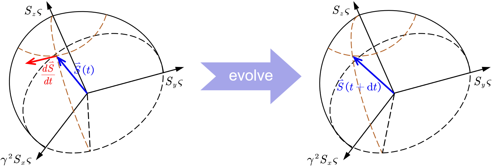

# Introduction of the Isometric Spin Boost

The properties of electron spin are fundamentally rooted in the representation
theory of the Lorentz group through the Dirac equation. While the intrinsic
magnetic moment and spin angular momentum naturally emerge from the decoupling
of positive- and negative-energy solutions, a subtle theoretical tension arises
when mapping these properties across reference frames: the magnitude of the spin
angular momentum ($s = \hbar/2$) is physically an invariant scalar, yet its
spatial projection behaves dynamically as a vector.

In standard relativistic kinematics—such as the framework grounding the classical
Thomas-Bargmann-Michel-Telegdi (T-BMT) equation—the spin 4-vector $S^\alpha$ is
constructed by imposing the orthogonality constraint $U_\alpha S^\alpha = 0$,
ensuring the vanishing of the temporal spin component in the particle's rest
frame. However, electron spin is fundamentally an irreducible representation of
Wigner's Little Group $\text{SO}(3)$ embedded within the homogeneous Lorentz
group $\text{SO}(3,1)^+$. Because the Lorentz boosts do not form a closed
subgroup ($[K_i, K_j] = -i\epsilon_{ijk}J_k$), a standard Lorentz boost (LB)
unavoidably mixes temporal and spatial components.

To resolve the conflict between covariance in direction and invariance in norm,
we recognize that while the orientation of spin must rotate covariantly via Wigner
rotations induced by LBs, its evolution must remain strictly restricted to the
invariant two-sphere manifold $S^2$ ($s = \hbar/2$). Consequently, we introduce
a non-linear frame transformation rule: the spin orientation after transformation
aligns strictly with the asymptotic trajectory prescribed by a standard Lorentz
boost—preserving its vector directional character—while its spatial Euclidean
norm remains invariantly conserved. We term this transformation the "Isometric
Spin Boost" (ISB).

 
<em>Differences and relationships between LB and ISB</em>

It should be noted that the ISB is designed not only to preserve the spatial
norm of the spin 4-vector, but also to maintain the vanishing of its temporal
component in every reference frame. To motivate this construction from the
underlying quantum-mechanical structure, we consider the Foldy–Wouthuysen (FW)
decoupling of the time-dependent Dirac equation and examine the distinct roles
of the spatial kinematic and temporal evolution operators.

For a time-independent FW transformation $e^{i\hat{S}}$, the Dirac Hamiltonian
$$
\hat{H} = \beta mc^2 + c\hat{\vec{\alpha}}\cdot\hat{\vec{p}} + \hat{V}
$$
is transformed into a block-diagonal form. In the nonrelativistic expansion,
the resulting positive-energy Hamiltonian contains the familiar relativistic
kinetic corrections together with the spin-dependent spin–orbit coupling (SOC) term,
$$
e^{i\hat{S}}\hat{H} e^{-i\hat{S}} = \beta mc^2 + \frac{\beta\hat{\vec{p}}^2}{2m}
- \frac{\beta\hat{\vec{p}}^4}{8m^3c^2} + \hat{H}_{\mathrm{SO}} +\cdots,
$$
where, for a central or slowly varying scalar potential,
$$
\hat{H}_{\mathrm{SO}} = \frac{1}{4m^2c^2} \hat{\vec{\Sigma}} \cdot \left(
\hat{\vec{\nabla}}\hat{V} \times \hat{\vec{p}} \right) +\cdots .
$$
The appearance of the Pauli spin operator $\hat{\vec{\Sigma}}$ demonstrates that
the effective relativistic dynamics of the positive-energy sector couples the
spatial kinematic degrees of freedom to the intrinsic spin degrees of freedom.
Thus, within the FW representation, the observable spin dynamics is intrinsically
encoded in a three-dimensional Pauli-spin space.

By contrast, for a time-independent FW transformation, the temporal evolution
operator remains invariant,
$$
e^{i\hat{S}} \left( i\hbar\frac{\partial}{\partial t}\hat{I}_4 \right)
e^{-i\hat{S}} = i\hbar\frac{\partial}{\partial t}\hat{I}_4,
$$
because
$$
\left[ \hat{S}, i\hbar\frac{\partial}{\partial t} \right]=0.
$$
Consequently, the temporal evolution sector introduces no additional
spin-dependent operator structure: it remains proportional to the identity in
the spinor space. This contrasts with the spatially dependent part of the FW
Hamiltonian, in which spin-dependent terms explicitly emerge.

These properties provide a physical motivation for identifying the observable
spin degree of freedom with the spatial Pauli-spin sector rather than with an
unconstrained four-component Lorentz-vector space. Accordingly, we impose the
intrinsic physical constraint
$$
S^\mu_{\mathrm{phys}}=(0,\vec{S}),
$$
where $\vec{S}$ denotes the observable spin vector. This condition should be
understood as a defining constraint of the physical spin space suggested by the
FW representation, rather than as a consequence of the standard Lorentz
transformation law.

Indeed, if $S^\mu$ were required to transform as an ordinary Lorentz 4-vector,
a boost would mix its temporal and spatial components according to
$$
S'^0 = \gamma \left( S^0-\frac{\vec{v}\cdot\vec{S}}{c} \right),
$$
so that $S^0=0$ in one reference frame would generally lead to $S'^0\neq0$ in
another. Therefore, the requirement that $S'^0=0$ be preserved for all inertial
frames is incompatible with conventional linear Lorentz 4-vector kinematics for
a nonzero spin vector.

This observation motivates the introduction of a distinct transformation principle.
Rather than treating $S^\mu$ as an ordinary Lorentz 4-vector, the ISB defines a
non-Lorentz, quantum-covariant transformation law whose purpose is to preserve
the physical spin manifold identified above. Specifically, the transformation is
required to satisfy
$$
S'^\mu = \mathcal{I}(\Lambda,S^\mu),
$$
with $S'^{0}=0$ and $\|\vec{S}'\|_2 = \|\vec{S}\|_2$ for every allowed
reference-frame transformation. In this sense, the ISB preserves both the
intrinsic three-dimensional character of the observable spin degree of freedom
and its Euclidean spatial norm, while abandoning the conventional linear mixing
of temporal and spatial components imposed by the standard Lorentz 4-vector
representation.

The ISB therefore embodies a quantum-covariant spin kinematics in which the
physical spin space is explicitly restricted to the spatial subspace
$$
\mathcal{S}_{\mathrm{phys}} = \left\{ S^\mu\in\mathbb{R}^4 \;\middle|\; S^0=0 \right\},
$$
and the transformation law is constructed so that this physical subspace is
invariant under changes of reference frame.

With the physical necessity of $\langle S^0 \rangle \equiv 0$ firmly established
by the FW representation, we can now systematically construct the algebraic matrix
for the Isometric Spin Boost (ISB). While a standard Lorentz Boost (LB) inevitably
couples spatial and temporal components, the ISB explicitly restricts the spin
evolution to the spatial manifold by encoding a strictly vanishing first row
(apart from the identity action associated with the time component) and employing
a state-dependent geometric projection factor $\zeta$:

$$
\begin{aligned}
S_{\text{LB}}' &= \varLambda _{\mathrm{LB}}S=\begin{pmatrix}
  \gamma & -\gamma \beta_1 & -\gamma \beta_2 & -\gamma \beta_3 \\
  -\gamma \beta_1 & 1+\frac{(\gamma -1)\beta_1^2}{\beta^2} & \frac{(\gamma
  -1)\beta_1\beta_2}{\beta^2} & \frac{(\gamma -1)\beta_1\beta_3}{\beta^2} \\
  -\gamma \beta_2 & \frac{(\gamma -1)\beta_1\beta_2}{\beta^2} & 1+\frac{(\gamma
  -1)\beta_2^2}{\beta^2} & \frac{(\gamma -1)\beta_2\beta_3}{\beta^2} \\
  -\gamma \beta_3 & \frac{(\gamma -1)\beta_1\beta_3}{\beta^2} & \frac{(\gamma
  -1)\beta_2\beta_3}{\beta^2} & 1+\frac{(\gamma -1)\beta_3^2}{\beta^2}
\end{pmatrix} S \\[10pt]
S_{\text{ISB}}' &= \varLambda _{\mathrm{ISB}}S=\begin{pmatrix}
  1 & 0 & 0 & 0 \\
  0 & \left[1+\frac{(\gamma -1)\beta_1^2}{\beta^2}\right]\zeta & \frac{(\gamma
  -1)\beta_1\beta_2}{\beta^2}\zeta & \frac{(\gamma -1)\beta_1\beta_3}{\beta^2}\zeta \\
  0 & \frac{(\gamma -1)\beta_1\beta_2}{\beta^2}\zeta & \left[1+\frac{(\gamma
  -1)\beta_2^2}{\beta^2}\right]\zeta & \frac{(\gamma -1)\beta_2\beta_3}{\beta^2}\zeta \\
  0 & \frac{(\gamma -1)\beta_1\beta_3}{\beta^2}\zeta & \frac{(\gamma
  -1)\beta_2\beta_3}{\beta^2}\zeta & \left[1+\frac{(\gamma -1)\beta_3^2}{\beta^2}\right]\zeta
\end{pmatrix} S
\end{aligned}
$$

By defining the Lorentz 4-vector parameter $\mathcal{K} \equiv (\gamma,
-\gamma\beta_1, -\gamma\beta_2, -\gamma\beta_3)^{\mathrm{T}}$, the normalization
scaling factor $\zeta$ can be expressed compactly in terms of the inner product
$\mathcal{K}^{\mathrm{T}}S$ as:

$$
\zeta = \left[ 1 + \frac{\left( \mathcal{K}^{\mathrm{T}}S \right)^2}{s^2} \right]^{-1/2}
$$

where $s = \hbar/2$ denotes the invariant magnitude of the spin angular momentum.
To isolate the structural algebra of the transformation, we partition the
transformation operator into an orthogonal spatial boost projection matrix $M$
and a temporal identity projection matrix $N$:

$$
M \equiv \begin{pmatrix}
  0 & 0 & 0 & 0 \\
  0 & 1+\frac{(\gamma -1)\beta_1^2}{\beta^2} & \frac{(\gamma
  -1)\beta_1\beta_2}{\beta^2} & \frac{(\gamma -1)\beta_1\beta_3}{\beta^2} \\
  0 & \frac{(\gamma -1)\beta_1\beta_2}{\beta^2} & 1+\frac{(\gamma
  -1)\beta_2^2}{\beta^2} & \frac{(\gamma -1)\beta_2\beta_3}{\beta^2} \\
  0 & \frac{(\gamma -1)\beta_1\beta_3}{\beta^2} & \frac{(\gamma
  -1)\beta_2\beta_3}{\beta^2} & 1+\frac{(\gamma -1)\beta_3^2}{\beta^2}
\end{pmatrix}, \quad
N \equiv \begin{pmatrix}
  1 & 0 & 0 & 0 \\
  0 & 0 & 0 & 0 \\
  0 & 0 & 0 & 0 \\
  0 & 0 & 0 & 0
\end{pmatrix}
$$

Thus, the action of the Isometric Spin Boost (ISB) on the spin 4-vector takes the
elegant and compact operator form:

$$
S_{\text{ISB}}' = \left( \zeta M + N \right) S
$$

The invariance of the spatial norm under the ISB is achieved through the
state-dependent scaling factor $\zeta$, making the ISB a genuinely nonlinear
mapping. While this transformation preserves the spatial norm similarly to a pure
rotation, it does not constitute an orthogonal rotation element of $\text{SO}(3)$.
Because the temporal component is constrained to zero ($S^0 = 0$), the
preservation of the three-dimensional Euclidean norm $\|\vec{S}\|^2$
automatically ensures the invariance of the four-dimensional Minkowski norm
$S_\mu S^\mu = \|\vec{S}\|^2 - (S^0)^2 = s^2$.

Furthermore, in the non-relativistic and low-speed limit ($\gamma \to 1$), the
ISB asymptotically converges to the linear Lorentz boost up to leading-order
relativistic corrections:

$$
S_{\text{ISB}}' = S_{\text{LB}}' + \mathcal{O}\left(\beta^2\right)
$$

# Thomas Kinematics of the Isometric Spin Boost

In standard special relativity, the algebraic non-closure of Lorentz boosts
dictates that successive non-collinear boosts inherently induce a spatial
Wigner rotation. When extended to the state-dependent ISB, this non-commutative
property operates under the strict geometric constraint of Euclidean norm
invariance on the spin manifold ($s = \hbar/2$). Consequently, by naturally
incorporating an infinitesimal non-linear Wigner-type rotation, the continuous
application of the ISB along an accelerated trajectory leads directly to the
Second Relativized Thomas Precession (SRTP).

Composing two consecutive ISBs on an initial spin state $S$, we have:

$$
S'' = \left( \frac{1}{\sqrt{1 + \left[ K'^{\mathrm{T}} (\zeta M + N) S \right]^2
/ s^2}} M' + N \right) (\zeta M + N) S
$$

Using the orthogonality and idempotency relations of the projectors:

$$
K^{\mathrm{T}}N = \gamma n^{\mathrm{T}}, \quad MN = M'N = \mathbf{O}_4, \quad N^2 = N
$$

all cross-terms vanish identically, simplifying the transformation to:

$$
S'' = \left( \frac{\zeta}{\sqrt{1 + \left( K'^{\mathrm{T}} \zeta M S \right)^2 /
s^2}} M'M + N \right) S
$$

Crucially, the spatial orientation of $S''$ is governed entirely by $M'M$. Thus,
its direction remains strictly identical to that produced by two consecutive
standard Lorentz boosts.

To derive the Thomas kinematics governing an accelerated electron with an arbitrary
spin vector $S$, we model its trajectory by first applying a finite ISB along the
$x$-direction, followed by an infinitesimal ISB in the $xy$-plane. We define the
velocity parameters as:

$$
\begin{aligned}
\beta_1 &\neq 0, & \beta_2 &= 0, & \beta_3 &= 0, & \gamma &= \left(1 -
\beta_1^2\right)^{-1/2}, \\
\beta'_1 &\to 0, & \beta'_2 &\to 0, & \beta'_3 &= 0, & \gamma' &\cong 1 +
\mathcal{O}\left(\beta'^2\right).
\end{aligned}
$$

For the initial finite boost along the $x$-axis, the spatial projection matrix
$M$ and the Lorentz parameter vector $\mathcal{K}$ are given by:

$$
M = \begin{pmatrix}
  0 & 0 & 0 & 0 \\
  0 & \gamma & 0 & 0 \\
  0 & 0 & 1 & 0 \\
  0 & 0 & 0 & 1
\end{pmatrix}, \quad
\mathcal{K} = \begin{pmatrix}
  \gamma \\
  -\gamma \beta_1 \\
  0 \\
  0
\end{pmatrix}.
$$

For the subsequent infinitesimal ISB in the $xy$-plane, utilizing the algebraic
identity $\frac{\gamma' - 1}{\beta'^2} = \frac{\gamma'^2}{\gamma' + 1}$ and
expanding to second order in small quantities, we obtain:

$$
M' = \begin{pmatrix}
  0 & 0 & 0 & 0 \\
  0 & 1 + \frac{\gamma'^2}{\gamma' + 1}{\beta'_1}^2 & \frac{\gamma'^2}{\gamma'
  + 1}\beta'_1 \beta'_2 & 0 \\
  0 & \frac{\gamma'^2}{\gamma' + 1}\beta'_1 \beta'_2 & 1 + \frac{\gamma'^2}{\gamma'
  + 1}{\beta'_2}^2 & 0 \\
  0 & 0 & 0 & 1
\end{pmatrix}
\cong \begin{pmatrix}
  0 & 0 & 0 & 0 \\
  0 & 1 + \frac{{\beta'_1}^2}{2} & \frac{\beta'_1 \beta'_2}{2} & 0 \\
  0 & \frac{\beta'_1 \beta'_2}{2} & 1 + \frac{{\beta'_2}^2}{2} & 0 \\
  0 & 0 & 0 & 1
\end{pmatrix}, \quad
\mathcal{K}' \cong \begin{pmatrix}
  1 \\
  -\beta'_1 \\
  -\beta'_2 \\
  0
\end{pmatrix}.
$$

Multiplying the two spatial projectors yields:

$$
M'M \cong \begin{pmatrix}
  0 & 0 & 0 & 0 \\
  0 & \gamma\left(1 + \frac{{\beta'_1}^2}{2}\right) & \frac{\beta'_1 \beta'_2}{2} & 0 \\
  0 & \gamma \frac{\beta'_1 \beta'_2}{2} & 1 + \frac{{\beta'_2}^2}{2} & 0 \\
  0 & 0 & 0 & 1
\end{pmatrix},
$$

and the corresponding composite normalization factor $\zeta_{\mathrm{s}}$
evaluates to:

$$
\zeta_{\mathrm{s}} = \frac{\zeta}{\sqrt{1 + \left(\mathcal{K}'^{\mathrm{T}}\zeta
M S\right)^2/s^2}} = \left[ 1 + \left(\gamma \beta_1 \frac{S_1}{s}\right)^2 +
\left(\gamma \beta'_1 \frac{S_1}{s} + \beta'_2 \frac{S_2}{s}\right)^2 \right]^{-1/2}
\cong \left[ 1 + \left(\gamma \beta_1 \frac{S_1}{s}\right)^2 \right]^{-1/2}.
$$

To compare this sequential transformation with a single effective ISB, we note
that to first order in the infinitesimal transverse velocity, the lab-frame
velocity parameterization is linearly additive up to $\mathcal{O}(\beta'^2)$:

$$
\beta_{\mathrm{t}1} \cong \beta_1, \quad \beta_{\mathrm{t}2} = \beta'_2, \quad
\beta_{\mathrm{t}3} = 0, \quad \gamma_{\mathrm{t}} \cong \gamma.
$$

The corresponding total spatial projection matrix $M_{\mathrm{t}}$ and its scaling
factor $\zeta_{\mathrm{t}}$ are directly constructed as:

$$
M_{\mathrm{t}} \cong \begin{pmatrix}
  0 & 0 & 0 & 0 \\
  0 & \gamma & \frac{(\gamma - 1)\beta'_2}{\beta_1} & 0 \\
  0 & \frac{(\gamma - 1)\beta'_2}{\beta_1} & 1 + \frac{(\gamma -
  1){\beta'_2}^2}{\beta_1^2} & 0 \\
  0 & 0 & 0 & 1
\end{pmatrix}, \quad
\zeta_{\mathrm{t}} = \left[ 1 + \frac{\left(\gamma_{\mathrm{t}}(\beta_1 +
\beta'_1)S_1 + \gamma_{\mathrm{t}}\beta'_2 S_2\right)^2}{s^2} \right]^{-1/2}
\cong \left[ 1 + \left(\gamma \beta_1 \frac{S_1}{s}\right)^2 \right]^{-1/2}.
$$

Here, the difference between $\zeta_{\mathrm{s}}$ and $\zeta_{\mathrm{t}}$ is of
higher-order and thus negligible. Let $\Omega$ denote the spatial nonlinear
precession matrix that connects the total ISB to the sequential ISB composition:

$$
\zeta_{\mathrm{t}} M_{\mathrm{t}} \Omega = \zeta_{\mathrm{s}} M'M.
$$

In the three-dimensional spatial subspace, substituting the matrix expressions
and neglecting second-order infinitesimals reduces the governing equation to:

$$
\begin{pmatrix}
  \gamma & \frac{(\gamma - 1)\beta'_2}{\beta_1} & 0 \\
  \frac{(\gamma - 1)\beta'_2}{\beta_1} & 1 & 0 \\
  0 & 0 & 1
\end{pmatrix} \Omega = \frac{\zeta_{\mathrm{s}}}{\zeta_{\mathrm{t}}}
\begin{pmatrix}
  \gamma & 0 & 0 \\
  0 & 1 & 0 \\
  0 & 0 & 1
\end{pmatrix}.
$$

Solving this linear matrix equation and retaining terms up to first-order
infinitesimals yields:

$$
\Omega=\left( \begin{matrix}
 1+\frac{\gamma ^2\beta _1\frac{S_1}{s}\left( \beta'_1\frac{S_1}{s}+\beta'_2\frac{S_2}{s}
  \right)}{1+\left( \gamma \beta _1\frac{S_1}{s} \right) ^2}&  \frac{\beta'_2}{\gamma
  \beta _1}\left( 1-\gamma \right)&  0\\
 \frac{\beta'_2}{\beta _1}\left( 1-\gamma \right)&  1+\frac{\gamma
  ^2\beta _1\frac{S_1}{s}\left( \beta'_1\frac{S_1}{s}+\beta'_2\frac{S_2}{s}
  \right)}{1+\left( \gamma \beta _1\frac{S_1}{s} \right) ^2}&  0\\
 0&  0&  1+\frac{\gamma ^2\beta _1\frac{S_1}{s}\left(
    \beta'_1\frac{S_1}{s}+\beta'_2\frac{S_2}{s} \right)}{1+\left( \gamma
    \beta _1\frac{S_1}{s} \right) ^2}\\
\end{matrix} \right)
$$

This is the required spatial nonlinear precession matrix $\Omega$. Notably, it
cannot be expressed as an orthogonal Euler rotation matrix of $\text{SO}(3)$—a
fundamental distinction between standard Lorentz boosts and continuous ISBs.
Whereas an infinitesimal orthogonal rotation requires antisymmetric off-diagonal
elements ($\omega_{12} = -\omega_{21}$), our precession operator explicitly
exhibits an asymmetric scaling weighted by the Lorentz factor:

$$
\omega_{12} = \frac{\beta'_2}{\gamma \beta_1}(1 - \gamma), \quad \omega_{21} =
\frac{\beta'_2}{\beta_1}(1 - \gamma) \implies \omega_{21} = \gamma \, \omega_{12}.
$$

The physical origin of this $\gamma$-anisotropy lies in the decoupling of the
temporal spin component. In a standard Lorentz boost sequence, the first boost
excites a non-zero temporal component $S^0$, and the second boost symmetrically
folds this temporal component back into the spatial sector to generate a standard
Wigner rotation. In contrast, continuous ISBs strictly project out $S^0 \equiv 0$
at every stage while conserving the Euclidean norm on the $S^2$ manifold. Thus,
the Lorentz contraction factor $\gamma$ is not absorbed by time-space mixing,
but instead manifests directly as an anisotropic shear in the spatial precession
operator.

# Kinetic Effect of Second Relativized Thomas Precession

The kinematic phenomenon of Thomas precession manifests dynamically as an
additional geometric term when transforming a four-vector's evolution from an
accelerating laboratory frame ($S_{\text{lab}}$) to the instantaneous comoving
rest frame ($S_{\text{rest}} = \varLambda_{\text{LB}}^{-1} S_{\text{lab}}$) along
the proper time $\tau$:

$$
\frac{\mathrm{d}S_{\text{rest}}}{\mathrm{d}\tau} = \varLambda_{\text{LB}}^{-1}
\frac{\mathrm{d}S_{\text{lab}}}{\mathrm{d}\tau} +
\frac{\mathrm{d}\varLambda_{\text{LB}}^{-1}}{\mathrm{d}\tau} S_{\text{lab}}.
$$

Here, $\varLambda_{\text{LB}}^{-1} \frac{\mathrm{d}S_{\text{lab}}}{\mathrm{d}\tau}$
represents the intrinsic dynamical evolution (e.g., external torque), whereas
$\frac{\mathrm{d}\varLambda_{\text{LB}}^{-1}}{\mathrm{d}\tau} S_{\text{lab}}$
encodes Thomas precession. Substituting the Wigner kinematic composition
$\varLambda_{\text{LB},\tau + \mathrm{d}\tau}^{-1} = R_{\mathrm{d}\tau}
\varLambda_{\text{LB},\tau}^{-1} \varLambda_{\text{LB},\mathrm{d}\tau}^{-1}$
demonstrates strict consistency between Thomas kinematics and Thomas dynamics:

$$
\frac{\mathrm{d}\varLambda_{\text{LB}}^{-1}}{\mathrm{d}\tau} S_{\text{lab}} =
\lim_{\mathrm{d}\tau \to 0} \frac{R_{\mathrm{d}\tau} \left(
  \varLambda_{\text{LB},\tau}^{-1} \varLambda_{\text{LB},\mathrm{d}\tau}^{-1}
  \varLambda_{\text{LB},\tau} \right) - I_4}{\mathrm{d}\tau} S_{\text{rest}} =
  \left( \mathbf{\Omega}_T - \vec{a}_{\text{rest}} \cdot \mathbf{K} \right) S_{\text{rest}},
$$

where $\mathbf{K}$ denotes the Lorentz boost generator matrices, and the spatial
precession torque generator $\mathbf{\Omega}_T = \lim_{\mathrm{d}\tau \to 0}
\frac{R_{\mathrm{d}\tau} - I_4}{\mathrm{d}\tau}$ originates entirely from the
kinematic Wigner rotation $R_{\mathrm{d}\tau}$.

Remarkably, the Isometric Spin Boost (ISB) preserves this exact kinematic-dynamic
consistency to first-order approximation. Because $\varLambda_{\mathrm{ISB}} =
\varLambda_{\mathrm{LB}} + \mathcal{O}(\beta^2)$, substituting the ISB composition
rule $\varLambda_{\mathrm{ISB},\tau + \mathrm{d}\tau}^{-1} = \Omega_{\mathrm{d}\tau}
\, \varLambda_{\mathrm{ISB},\tau}^{-1} \,
\varLambda_{\mathrm{ISB},\mathrm{d}\tau}^{-1}$ yields:

$$
\frac{\mathrm{d}\varLambda_{\mathrm{ISB}}^{-1}}{\mathrm{d}\tau} S_{\text{lab}} =
\lim_{\mathrm{d}\tau \to 0} \frac{\Omega_{\mathrm{d}\tau} \left(
  \varLambda_{\mathrm{ISB},\tau}^{-1} \varLambda_{\mathrm{ISB},\mathrm{d}\tau}^{-1}
  \varLambda_{\mathrm{ISB},\tau} \right) - I_4}{\mathrm{d}\tau} S_{\text{rest}} =
  \left( \mathbf{\Omega}_{\text{SRTP}} - \vec{a}_{\text{rest}} \cdot \mathbf{K}
  \right) S_{\text{rest}}.
$$

Crucially, the purely spatial precession torque is governed entirely by
$\mathbf{\Omega}_{\text{SRTP}} = \lim_{\mathrm{d}\tau \to 0}
\frac{\Omega_{\mathrm{d}\tau} - I_4}{\mathrm{d}\tau}$, which is directly generated
by the kinematic ISB precession matrix $\Omega_{\mathrm{d}\tau}$. Consequently,
despite its non-orthogonal $\gamma$-anisotropy, the ISB framework retains rigorous
first-order consistency between Thomas kinematics and dynamics, where the standard
BMT structure survives with the orthogonal rotation $R$ replaced by the anisotropic
precession operator $\mathbf{\Omega}$.

The demonstrated consistency between Thomas kinematics and dynamics allows us to
formulate the dynamical evolution of the SRTP directly from the ISB kinematic
equations. However, because the SRTP operator $\Omega$ is not an orthogonal Euler
rotation matrix, the exact manifold on which this precession takes place is not
immediately obvious.

To bridge the kinematics to energy, we express the normalized spin components as
direction cosines $S_x = S_1/s$, $S_y = S_2/s$, and $S_z = S_3/s$. Using classical
Hamiltonian mechanics, the time evolution of the spin vector $\dot{\vec{S}} =
\{\vec{S}, E\}$ parameterized by spherical coordinates (polar angle $\theta$,
azimuthal angle $\varphi$) relates the energy gradients to the precession matrix
$\Omega_{\mathrm{d}\tau}$:

$$
\frac{\partial E}{\partial \theta} \begin{pmatrix} -\sin \varphi \\ \cos \varphi
\\ 0 \end{pmatrix} - \frac{\partial E}{\partial \varphi} \begin{pmatrix} \cot
\theta \cos \varphi \\ \cot \theta \sin \varphi \\ -1 \end{pmatrix} = \frac{\partial
\Omega_{\mathrm{d}\tau}}{\partial \tau} \begin{pmatrix} S_x \\ S_y \\ S_z \end{pmatrix}.
$$

Substituting the derived expression for $\Omega_{\mathrm{d}\tau}$, we obtain:

$$
\frac{\partial E}{\partial \theta} \begin{pmatrix} -\sin \varphi \\ \cos \varphi
\\ 0 \end{pmatrix} - \frac{\partial E}{\partial \varphi} \begin{pmatrix} \cot
\theta \cos \varphi \\ \cot \theta \sin \varphi \\ -1 \end{pmatrix} = \begin{pmatrix}
  \frac{\gamma^2\beta_1 S_x(\dot{\beta}_1 S_x + \dot{\beta}_2 S_y)}{1 +
  (\gamma\beta_1 S_x)^2} & \frac{\dot{\beta}_2}{\gamma\beta_1}(1-\gamma) & 0 \\
  \frac{\dot{\beta}_2}{\beta_1}(1-\gamma) & \frac{\gamma^2\beta_1
  S_x(\dot{\beta}_1 S_x + \dot{\beta}_2 S_y)}{1 + (\gamma\beta_1 S_x)^2} & 0 \\
  0 & 0 & \frac{\gamma^2\beta_1 S_x(\dot{\beta}_1 S_x + \dot{\beta}_2 S_y)}{1 +
  (\gamma\beta_1 S_x)^2}
\end{pmatrix} \begin{pmatrix} S_x \\ S_y \\ S_z \end{pmatrix}.
$$

To isolate the core physical mechanism, we consider a purely transverse acceleration
model ($\dot{\beta}_1 = 0, \beta_2 = 0$). Neglecting radial acceleration merely
reduces algebraic clutter caused by the scaling factor $\zeta$, as the angular
acceleration is what primarily dictates the precession dynamics. Expanding this
relation, we seek an affine-transformed coordinate system $(\bar{S}_x, \bar{S}_y,
\bar{S}_z)$ where the dynamics conform to standard rotations:

$$
(\gamma + 1)S_x \frac{\bar{S}_x}{\gamma} + (\gamma + 1)S_y \bar{S}_y + (\gamma +
1)S_z \bar{S}_z = \frac{\bar{S}_x}{\gamma S_x} + \left( \gamma^2\beta^2 S_x^2 +
1 \right) \frac{\bar{S}_y}{S_y}.
$$

To solve for the axes of this new space, we apply a directional scaling ansatz
$\bar{S}_x/\gamma = \kappa S_x \varsigma$, $\bar{S}_y = S_y \varsigma$, and
$\bar{S}_z = S_z \varsigma$. Substituting this into the geometric constraint yields
$\kappa = \gamma$. By normalizing the transformed vector, we define the affine
scaling factor:

$$
\varsigma = \frac{1}{\sqrt{(\gamma^2 + 1)\gamma^2\beta^2 S_x^2 + 1}}.
$$

This yields the explicit mapping to the new basis:

$$
\bar{S}_x = \frac{\gamma^2 S_x}{\sqrt{(\gamma^2 + 1)\gamma^2\beta^2 S_x^2 + 1}},
\quad \bar{S}_y = \frac{S_y}{\sqrt{(\gamma^2 + 1)\gamma^2\beta^2 S_x^2 + 1}},
\quad \bar{S}_z = \frac{S_z}{\sqrt{(\gamma^2 + 1)\gamma^2\beta^2 S_x^2 + 1}}.
$$

Geometrically, this reveals that the precession manifold is effectively the original
spin sphere $S^2$ anisotropically stretched by a factor of $\gamma^2$ along the
velocity direction. This geometric deformation perfectly explains why the kinematic
operator $\Omega$ deviates from a standard Euler rotation matrix. We define this
affinely stretched manifold as the Spin Precession Space (SPS).

 
<em>Dynamical evolution of spin precession in Spin Precession Space</em>

Transitioning to the energy evaluation, the azimuthal gradient in the low-speed
approximation ($\beta \ll 1$) yields:

$$
\frac{\partial E}{\partial \varphi} \approx \beta_1\dot{\beta}_2 \bar{S}_x \bar{S}_y
\bar{S}_z \left( \frac{1}{1 - 2\beta^2 \bar{S}_x^2} \right) = \beta_1\dot{\beta}_2
\sin^2\theta \cos\theta \frac{\sin\varphi \cos\varphi}{1 - 2\beta_1^2 \sin^2\theta
\cos^2\varphi}.
$$

Integrating with respect to $\varphi$ and retaining the leading-order expansion
of the resulting logarithmic function gives:

$$
E \approx -\frac{1}{2}\beta_1\dot{\beta}_2 \sin^2\theta \cos^2\varphi \cos\theta + C.
$$

Crucially, the coefficient of $1/2$ naturally emerges, recovering the standard
Thomas half-value. Expressing this energy strictly in vector notation highlights
the novel dynamical signature of the SRTP:

$$
E_{\mathrm{SRTP}} = -\frac{1}{2} \vec{S}_\gamma \cdot (\vec{\beta} \times
\dot{\vec{\beta}}) \bar{S}_x^2 = \frac{1}{2\beta^2} \vec{S}_\gamma \cdot
(\dot{\vec{\beta}} \times \vec{\beta}) \frac{\gamma^4 (\vec{\beta} \cdot
\vec{S})^2}{(\gamma^2 + 1)\gamma^2(\vec{\beta} \cdot \vec{S})^2 + 1}.
$$

Here, $\vec{S}_\gamma$ represents the spin vector residing in the SPS. It is
evident that the dynamical effects of SRTP share a deep mathematical lineage
with standard Thomas precession. However, the SRTP imposes a distinct falsifiable
signature: the precession coupling vector resides within the affinely stretched
SPS, introducing the precession vector $S_\gamma$ dependent on the spin's
orientation relative to the boost axis.

# Correction to the DKH Hamiltonian Based on the SRTP Effect

Before quantizing the SRTP Hamiltonian, it is crucial to establish the physical
nature of the spin vector $\vec{S}$ used in our classical kinematic derivation.
In strict quantum mechanics, the components of the spin operator $\hat{\vec{S}}$
do not commute ($[\hat{S}_i, \hat{S}_j] = i\hbar\epsilon_{ijk}\hat{S}_k$), and
the Casimir invariant for a spin-$1/2$ particle dictates an operator eigenvalue
of $\hat{S}^2 = s(s+1)\hbar^2 = \frac{3}{4}\hbar^2$.

However, the spin orientation governed by the classical Thomas-BMT equation—and
our geometric Spin Precession Space (SPS)—is fundamentally rooted in the spin
coherent state represented on the Bloch sphere. In this semiclassical limit, the
classical vector $\vec{S}$ is mathematically defined as the local expectation
value of the quantum spin operator. For a pure spin coherent state, the geometric
norm of this Bloch vector is precisely $|\vec{S}| = \hbar/2$ (yielding a squared
norm of $\frac{1}{4}\hbar^2$, distinct from the Casimir eigenvalue). This recovers
the invariant $S^2$ manifold geometry that the Isometric Spin Boost (ISB) maps onto.
This distinction is paramount: mapping this classical vector back into the quantum
domain requires preventing the continuous spatial anisotropy of the SPS from
collapsing via premature operator Weyl ordering.

We begin with the classical SRTP Hamiltonian derived from the SPS geometry:

$$
E_{\mathrm{SRTP}} = \frac{1}{2\beta^2} \vec{S}_\gamma \cdot (\dot{\vec{\beta}}
\times \vec{\beta}) \frac{\gamma^4 (\vec{\beta} \cdot \vec{S})^2}{(\gamma^2 +
1)\gamma^2(\vec{\beta} \cdot \vec{S})^2 + 1}.
$$

To generalize this into a coordinate-free form, let $\vec{n} = \vec{\beta}/\beta$
be the unit vector along the velocity. The dimensionless longitudinal spin
projection is then $u = \vec{n} \cdot \vec{S}/s$ (where $s = \hbar/2$).

A crucial geometric simplification occurs in the dot product. Because the dynamic
torque vector $\vec{\tau} = \dot{\vec{\beta}} \times \vec{\beta}$ is strictly
orthogonal to the velocity $\vec{\beta}$, it completely annihilates the longitudinal
component of the stretched SPS vector $\vec{S}_\gamma$. Consequently, the dot product
is entirely determined by the transverse components, yielding:

$$
\vec{S}_\gamma \cdot (\dot{\vec{\beta}} \times \vec{\beta}) = \frac{1}{N} \vec{S}
\cdot (\dot{\vec{\beta}} \times \vec{\beta}),
$$

where $N = \sqrt{(\gamma^2+1)\gamma^2\beta^2 u^2 + 1}$ is the normalization factor
of the SPS mapping. Substituting this back, the Hamiltonian takes a unified,
compact form:

$$
E_{\mathrm{SRTP}} = \frac{1}{2} \left[ \vec{S} \cdot (\dot{\vec{\beta}} \times
\vec{\beta}) \right] \frac{\gamma^4 u^2}{\left[ 1 + (\gamma^2+1)\gamma^2 \beta^2
u^2 \right]^{3/2}}.
$$

To implement this dynamically, we perform a Taylor expansion with respect to the
relativistic parameter $\beta^2$. Using $\gamma^2 \approx 1 + \beta^2$ and $\gamma^4
\approx 1 + 2\beta^2$, the classical SRTP energy expanded to first order in $\beta^2$
simplifies to:

$$
E_{\mathrm{SRTP}} \approx \frac{1}{2} \left[ \vec{S} \cdot (\dot{\vec{\beta}}
\times \vec{\beta}) \right] u^2 \left[ 1 + \beta^2 \left( 2 - 3u^2 \right) \right].
$$

In the context of molecular electronic structure, the acceleration is internally
governed by the Hellmann-Feynman force derived from the scalar potential:
$\dot{\vec{\beta}} = -\frac{1}{mc}\nabla V$. Thus, the classical torque vector
$\vec{\tau} = \dot{\vec{\beta}} \times \vec{\beta}$ is explicitly replaced by
$-\frac{1}{m^2c^2}(\nabla V \times \vec{p})$, reducing the SRTP operator to a
standard spin-orbit coupling structure that is naturally evaluable in quantum
chemistry calculations, yet critically modulated by the SPS factor.

Transitioning this classical expression into a robust quantum mechanical operator
presents two distinct theoretical hurdles: the treatment of the nonlinear spin
projection $u^2$ and the rigorous definition of the momentum direction
$\vec{n} = \vec{p}/p$.

First, a strict canonical quantization (promoting all classical spin vectors
directly to Pauli operators) is physically prohibitive for the scalar term
$u^2 \propto (\vec{n} \cdot \vec{S})^2$. Due to the Pauli matrix identity
$(\vec{n} \cdot \hat{\vec{\sigma}})^2 = \hat{I}$, full operatorization forces
the longitudinal projection to collapse into an isotropic scalar, fatally
destroying the continuous spatial anisotropy of the SPS.

Second, promoting the classical parameter $1/p^2$ to the quantum operator
$1/\hat{p}^2$ for bound electrons raises theoretical concerns regarding infrared
singularities. However, the complete physical structure emerges as the tensor
$\frac{\hat{\vec{p}} \otimes \hat{\vec{p}}}{\hat{p}^2}$. In rigorous functional
analysis and Quantum Electrodynamics (QED), this acts as a mathematically bounded
longitudinal projection operator (with a spectrum strictly restricted between 0
and 1), seamlessly curing any apparent scalar divergence. This identical bounded
projector is routinely evaluated in *ab initio* relativistic frameworks, such as
the Breit-Pauli transverse photon propagator.

To preserve the geometric deformation of the SPS while maintaining mathematical
rigor and time-reversal symmetry (TRS) consistency, we abandon strict canonical
quantization for the non-linear geometric factor. Furthermore, simply substituting
$\vec{S}$ with a global macroscopic net magnetization
($\langle \hat{\vec{S}}_{\text{tot}} \rangle$) leads to a fundamental physical
inconsistency: in closed-shell molecules, the global first spin moment strictly
vanishes, which would unphysically eliminate the local kinematic Thomas precession
experienced by individual electrons. Physically, Thomas precession is a local
kinematic effect.

Instead, we adopt an occupied-spinor-resolved mean-field prescription. We define
the local spin polarization vector for each occupied spinor $|\psi_k\rangle$ as:
$$
\vec{s}_k = \langle \psi_k | \hat{\vec{S}} | \psi_k \rangle.
$$
Rather than relying on the global first spin moment, we construct the
occupation-normalized spin-polarization second moment tensor $\mathbf{T}$:
$$
\mathbf{T} = \frac{1}{N_e} \sum_{k \in \text{occ}} n_k \left( \vec{s}_k \otimes
\vec{s}_k \right),
$$
where $n_k$ is the occupation number of the spinor, and $N_e = \sum n_k$ ensures
that the subsequent bounded projection limits satisfy $0 \le \mathcal{U}^2 \le 1$. 

By replacing the classical vector product with this positive-semidefinite second
moment tensor, the background field operator $\hat{\mathcal{U}}^2$ naturally
emerges as:
$$
u^2 \longrightarrow \hat{\mathcal{U}}^2 = \frac{1}{s^2} \frac{\hat{\vec{p}} \cdot
\mathbf{T} \cdot \hat{\vec{p}}}{\hat{p}^2}.
$$

This occupied-spinor-resolved formulation ensures that for time-reversal symmetric
systems, a Kramers pair ($\vec{s}_{\bar{k}} = -\vec{s}_k$) contributes constructively
to the second moment tensor, preserving the geometric deformation as a local
kinematic effect even in non-magnetic closed-shell molecules. We thus retain the
linear Thomas torque as a rigorous quantum operator responsible for localized
dynamic transitions ($\hat{\vec{S}}$), while treating the nonlinear SPS geometric
deformation as a semiclassical background field dictated by the tensor-averaged
spinor polarization.

Crucially, the constructed effective Hamiltonian must be both Hermitian and
invariant under time reversal (i.e., commute with the time-reversal operator).
Since both $\hat{\vec{p}}$ and $\hat{\vec{S}}$ are odd under time reversal, while
the spin-polarization tensor $\mathbf{T}$ and the scalar potential $V$ are
time-reversal even, the operators $\hat{\mathcal{U}}^2 \propto (\hat{\vec{p}}
\cdot \mathbf{T} \cdot \hat{\vec{p}}) / \hat{p}^2$ and $\hat{\vec{S}} \cdot
(\nabla V \times \hat{\vec{p}})$ are individually time-reversal even. Thus, the
SRTP interaction inherently preserves time-reversal symmetry, independently of
the specific magnetic character of the electronic state; this differs fundamentally
from the aforementioned construction requirements. Because these two TR-even
operators generally do not commute, their simple product is non-Hermitian; we
therefore enforce Hermiticity through the symmetric anticommutator
$\{\hat{A}, \hat{B}\} = \hat{A}\hat{B} + \hat{B}\hat{A}$, strictly yielding valid
physical observables while retaining the exact time-reversal invariance of the
operator algebra.

The resulting fully symmetrized quantum SRTP Hamiltonian correction
$\Delta \hat{H}_{\mathrm{SRTP}} = \hat{H}_{\mathrm{SRTP}}^{(0)} +
\hat{H}_{\mathrm{SRTP}}^{(1)}$ is directly integrable into Self-Consistent Field
(SCF) methodologies:

**1. Zero-Order Term (Base Anisotropy):**
$$
\hat{H}_{\mathrm{SRTP}}^{(0)} = -\frac{1}{4m^2c^2} \left\{ \hat{\vec{S}} \cdot
(\nabla V \times \hat{\vec{p}}), \, \hat{\mathcal{U}}^2 \right\}
$$
*Physical Meaning:* The dominant kinematic modifier. The standard linear spin-orbit
torque operator is dynamically modulated by a non-local geometric background field.
Symmetrization ensures that the energetic interplay between the macroscopic spin
polarization and the local orbital momentum remains strictly observable.

**2. First-Order Relativistic Correction:**
$$
\hat{H}_{\mathrm{SRTP}}^{(1)} = \frac{1}{2m^2c^2} \left\{ \hat{p}^2 \left( 2\hat{I}
- 3\hat{\mathcal{U}}^2 \right), \, \hat{H}_{\mathrm{SRTP}}^{(0)} \right\}
$$
*Physical Meaning:* This term captures the deep non-Euclidean manifold distortion
of the SPS at higher velocities. It acts as a symmetrized dynamical feedback loop,
further enhancing or suppressing the local spin-orbit splitting based on the
continuous geometric coupling between the coherent spin state and the molecular
scalar potential.

Given that the DKH2 Hamiltonian strictly retains relativistic contributions only
up to $O(c^{-2})$, we must consistently isolate the leading SRTP contribution—i.e.,
the zeroth-order term in the $\beta^2$ expansion,
$\hat{H}_{\mathrm{SRTP}}^{(0)} \sim O(c^{-2})$. The subsequent geometric correction,
$\hat{H}_{\mathrm{SRTP}}^{(1)} \sim O(c^{-4})$, fundamentally lies beyond the formal
truncation boundary of DKH2 and is thus neglected.

From a dynamical perspective, the spin-dependent relativistic interactions at
$O(c^{-2})$ originate from two distinct physical channels: the Thomas precession
(a pure kinematic consequence of non-commuting Lorentz boosts) and, in a general
electromagnetic description, the direct spin–field Larmor coupling (a direct
magnetic dipole interaction). The Isometric Spin Boost (ISB) correction alters
these two channels at different relativistic orders because their underlying
kinematic structures are fundamentally distinct.

The derivation of Thomas precession inherently involves the kinematic relativistic
factor $\frac{\gamma-1}{\beta^2}$, which possesses the low-velocity asymptotic
expansion:
$$ \frac{\gamma-1}{\beta^2} = \frac{1}{2} + O(\beta^2) $$
Because the explicit $1/\beta^2$ factor cancels the leading $O(\beta^2)$ behavior
of $(\gamma-1)$, the base coefficient emerges at $O(\beta^0)$. Consequently, the
first-order geometric deformation introduced by the ISB is effectively elevated
to the zeroth order in the dimensionless relativistic expansion. This non-Euclidean
anisotropic modification directly multiplies the leading Thomas-precession coupling,
preserving its overall Hamiltonian contribution at $O(c^{-2})$. This precise kinematic
elevation is the origin of the leading SRTP Hamiltonian $\hat{H}_{\mathrm{SRTP}}^{(0)}$.

Conversely, the direct Larmor-type spin–field coupling exhibits a qualitatively
different structure. As a direct dipole interaction, it lacks an analogous kinematic
factor proportional to $\frac{\gamma-1}{\beta^2}$ that could cancel the leading
$\beta^2$ dependence of the ISB frame-transformation correction. Therefore, the
ISB-induced modification to this channel can only manifest through an ordinary
even-power relativistic expansion of the form:
$$ 1 + a_1\beta^2 + a_2\beta^4 + \cdots $$
This dictates that the leading ISB correction begins at $O(c^{-2})$ relative to
the unmodified coupling. Since the underlying spin–orbit/dipole interaction itself
already scales as $O(c^{-2})$, the corresponding absolute ISB geometric modulation
of the Larmor channel strictly enters at $O(c^{-4})$ or higher.

Accordingly, within the formal $O(c^{-2})$ accuracy of the DKH2 framework, the
leading ISB modification of the kinematic Thomas-precession channel must be
explicitly retained, whereas the ISB-induced correction to the direct Larmor-type
coupling constitutes a higher-order $O(c^{-4})$ perturbation and is consistently
discarded. The present SRTP-DKH2 construction therefore isolates and retains solely
the leading anisotropic geometric correction to the Thomas precession contribution.

Neglecting the anomalous magnetic moment, the equivalent magnetic moments
associated with electron Larmor precession and Thomas precession can be expressed
as follows—an exact kinematic result that is strictly consistent with the total
spin-orbit coupling (SOC) term derived from the Dirac equation via the
Foldy-Wouthuysen transformation.

$$
\mu_{\mathrm{Larmor}} + \mu_{\mathrm{Thomas}} = \mu_0 - \frac{\gamma}{\gamma +
1}\mu_0 = \frac{\gamma + 1 - \gamma}{\gamma + 1}\mu_0 = \frac{1}{\gamma + 1}\mu_0
$$

In the low-velocity limit ($\gamma \to 1$), this exactly recovers the $O(c^{-2})$
dynamical relation $\mu_0 - \frac{1}{2}\mu_0 = \frac{1}{2}\mu_0$. This explicitly
demonstrates how the base DKH1 SOC operator intrinsically blends the direct Larmor
coupling (coefficient $1$) with the kinematic Thomas precession (coefficient $-1/2$).

Because the ISB geometrically distorts only the kinematic Thomas channel at the
retained formal order, we must selectively modulate its corresponding fractional
contribution. This implies that to rigorously correct the spin-dependent terms in
the decoupled first-order DKH Hamiltonian (DKH1, at order $c^{-2}$), the following
symmetrized substitution must be applied to the base SOC spatial operator $\hat{h}$:

$$
\left( \mu_0 - \frac{1}{2}\mu_0 \right) \hat{h} \longrightarrow \frac{1}{2}\left\{
  \mu_0 - \frac{1}{2}\mu_0\hat{\mathcal{U}}^2, \hat{h} \right\}
$$

While the generalized SRTP-Pauli vector rule provides a mathematically rigorous
formulation, its direct implementation presents a practical bottleneck in standard
quantum chemistry architectures. In relativistic codes, the intermediate DKH
operator $A_i R_i V_{ij} R_j A_j$ is not evaluated as a monolithic spin-dependent
entity. Instead, the spatial integration is strictly separated from the spin
algebra to optimize computational efficiency.

To translate the SRTP Hamiltonian into a programmable algorithm without disrupting
the underlying integral evaluation routines, we must intercept the Hamiltonian
assembly at the level of the two-component spinor matrix construction.

In a standard DKH implementation, the operator $R_p$ is factorized into its scalar
kinematic part $\mathcal{R}_p = \frac{c}{E_p + mc^2}$ and the Pauli momentum
operator $\vec{\sigma} \cdot \vec{p}$ (Hess, The generalized Douglas–Kroll
transformation, 2002). The spatial integrals over the potential $V$ are evaluated
in the atomic orbital basis and transformed into the diagonal $p^2$-representation.
This yields two distinct spatial matrices:

1. The Scalar Matrix: $S_{ij} = \vec{p}_i \cdot V_{ij} \vec{p}_j$ (spin-free)
2. The Vector Matrix: $\vec{V}_{ij} = \vec{p}_i \times V_{ij} \vec{p}_j$ (spin-dependent)

The standard DKH1 even operator block $\mathcal{E}_{1+}$ is then assembled into
a $2N \times 2N$ spinor matrix by taking the Kronecker product with the $2 \times 2$
identity matrix $\mathbf{1}$ and the Pauli vector $\vec{\sigma}$. Maintaining the
exact symmetric structure of the $A R V R A$ operator sequence, the matrix elements
are constructed as:

$$
\mathcal{E}_{1+}^{\mathrm{standard}}(i,j) = A_i V_{ij} A_j \otimes \mathbf{1} +
A_i \mathcal{R}_i \left[ S_{ij} \otimes \mathbf{1} + i \vec{V}_{ij} \cdot
\vec{\sigma} \right] \mathcal{R}_j A_j.
$$

To integrate the SRTP correction, we must selectively modulate the Thomas precession
component within the spin-dependent term without attempting to analytically isolate
it from the Larmor component. As established, the base unperturbed DKH1 spin-dependent
matrix element intrinsically carries a net fractional coefficient of $1/2$ (combining
a Larmor contribution of $1$ and a Thomas contribution of $-1/2$). To rigorously apply
the symmetrized substitution
$(\mu_0 - \frac{1}{2}\mu_0)\hat{h} \rightarrow \frac{1}{2}\{\mu_0 -
\frac{1}{2}\mu_0\hat{\mathcal{U}}^2, \hat{h}\}$ to the existing integrals, the
multiplicative weight matrix $W_{ij}$ must reflect the ratio of the modified
operator $(1 - \frac{1}{2}\hat{\mathcal{U}}^2)$ to the unperturbed coefficient
$(1/2)$. This defines an effective momentum-dependent scaling operator:
$$
\hat{W}=2-\hat{\mathcal{U}}^2.
$$

The identification of the array-scaled matrix $W_{ij}\vec{V}_{ij}$ with the
symmetrized quantum operator $\frac{1}{2}\{\hat{W},\hat{h}\}$ is not an
approximation. Rather, it is an exact matrix-element identity in the momentum
representation used for the DKH spatial transformation. Because the Cartesian
momentum components commute,
$[\hat{p}_x,\hat{p}_y]=[\hat{p}_y,\hat{p}_z]=[\hat{p}_z,\hat{p}_x]=0$, one may
work in their common momentum eigenbasis $\{|\vec{p}_i\rangle\}$, in which
$$
\hat{\vec{p}}|\vec{p}_i\rangle=\vec{p}_i|\vec{p}_i\rangle, \qquad
\hat{p}^2|\vec{p}_i\rangle=p_i^2|\vec{p}_i\rangle.
$$
In this representation, $\hat{\mathcal{U}}^2$ and therefore $\hat{W}$ act diagonally:
$$
\hat{\mathcal{U}}^2|\vec{p}_i\rangle = \frac{\vec{p}_i \cdot \mathbf{T} \cdot
\vec{p}_i}{s^2 p_i^2} |\vec{p}_i\rangle, \qquad
\hat{W}|\vec{p}_i\rangle=W_i|\vec{p}_i\rangle, \quad W_i = 2 - \frac{\vec{p}_i
\cdot \mathbf{T} \cdot \vec{p}_i}{s^2 p_i^2}.
$$

The exact matrix elements of the Hermitian symmetrized operator are then
$$
\left\langle\vec{p}_i\left| \frac{1}{2}\{\hat{W},\hat{h}\}
\right|\vec{p}_j\right\rangle = \frac{1}{2} \left(
  \langle\vec{p}_i|\hat{W}\hat{h}|\vec{p}_j\rangle +
  \langle\vec{p}_i|\hat{h}\hat{W}|\vec{p}_j\rangle \right) =
  \frac{1}{2} \left( W_i\langle\vec{p}_i|\hat{h}|\vec{p}_j\rangle +
  \langle\vec{p}_i|\hat{h}|\vec{p}_j\rangle W_j \right) = \frac{1}{2}(W_i+W_j)
  \langle\vec{p}_i|\hat{h}|\vec{p}_j\rangle.
$$

Therefore, defining the matrix-element weight $W_{ij}\equiv\frac{1}{2}(W_i+W_j)$
explicitly yields the state-dependent geometric weight matrix:
$$
W_{ij} = 2 - \frac{1}{2} \left[ \mathcal{U}^2(\vec{p}_i) + \mathcal{U}^2(\vec{p}_j)
\right] = 2 - \frac{1}{2s^2} \left[ \frac{\vec{p}_i \cdot \mathbf{T} \cdot
\vec{p}_i}{p_i^2} + \frac{\vec{p}_j \cdot \mathbf{T} \cdot \vec{p}_j}{p_j^2} \right],
$$
which gives the exact relation
$$
\left[ \frac{1}{2}\{\hat{W},\hat{h}\} \right]_{ij} = W_{ij}h_{ij}.
$$

For the spin-dependent DKH spatial contribution, where the matrix element of
$\hat{h}$ is represented by the vector integral $\vec{V}_{ij}$ together with the
Pauli spin algebra, the same relation is implemented directly at the spatial-matrix
level as
$$
\tilde{\vec{V}}_{ij}=W_{ij}\vec{V}_{ij}.
$$
Thus, the element-wise scaling by the arithmetic mean $W_{ij}$ is not an empirical
averaging prescription, but the exact matrix representation of the symmetrized
operator $\frac{1}{2}\{\hat{W},\hat{h}\}$ in the chosen momentum basis.

Because $W_i$ is real and $W_{ij}=W_{ji}$, this construction also preserves
Hermiticity whenever the original DKH spin-dependent matrix satisfies the
corresponding Hermitian symmetry. In particular, in the isotropic limit
$\hat{\mathcal{U}}^2=\hat{I}$, one has $W_i=1$ for every momentum state and hence
$W_{ij}=1$, yielding $\tilde{\vec{V}}_{ij}=\vec{V}_{ij}$ and recovering the
unmodified DKH operator exactly.

The final, fully programmable SRTP-DKH1 even operator seamlessly preserves the
symmetric operator nesting while incorporating the geometric distortion:
$$
\tilde{\mathcal{E}}_{1+}(i,j) = A_i V_{ij} A_j \otimes \mathbf{1} + A_i
\mathcal{R}_i \left[ S_{ij} \otimes \mathbf{1} + i \tilde{\vec{V}}_{ij} \cdot
\vec{\sigma} \right] \mathcal{R}_j A_j.
$$

**Mean-Field Error and the Collinear Limit**

The physical validity and inherent boundaries of this mean-field $\mathbf{T}$
tensor formulation can be critically evaluated through the lens of the
Self-Consistent Field (SCF) iterative evolution.

At the initial stage of the SCF procedure (Iteration 0), the density matrix is
typically constructed from a scalar relativistic or non-relativistic guess. In
this state, all electron spins are artificially quantized along a single axis
(e.g., the $z$-axis), meaning the system operates within a strict collinear limit.
Under these initial conditions, all orbitals are fully polarized
($\langle S_z \rangle \approx \pm 0.5$). Consequently, projecting any electron's
momentum onto the globally averaged $\mathbf{T}$ tensor is mathematically
identical to projecting it onto its own individualized spin polarization vector.
Therefore, at Iteration 0, the mean-field approximation introduces absolutely
zero error and perfectly recovers the exact classical local SRTP Hamiltonian for
each electron.

However, as the SCF iterative process progresses and off-diagonal Spin-Orbit
Coupling (SOC) interactions are fully incorporated, the spinors undergo varying
degrees of mixing. This introduces deviations from the collinear $z$-axis, causing
spatial tilting and $z$-direction depolarization. The extent of this depolarization
heavily depends on the local SOC strength:
*   Strong SOC Orbitals (e.g., heavy-element core orbitals): Experience severe
spin-flipping and spatial polarization shifts.
*   Weak SOC Orbitals (e.g., typical valence orbitals): Remain largely unperturbed
and close to their original collinear polarization.

The fundamental physical compromise of the mean-field approximation becomes
apparent here: the macroscopic $\mathbf{T}$ tensor is statistically dominated by
the majority of electrons (typically the weakly-coupled valence electrons),
establishing a global geometric metric. For electrons residing in strongly
SOC-perturbed orbitals, their highly individualized, tilted spatial deformations
are artificially "smoothed over" or homogenized by the projection onto this
global background tensor. The mean-field tensor essentially dilutes the localized
geometric characteristics of the most strongly relativistic orbitals, pulling them
toward the statistical average. In short, for orbitals closely reflecting the
macroscopic spin distribution, the $\mathbf{T}$ tensor description remains highly
accurate; for those few orbitals subject to intense, highly localized SOC, their
unique SRTP kinematic distortions are unavoidably underestimated by the global
mean-field background.

