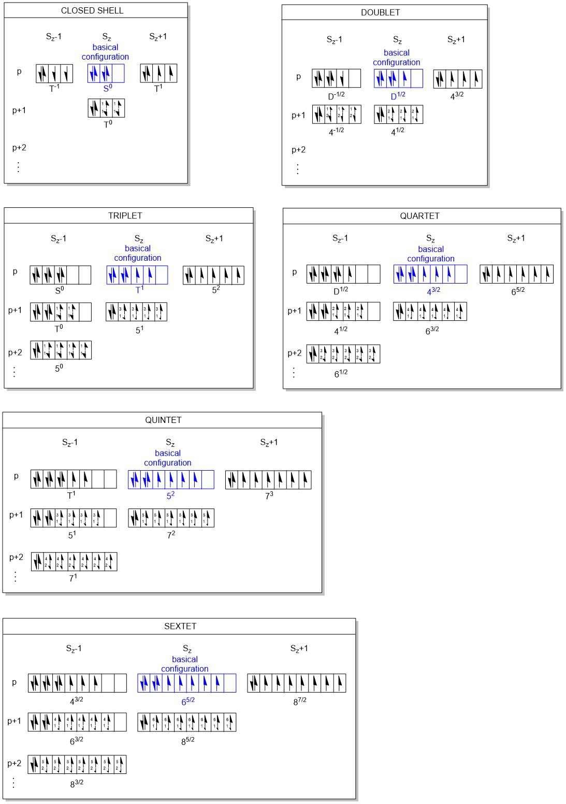

# Section 1: Two-Component Relativistic Operator: pVp, pppVp Matrix Elements

> Note that the pppVp integral was originally introduced to account for the SRTP
effect; however, the associated derivation was flawed, and the downstream code
has been abandoned. The derivation and code for the pppVp integral are retained
solely to facilitate potential future use. Correct modeling of the SRTP effect
does not require the introduction of a new integral; please refer to
`docs/Mathematics_and_Algorithms.pdf`.

## 1. Pauli Vector Potential Expansion

$$(\mathbf{\sigma} \cdot \mathbf{P}) V (\mathbf{\sigma} \cdot \mathbf{P}) = I_2
P_x V P_x + I_2 P_y V P_y + I_2 P_z V P_z + i \sigma_z (P_x V P_y - P_y V P_x) +
i \sigma_y (P_z V P_x - P_x V P_z) + i \sigma_x (P_y V P_z - P_z V P_y)$$

## 2. Relativistic Kinematic Factor Transformation

$$\sqrt{\frac{\varepsilon_i \varepsilon_j}{\varepsilon_k}} (\mathbf{\sigma} \cdot
\mathbf{P}) V_N \sqrt{\frac{\varepsilon_i \varepsilon_j}{\varepsilon_k}}
(\mathbf{\sigma} \cdot \mathbf{P}) \quad \text{($V$ is symmetric on both sides,
Hermitian)}$$

$$= I_2 \sqrt{\frac{\varepsilon_y \varepsilon_z}{\varepsilon_x}} P_x V
\sqrt{\frac{\varepsilon_y \varepsilon_z}{\varepsilon_x}} P_x + I_2
\sqrt{\frac{\varepsilon_x \varepsilon_z}{\varepsilon_y}} P_y V
\sqrt{\frac{\varepsilon_x \varepsilon_z}{\varepsilon_y}} P_y + I_2
\sqrt{\frac{\varepsilon_x \varepsilon_y}{\varepsilon_z}} P_z V
\sqrt{\frac{\varepsilon_x \varepsilon_y}{\varepsilon_z}} P_z + i
\sigma_z \left(\sqrt{\frac{\varepsilon_y \varepsilon_z}{\varepsilon_x}} P_x V
\sqrt{\frac{\varepsilon_x \varepsilon_z}{\varepsilon_y}} P_y -
\sqrt{\frac{\varepsilon_x \varepsilon_z}{\varepsilon_y}} P_y V
\sqrt{\frac{\varepsilon_y \varepsilon_z}{\varepsilon_x}} P_x\right) + i
\sigma_y \left(\sqrt{\frac{\varepsilon_x \varepsilon_y}{\varepsilon_z}} P_z V
\sqrt{\frac{\varepsilon_y \varepsilon_z}{\varepsilon_x}} P_x -
\sqrt{\frac{\varepsilon_y \varepsilon_z}{\varepsilon_x}} P_x V
\sqrt{\frac{\varepsilon_x \varepsilon_y}{\varepsilon_z}} P_z\right) + i
\sigma_x \left(\sqrt{\frac{\varepsilon_x \varepsilon_z}{\varepsilon_y}} P_y V
\sqrt{\frac{\varepsilon_x \varepsilon_y}{\varepsilon_z}} P_z -
\sqrt{\frac{\varepsilon_x \varepsilon_y}{\varepsilon_z}} P_z V
\sqrt{\frac{\varepsilon_x \varepsilon_z}{\varepsilon_y}} P_y\right)$$

## 3. Series Expansion Approximations

$$E_x = \frac{1}{\sqrt{1 - \frac{c^2}{E^2} P_x^2}} = 1 + \frac{P_x^2}{2c^2} \quad
(\text{to } c^{-2} |\Pi\rangle)$$

$$\sqrt{\frac{\varepsilon_y \varepsilon_z}{\varepsilon_x}} = 1 +
\frac{P_y^2}{4c^2} + \frac{P_z^2}{4c^2} - \frac{P_x^2}{4c^2} = 1 +
\frac{1}{4c^2}(P^2 - 2P_x^2) \quad (\text{to 2nd order})$$

Expanding $\sqrt{\frac{\varepsilon_y \varepsilon_z}{\varepsilon_x}} P_x V
\sqrt{\frac{\varepsilon_y \varepsilon_z}{\varepsilon_x}} P_x$:
$$\left[1 + \frac{1}{4c^2}(P^2 - 2P_x^2)\right] P_x V \left[1 +
\frac{1}{4c^2}(P^2 - 2P_x^2)\right] P_x$$
$$= P_x V P_x + \frac{1}{4c^2}(P^2 - 2P_x^2) P_x V P_x + \frac{1}{4c^2}
P_x V P_x (P^2 - 2P_x^2) \quad (\text{to } c^{-2})$$
$$= P_x V P_x + \frac{1}{4c^2} P^2 P_x V P_x + \frac{1}{4c^2} P_x V P_x P^2 -
\frac{1}{2c^2} P_x^2 P_x V P_x - \frac{1}{2c^2} P_x V P_x P_x^2 \quad (\text{In }
P^2 \text{ eigen-space description})$$

## 4. Classification of Required PVP Matrix Elements

Total: **27 irreducible PVP matrix elements** (cannot be reduced further):

* $P_x V P_x, P_y V P_y, P_z V P_z$
* $P_x V P_x^3, P_y V P_y^3, P_z V P_z^3$
* $P_x V P_y, P_y V P_x, P_x^3 V P_y, P_x V P_y^3, P_y^3 V P_x, P_y V P_x^3$
* $P_x V P_z, P_z V P_x, P_x^3 V P_z, P_x V P_z^3, P_z^3 V P_x, P_z V P_x^3$
* $P_y V P_z, P_z V P_y, P_y^3 V P_z, P_y V P_z^3, P_z^3 V P_y, P_z V P_y^3$

Hermitian Conjugate & Transpose Relations:
$$(\langle \chi_i | P_x V P_z | \chi_j \rangle)^\dagger \equiv P_x V P_z
|_{ij}^\dagger = \langle \chi_j | P_z V P_x | \chi_i \rangle = P_z V P_x
|_{ji}$$
$$(\langle \chi_i | P_x^3 V P_z | \chi_j \rangle)^\dagger = \langle \chi_j
| P_z V P_x^3 | \chi_i \rangle = P_z V P_x^3 |_{ji}$$

*Both $PVP$ and $PVP^3$ are non-symmetric real matrices, but only half of the
off-diagonal elements need to be computed.*

## 5. Derivative Operator Action & Sign Convention Rules

$$\langle \chi_i | P_x V P_z | \chi_j \rangle = \langle \chi_i | (-i
\partial_x)^\dagger V (-i \partial_z) | \chi_j \rangle = \langle \chi_i
| -i \partial_x V (-i \partial_z) | \chi_j \rangle = -\langle \chi_i |
\partial_x V \partial_z | \chi_j \rangle$$
$$\langle \chi_i | P_x^3 V P_z | \chi_j \rangle = \langle \chi_i | (-i
\partial_x)^{3\dagger} V (-i \partial_z) | \chi_j \rangle = \langle \chi_i |
-i (-\partial_x^3) V (-i \partial_z) | \chi_j \rangle = \langle \chi_i |
\partial_x^3 V \partial_z | \chi_j \rangle$$

* **$PVP$ and $P^3VP^3$**: Must take **negative sign** ($-$).
* **$P^3VP$ and $PVP^3$**: Do **NOT** take negative sign.

Mathematical Justification via Integration by Parts:
$$\langle \chi_i | \partial_x^\dagger \partial_x | \chi_j \rangle = \int dx \,
\langle \chi_i | \partial_x^\dagger | x \rangle \langle x | \partial_x | \chi_j
\rangle = \int dx \, \left(\frac{\partial}{\partial x} \chi_i(x)\right)
\left(\frac{\partial}{\partial x} \chi_j(x)\right)$$
$$\langle \chi_i | \partial_x \partial_x | \chi_j \rangle = \int_\Omega dx \,
\langle \chi_i | x \rangle \langle x | \frac{\partial^2}{\partial x^2} | \chi_j
\rangle = \int dx \, \chi_i(x) \frac{\partial^2}{\partial x^2} \chi_j(x)$$
$$= \int \chi_i(x) \, d\left(\frac{\partial}{\partial x} \chi_j(x)\right) =
\left. \chi_i(x) \frac{\partial}{\partial x} \chi_j(x) \right|_{-\infty}^{+\infty}
- \int dx \, \left(\frac{\partial}{\partial x} \chi_j(x)\right)
\left(\frac{\partial}{\partial x} \chi_i(x)\right) = -\int dx \,
\frac{\partial}{\partial x} \chi_j(x) \frac{\partial}{\partial x} \chi_i(x)$$

*Conclusion*: Calculating via action on both sides actually evaluates $-\nabla^2$,
so no extra negative sign is needed.

* $\langle \chi_i | P_x V P_z | \chi_j \rangle = -\langle \chi_i | \partial_x V
\partial_z | \chi_j \rangle = \langle \chi_i | \partial_x^\dagger V \partial_z |
\chi_j \rangle$ ($PVP$ do not change sign).
* $\langle \chi_i | P_x^3 V P_z | \chi_j \rangle = \langle \chi_i | \partial_x^3
V \partial_z | \chi_j \rangle = -\langle \chi_i | {\partial_x^3}^\dagger V
\partial_z | \chi_j \rangle$ ($P^3VP$ / $PVP^3$ change sign).

# Section 2: Recurrence Relations, Gaussian Product Rule & Core Integrals

## 1. Horizontal Transfer Formula ($\chi_i \rightarrow \chi_j$)

$$I_x(n_i, n_j) = I_x(n_i + 1, n_j - 1) + (x_i - x_j) I_x(n_i, n_j - 1)$$
$$I_x(n_i, n_j - 1) = I_x(n_i + 1, n_j - 2) + (x_i - x_j) I_x(n_i, n_j - 2)$$
$$\dots$$
$$I_x(n_i, 1) = I_x(n_i + 1, 0) + (x_i - x_j) I_x(n_i, 0)$$

Stepwise Binomial Expansion:
$$I_x(n_i, n_j) = I_x(n_i + 2, n_j - 2) + 2(x_i - x_j) I_x(n_i + 1, n_j - 2) +
(x_i - x_j)^2 I_x(n_i, n_j - 2)$$
$$= I_x(n_i + 3, n_j - 3) + 3(x_i - x_j) I_x(n_i + 2, n_j - 3) + 3(x_i - x_j)^2
I_x(n_i + 1, n_j - 3) + (x_i - x_j)^3 I_x(n_i, n_j - 3)$$
$$= I_x(n_i + 4, n_j - 4) + 4(x_i - x_j) I_x(n_i + 3, n_j - 4) + 6(x_i - x_j)^2
I_x(n_i + 2, n_j - 4) + 4(x_i - x_j)^3 I_x(n_i + 1, n_j - 4) + (x_i - x_j)^4
I_x(n_i, n_j - 4)$$

General Closed-Form (Binomial Coefficients):
$$I_x(n_i, n_j) = \sum_{k=0}^{n_j} C_{n_j}^k (x_i - x_j)^k I_x(n_i + n_j - k, 0)$$

---

## 2. Gaussian Product Rule

$$\int_{-\infty}^{+\infty} e^{-b(x - x_0)^2} dx = \sqrt{\frac{\pi}{b}}$$

Product of Two Gaussians:
$$e^{-b_1(x - x_1)^2} e^{-b_2(x - x_2)^2} = e^{-(b_1 + b_2)(x - x_P)^2}
e^{-\frac{b_1 b_2}{b_1 + b_2}(x_1 - x_2)^2}$$

Center of Product Gaussian ($x_P$):
$$x_P = \frac{x_1 b_1 + x_2 b_2}{b_1 + b_2}$$

---

## 3. $s$-Shell Potential Integral Core (3D Two-Electron Repulsion)

Integrands Integration over $u$, $\mathbf{r}_1$, and $\mathbf{r}_2$ (3D Space):
$$ \frac{2}{\sqrt{\pi}} \int_0^\infty du \iint_{-\infty}^\infty d\mathbf{r}_1
d\mathbf{r}_2 \, e^{-A(\mathbf{r}_1 - \mathbf{R}_P)^2} e^{-B(\mathbf{r}_2 -
\mathbf{R}_Q)^2} e^{-u^2(\mathbf{r}_1 - \mathbf{r}_2)^2} $$

Evaluating the 3D spatial integrals over $\mathbf{r}_1$ and $\mathbf{r}_2$:
$$ = \frac{2}{\sqrt{\pi}} \int_0^\infty du \left( \frac{\pi}{A + u^2} \right)^{3/2}
\left( \frac{\pi}{\frac{A u^2}{A + u^2} + B} \right)^{3/2} e^{-\frac{u^2 A B}{A
B + u^2 A + u^2 B}(\mathbf{R}_P - \mathbf{R}_Q)^2} $$
$$ = \frac{2}{\sqrt{\pi}} \int_0^\infty du \left( \frac{\pi^2}{A B + u^2(A + B)}
\right)^{3/2} e^{-\frac{u^2 \rho}{\rho + u^2}(\mathbf{R}_P - \mathbf{R}_Q)^2} $$
*(where $\rho = \frac{AB}{A+B}$)*

Variable Transformation ($u \rightarrow t$):
Let $u^2 = \frac{\rho t^2}{1 - t^2}$. The Jacobian is $du = \sqrt{\rho}
(1 - t^2)^{-3/2} dt$.

Substituting $u^2$ into the denominator of the spatial term:
$$ A B + u^2(A + B) = A B + \frac{A B}{A + B} \frac{t^2}{1 - t^2} (A + B) =
\frac{A B}{1 - t^2} $$
Thus, the 3D spatial term scales perfectly as:
$$ \left( \frac{\pi^2 (1 - t^2)}{A B} \right)^{3/2} $$

Combining Spatial Term, Jacobian, and Exponent:
$$ = \frac{2}{\sqrt{\pi}} \int_0^1 dt \underbrace{ \sqrt{\rho} (1 - t^2)^{-3/2}
}_{\text{Jacobian}} \underbrace{ \left( \frac{\pi^2}{A B} \right)^{3/2}
(1 - t^2)^{3/2} }_{\text{3D Spatial Term}} e^{-\rho
(\mathbf{R}_P - \mathbf{R}_Q)^2 t^2} $$

The $(1 - t^2)$ terms now perfectly cancel in 3D:
$$ = 2 \sqrt{\frac{\rho}{\pi}} \left( \frac{\pi^2}{A B} \right)^{3/2} \int_0^1
dt \, e^{-D t^2} $$
*(where $D = \rho (\mathbf{R}_P - \mathbf{R}_Q)^2$)*

# Section 3: Resolution of Identity (RI) & Projection Operator Approximations
(Hess Approach)

## 1. Generalized Eigenvalue Problem & Exact RI

For a nonorthogonal AO basis $\{|\chi_\mu\rangle\}$ with overlap matrix $S$, the
$P^2$ operator is represented by the generalized eigenvalue problem:
$$P^2 C = S C \varepsilon, \quad C^\dagger S C = I, \quad C^\dagger P^2 C =
\varepsilon = \operatorname{diag}(p_1^2, \dots, p_N^2)$$

The normalized $P^2$-eigenstates are $|P_i\rangle = \sum_\mu |\chi_\mu\rangle
C_{\mu i}$, satisfying $\langle P_i | P_j \rangle = \delta_{ij}$. The exact
resolution of identity within this subspace is:
$$\hat{I}_{\rm AO} = \sum_i |P_i\rangle \langle P_i|$$

For an arbitrary one-electron operator $\hat{X}$, its matrix representation in
the normalized $P^2$ eigenbasis is $X^{P^2} = C^\dagger X^{AO} C$.

*Note on Outer-Diagonalization*: Directly diagonalizing $X^{AO}_{\mu\nu}$ via
unitary transformation without satisfying $C^\dagger S C = I$ is an
**outer-diagonalization approximation**, valid only if the numerical effect of
AO nonorthogonality is negligible.

---

## 2. Exact Resolution via Löwdin Symmetric Orthogonalization

To rigorously eliminate nonorthogonality, apply Löwdin symmetric orthogonalization:
$$S = U \Lambda U^\dagger \implies S^{-1/2} = U \Lambda^{-1/2} U^\dagger$$

The $P^2$ matrix in this orthonormal basis is $\tilde{P}^2 = S^{-1/2} P^2 S^{-1/2}$,
diagonalized by a unitary matrix $\Omega$:
$$\Omega^\dagger \tilde{P}^2 \Omega = \operatorname{diag}(p_1^2, \dots, p_N^2)$$

For an arbitrary operator matrix $\hat{X}$, the exact representation in the
$P^2$-space becomes:
$$X^{P^2} = \Omega^\dagger S^{-1/2} X^{AO} S^{-1/2} \Omega$$

# Section 4: Two-Electron Integrals (Hess RI) & DKH1 Algorithm Pipeline

## 1. Two-Electron Representation in the $P^2$ Tensor Space

For the two-electron operator $\hat{W} = A_i A_j R_i V_{ij} R_j A_i A_j$,
inserting the exact two-electron identity $\hat{I}_{12} = \sum_{\mu\nu}
|P_\mu(i) P_\nu(j)\rangle \langle P_\mu(i) P_\nu(j)|$ yields:
$$\langle P_\mu(i) P_\nu(j) | A_i A_j R_i V_{ij} R_j A_i A_j | P_k(i)
P_\lambda(j) \rangle$$
$$= A_\mu(i) A_\nu(j) \langle P_\mu(i) P_\nu(j) | R_i V_{ij} R_j | P_k(i)
P_\lambda(j) \rangle A_k(i) A_\lambda(j)$$

The external kinematic $A$ operators factorize completely due to their
diagonality in the $P^2$ eigenbasis.

---

## 2. Coulomb/Exchange Contraction & Modified Density Matrix

To construct the Coulomb matrix $J_{\mu k}$:
$$J_{\mu k} = A_\mu(i) A_k(i) \sum_{\nu\lambda} \langle P_\mu(i) P_\nu(j)
| R_i V_{ij} R_j | P_k(i) P_\lambda(j) \rangle \tilde{D}_{\nu\lambda}^{P^2}$$

The internal kinematic factors are absorbed into the **kinematically modified
density matrix**:
$$\tilde{D}_{\nu\lambda}^{P^2} = A_\nu(j) D_{\nu\lambda}^{P^2} A_\lambda(j)$$
*(Note: Exchange contributions follow an analogous construction but require
appropriate permutation of the two-electron indices.)*

The fully contracted two-index matrix is then back-transformed:
$$\langle R_i V_{ij} R_j \rangle_{\mu k, c}^{P^2} = \left[ \Omega^\dagger S^{-1/2}
\langle R_i V_{ij} R_j \rangle_c^{AO} S^{-1/2} \Omega \right]_{\mu k}$$

---

## 3. Computational Pipeline (Density Matrix Driven)

1. **Compute Standard ERIs:** Evaluate standard, non-relativistic 4-index
integrals in the Gaussian AO basis: $(\mu\nu|\kappa\lambda) = \langle
\chi_\mu(i)\chi_\nu(j) | \frac{1}{r_{12}} | \chi_\kappa(i)\chi_\lambda(j) \rangle$.
2. **Construct Modified Density Matrix:** Transform the AO density matrix to the
orthonormal $P^2$ basis and incorporate internal kinematic factors:
$\tilde{D}^{P^2} = A^{P^2} D^{P^2} A^{P^2}$.
3. **Contract ERIs in AO Space:** Back-transform $\tilde{D}^{P^2}$ to the AO
representation ($\tilde{D}^{AO}$) and contract it with the standard 4-index
ERIs to obtain intermediate Coulomb/Exchange matrices ($J_c^{AO}, K_c^{AO}$).
4. **Apply External Operators:** Transform these intermediate matrices to the
$P^2$ basis and apply external kinematic factors symmetrically:
$J^{P^2} = A^{P^2} J_c^{P^2} A^{P^2}$.
5. **Final Transformation:** Back-transform $J^{P^2}$ (and $K^{P^2}$) to the
original AO representation to form the final DKH1 two-electron contribution.

> For further algorithmic details regarding the two-electron DKH1 Hamiltonian,
please refer to `docs/Derivation_of_2-electron_DKH1_terms.md`.

# Section 5: Cauchy-Schwarz Screening for 4-Index PVP Integrals

## 1. Inequalities in Physicist's vs. Chemist's Notation

For non-relativistic 4-index integrals, both "physicist's" and "chemist's"
notations satisfy the Cauchy-Schwarz inequality:
*   **Physicist's notation:** $\langle ij | V_{12} | kl \rangle^2 \le \langle ij
| V_{12} | ij \rangle \langle kl | V_{12} | kl \rangle$
*   **Chemist's notation:** $(ik | V_{12} | jl)^2 \le (ik | V_{12} | ik)(jl |
V_{12} | jl)$

For DKH2 calculations, consider the half-transformed PVP integral $(I K | j l)$,
where electron 1 is operated on by the kinematic operator
($I = R_i i, K = R_k k$), and electron 2 remains in the standard spatial basis
($j, l$). We can establish two different screening bounds:

**Approach A: Direct Chemist's Bound (Loose)**
$$(IK | jl)^2 \le (IK | IK)(jl | jl)$$

**Approach B: Converted Physicist's Bound (Tight)**
By starting from the exact physicist's inequality $\langle I j | V_{12} | K l
\rangle^2 \le \langle I j | V_{12} | I j \rangle \langle K l | V_{12} | K l
\rangle$, we can translate it back into the chemist's notation:
$$(IK | jl)^2 \le (II | jj)(KK | ll)$$

---

## 2. Tightness Analysis and Physical Justification

The bound $(II | jj)(KK | ll)$ is significantly tighter and more suitable for CS
screening for the following physical and computational reasons:

*   **Asymptotic Distance Decay:** The bound $(IK | IK)(jl | jl)$ represents the
product of the self-interaction of electron 1 and the self-interaction of
electron 2. This term does not decay with the spatial distance $R$ between the
two AO pairs $(i, k)$ and $(j, l)$. Even when the density distributions are far
apart, this upper bound remains artificially large.
*   **Inter-Electron Interaction:** Conversely, $(II | jj)(KK | ll)$ represents
the true cross-interaction between the density of electron 1 and electron 2. As
the spatial separation $R$ between the two density distributions increases,
terms like $(II | jj)$ physically decay asymptotically as $1/R$. Thus, for distant
pairs that we actively want to screen out, this bound tightly matches the true
asymptotic decay of the integral.
*   **Sieve Analogy:** For inherently large integrals (short-range), both bounds
are sufficiently large and will not be erroneously screened out. The CS screening
acts as a sieve: it is "dense" where screening is needed (long-range, using the
decaying Physicist's bound) and computationally permissive where it is not.
*   **Computational Cost:** Evaluating the self-repulsion
$(II | jj) = (R_i i, R_i i | j j)$ is substantially cheaper in our implementation.
It avoids the fully crossed terms of different basis functions required for
$(IK | IK)$, demanding significantly fewer matrix operations.

**Extension to Exchange Integrals:**
By the same logic, the optimal Schwarz screening inequality for exchange
integrals is:
$$(Ij | Kl)^2 \le (Ij | Ij)(Kl | Kl)$$

# Section 6: Basis Set Transformation Sequences and Rules

In TRESC, handling the numerical representations of operator matrices,
coefficient matrices, and density matrices across Cartesian (C), Spherical
Harmonic (S), and Orthonormal spaces requires strict adherence to transformation
rules to avoid numerical pitfalls.

## 1. Transformation Directions and Rules

*   **Coefficient Matrices ($C$)**:
    The transformation must strictly follow the direction $S \rightarrow C$
    (Spherical to Cartesian). Since Molecular Orbitals (MOs) are distributed by
    columns, this is executed as a left multiplication:
    $$C_c = U C_s$$
*   **Density Matrices ($R$)**:
    Consequently, the density matrix transformation also strictly follows $S
    \rightarrow C$:
    $$R_c = C_c C_c^T = U C_s C_s^T U^T = U R_s U^T$$
*   **Operator Matrices ($A$)**:
    For operator matrices (e.g., integrals generated by the engine), the
    transformation must strictly follow the direction $C \rightarrow S$
    (Cartesian to Spherical):
    $$A_s = U^T A_c U$$

## 2. Mathematical Justification: The Rank Deficiency Principle

Mathematically, it is not that transformations *can only* be explicitly written
in one direction, but rather that transformations
**cannot be applied back and forth** recursively.

This is fundamentally caused by the transformation matrix $U$ not being full
rank (e.g., mapping 6 Cartesian d-functions to 5 Spherical d-functions results
in a rectangular, rank-deficient matrix). Therefore:
*   $U^T U = I_s$ (Identity in the Spherical subspace)
*   $U U^T \neq I_c$ (It acts as a projector in Cartesian space, annihilating
unphysical contaminants).

In practical calculations within the code, traversing the data flow in the
specified directions above is computationally mandatory, and
**reverse transformations are strictly prohibited** to prevent irreversible loss
of dimensional information.

By the same logic, if strong linear dependencies are detected during
orthogonalization (where the independent dimension is less than the full basis
dimension, i.e., $ftdm < sbdm$), the transformation into the truncated
independent basis ($s \rightarrow f$) is also strictly one-way.

# Section 7: Complex Density Matrix and Energy Contraction

## 1. Hermiticity of the Complex Density Matrix

The standard definition of the complex density matrix from molecular orbital (MO)
coefficients is strictly Hermitian. For a given number of occupied orbitals ($occ$),
the matrix element is defined as:
$$\rho_{\sigma \lambda} = \sum_{j}^{occ} C_{\sigma j} C_{\lambda j}^*$$

Expanding the coefficients into real ($R$) and imaginary ($I$) components
($C_{\sigma j} = R_{\sigma j} + i I_{\sigma j}$):
$$\rho_{\sigma \lambda} = \sum_{j}^{occ} (R_{\sigma j} + i
I_{\sigma j})(R_{\lambda j} - i I_{\lambda j})$$
$$= \sum_{j}^{occ} \left( R_{\sigma j} R_{\lambda j} +
I_{\sigma j} I_{\lambda j} \right) + i \left( I_{\sigma j} R_{\lambda j} -
R_{\sigma j} I_{\lambda j} \right)$$

To verify Hermiticity, we evaluate the transposed element $\rho_{\lambda
\sigma}$:
$$\rho_{\lambda \sigma} = \sum_{j}^{occ} C_{\lambda j} C_{\sigma j}^* =
\sum_{j}^{occ} (R_{\lambda j} + i I_{\lambda j})(R_{\sigma j} - i I_{\sigma j})$$
$$= \sum_{j}^{occ} \left( R_{\lambda j} R_{\sigma j} + I_{\lambda j}
I_{\sigma j} \right) + i \left( I_{\lambda j} R_{\sigma j} - R_{\lambda j}
I_{\sigma j} \right)$$

Comparing the two expansions, it is explicitly clear that $\rho_{\sigma
\lambda} = \rho_{\lambda \sigma}^*$, mathematically proving the density matrix
is **Hermitian**.
*(Note: Incorrect index summations, such as $\sum_{j}^{occ} C_{\sigma j}
C_{j \lambda}^*$, fail to satisfy the condition $\rho = \rho^\dagger$ and result
in a Non-Hermitian matrix.)*

---

## 2. Energy Contraction: Tr(PG) is Strictly Real

### SCF convergence diagnostics

For a non-orthogonal AO basis, an SCF stationary point satisfies

$$ R = F P S - S P F = 0, $$

where $F$ is the Fock matrix, $P$ the density matrix, and $S$ the AO overlap
matrix. The implementation transforms the density to the final orthonormal
basis and evaluates the equivalent commutator $R_f = F_fP_f-P_fF_f$. TRESC
reports both the maximum element and RMS Frobenius norm $\\|R_f\\|_F/N$ in
Hartree. SCF termination requires energy, density-matrix, and generalized-
residual criteria; the damping or DIIS mixing coefficient is not a convergence
criterion.

In the Self-Consistent Field (SCF) procedure, the scalar energy contribution is
calculated by contracting the density matrix $P$ with the $G$ matrix ($G = J - K$):
$$E = \frac{1}{2} \text{Tr}(PG) = \frac{1}{2} \sum_{\mu \nu} P_{\mu \nu} G_{\nu
\mu}$$

Expanding the sum into symmetrically permuted pairs (terms $\mu, \nu$ and $\nu,
\mu$):
$$\sum_{\mu \nu} P_{\mu \nu} G_{\nu \mu} = \dots + P_{\mu \nu} G_{\nu \mu} +
P_{\nu \mu} G_{\mu \nu} + \dots$$

By utilizing the Hermitian property of both the $P$ and $G$ matrices ($P_{\nu
\mu} = P_{\mu \nu}^*$ and $G_{\mu \nu} = G_{\nu \mu}^*$), we can substitute the
conjugates:
$$P_{\mu \nu} G_{\nu \mu} + P_{\nu \mu} G_{\mu \nu} = (P_{\mu \nu}^R + i P_{\mu
\nu}^I)(G_{\nu \mu}^R + i G_{\nu \mu}^I) + (P_{\mu \nu}^R - i P_{\mu
\nu}^I)(G_{\nu \mu}^R - i G_{\nu \mu}^I)$$

Evaluating the complex products:
$$= \left[ (P_{\mu \nu}^R G_{\nu \mu}^R - P_{\mu \nu}^I G_{\nu \mu}^I) +
i(P_{\mu \nu}^R G_{\nu \mu}^I + P_{\mu \nu}^I G_{\nu \mu}^R) \right] +
\left[ (P_{\mu \nu}^R G_{\nu \mu}^R - P_{\mu \nu}^I G_{\nu \mu}^I) -
i(P_{\mu \nu}^R G_{\nu \mu}^I + P_{\mu \nu}^I G_{\nu \mu}^R) \right]$$

The imaginary components cancel each other out perfectly:
$$= 2 \left( P_{\mu \nu}^R G_{\nu \mu}^R - P_{\mu \nu}^I G_{\nu \mu}^I \right)$$

Alternatively written in the fully expanded symmetric form:
$$= P_{\mu \nu}^R G_{\nu \mu}^R - P_{\mu \nu}^I G_{\nu \mu}^I + P_{\nu \mu}^R
G_{\mu \nu}^R - P_{\nu \mu}^I G_{\mu \nu}^I$$

**Conclusion:** The imaginary parts cancel exactly during the contraction. The
resulting total scalar energy is rigorously guaranteed to be strictly real.

# Section 8: KS Matrix Elements for Open-Shell GGA Functionals

## 1. Definition of the GGA Exchange-Correlation Energy

For an open-shell system, the GGA exchange-correlation energy is a functional of
the spin densities ($\rho_\alpha, \rho_\beta$) and their gradient invariants. Let
the gradient invariants be defined as:
$$\sigma_{\alpha\alpha} = \nabla\rho_\alpha \cdot \nabla\rho_\alpha, \quad
\sigma_{\alpha\beta} = \nabla\rho_\alpha \cdot \nabla\rho_\beta, \quad
\sigma_{\beta\beta} = \nabla\rho_\beta \cdot \nabla\rho_\beta$$

The energy functional is:
$$E_{XC} = \int \varepsilon(\rho_\alpha, \rho_\beta, \sigma_{\alpha\alpha},
\sigma_{\alpha\beta}, \sigma_{\beta\beta}) d\mathbf{r}$$

The exchange-correlation potentials for each spin are given by the functional
derivatives:
$$V_\alpha^{XC} = \frac{\delta E_{XC}}{\delta \rho_\alpha(\mathbf{r})}, \quad
V_\beta^{XC} = \frac{\delta E_{XC}}{\delta \rho_\beta(\mathbf{r})}$$

The corresponding KS matrix elements to be evaluated on the numerical grid are:
$$F_{\mu\nu}^{XC(\alpha)} = \int \chi_\mu V_\alpha^{XC} \chi_\nu d\mathbf{r},
\quad F_{\mu\nu}^{XC(\beta)} = \int \chi_\mu V_\beta^{XC} \chi_\nu d\mathbf{r}$$

---

## 2. Functional Derivative via Integration by Parts

Taking the $\alpha$-spin potential as an example, we apply a small perturbation
$\delta\rho_\alpha$, leading to variations in the invariants:
$$\delta\sigma_{\alpha\alpha} = 2 \nabla\rho_\alpha \cdot \nabla(\delta\rho_\alpha)$$
$$\delta\sigma_{\alpha\beta} = \nabla\rho_\beta \cdot \nabla(\delta\rho_\alpha)$$
$$\delta\sigma_{\beta\beta} = 0$$

The first-order variation of the energy is:
$$\delta E_\alpha^{XC} = \int d\mathbf{r} \left[ \frac{\partial \varepsilon}
{\partial \rho_\alpha} \delta\rho_\alpha + 2\frac{\partial \varepsilon}
{\partial \sigma_{\alpha\alpha}} \nabla\rho_\alpha \cdot \nabla(\delta\rho_\alpha)
+ \frac{\partial \varepsilon}{\partial \sigma_{\alpha\beta}} \nabla\rho_\beta \cdot
\nabla(\delta\rho_\alpha) \right]$$

Applying the vector identity $\nabla \cdot (f\mathbf{A}) =
f(\nabla \cdot \mathbf{A}) + \mathbf{A} \cdot \nabla f$, we perform integration
by parts on the gradient terms. For the $\sigma_{\alpha\alpha}$ term:
$$\int d\mathbf{r} \left[ 2\frac{\partial \varepsilon}{\partial
\sigma_{\alpha\alpha}} \nabla\rho_\alpha \cdot \nabla(\delta\rho_\alpha) \right]
= \oint d\mathbf{S} \left[ \nabla \cdot \left( \delta\rho_\alpha 2\frac{\partial
\varepsilon}{\partial \sigma_{\alpha\alpha}} \nabla\rho_\alpha \right) \right] -
\int d\mathbf{r} \delta\rho_\alpha \nabla \cdot \left( 2\frac{\partial
\varepsilon}{\partial \sigma_{\alpha\alpha}} \nabla\rho_\alpha \right)$$

Assuming the basis functions and their perturbations decay to zero at infinity,
the surface integral vanishes:
$$= -\int d\mathbf{r} \delta\rho_\alpha \nabla \cdot \left( 2\frac{\partial
\varepsilon}{\partial \sigma_{\alpha\alpha}} \nabla\rho_\alpha \right)$$

By the same logic, the $\sigma_{\alpha\beta}$ term evaluates to:
$$= -\int d\mathbf{r} \delta\rho_\alpha \nabla \cdot \left( \frac{\partial
\varepsilon}{\partial \sigma_{\alpha\beta}} \nabla\rho_\beta \right)$$

Factoring out $\delta\rho_\alpha$, we obtain the rigorous analytical expression
for the potential:
$$V_\alpha^{XC} = \frac{\delta E_\alpha^{XC}}{\delta \rho_\alpha} =
\frac{\partial \varepsilon}{\partial \rho_\alpha} - \nabla \cdot
\left( 2\frac{\partial \varepsilon}{\partial \sigma_{\alpha\alpha}}
\nabla\rho_\alpha \right) - \nabla \cdot \left( \frac{\partial \varepsilon}
{\partial \sigma_{\alpha\beta}} \nabla\rho_\beta \right)$$

---

## 3. Second Integration by Parts for Matrix Elements

Direct evaluation of $V_\alpha^{XC}$ requires computing the Laplacian of the
density ($\nabla \cdot \nabla\rho$), which is numerically unstable and
computationally expensive on a grid. We circumvent this by inserting
$V_\alpha^{XC}$ into the matrix element formula and applying integration by parts
a second time:

$$F_{\mu\nu}^{XC(\alpha)} = \int d\mathbf{r} \left[ \frac{\partial
\varepsilon}{\partial \rho_\alpha} - \nabla \cdot \left( 2\frac{\partial
\varepsilon}{\partial \sigma_{\alpha\alpha}} \nabla\rho_\alpha \right) -
\nabla \cdot \left( \frac{\partial \varepsilon}{\partial \sigma_{\alpha\beta}}
\nabla\rho_\beta \right) \right] \chi_\mu \chi_\nu$$

Transferring the divergence operator from the density terms onto the basis
function product $\chi_\mu \chi_\nu$:
$$\int d\mathbf{r} \left[ -\nabla \cdot \left( 2\frac{\partial \varepsilon}
{\partial \sigma_{\alpha\alpha}} \nabla\rho_\alpha \right)
\chi_\mu \chi_\nu \right] = \int d\mathbf{r} \left[ 2\frac{\partial \varepsilon}
{\partial \sigma_{\alpha\alpha}} \nabla\rho_\alpha \cdot \nabla(\chi_\mu \chi_\nu)
\right]$$
$$\int d\mathbf{r} \left[ -\nabla \cdot \left( \frac{\partial \varepsilon}
{\partial \sigma_{\alpha\beta}} \nabla\rho_\beta \right) \chi_\mu \chi_\nu \right]
= \int d\mathbf{r} \left[ \frac{\partial \varepsilon}
{\partial \sigma_{\alpha\beta}} \nabla\rho_\beta \cdot \nabla(\chi_\mu \chi_\nu)
\right]$$

*(Note: The surface boundary terms again vanish exactly at infinity.)*

---

## 4. Final Working Equations

Summing all contributions, we arrive at the final, numerically robust KS matrix
element formulas for open-shell GGA calculations. The gradient operators act
entirely on the known basis functions rather than requiring second derivatives
of the density fields:

$$F_{\mu\nu}^{XC(\alpha)} = \int d\mathbf{r} \left[ \frac{\partial \varepsilon}
{\partial \rho_\alpha} \chi_\mu \chi_\nu + \left( 2\frac{\partial \varepsilon}
{\partial \sigma_{\alpha\alpha}} \nabla\rho_\alpha + \frac{\partial \varepsilon}
{\partial \sigma_{\alpha\beta}} \nabla\rho_\beta \right) \cdot
\nabla(\chi_\mu \chi_\nu) \right]$$

By permuting the spin indices ($\alpha \leftrightarrow \beta$), the $\beta$-spin
matrix element is analogously obtained:
$$F_{\mu\nu}^{XC(\beta)} = \int d\mathbf{r} \left[ \frac{\partial \varepsilon}
{\partial \rho_\beta} \chi_\mu \chi_\nu + \left( 2\frac{\partial \varepsilon}
{\partial \sigma_{\beta\beta}} \nabla\rho_\beta + \frac{\partial \varepsilon}
{\partial \sigma_{\alpha\beta}} \nabla\rho_\alpha \right) \cdot \nabla(\chi_\mu
\chi_\nu) \right]$$

# Section 9: Initial Guess Wavefunction Projection Between Basis Sets

## 1. Wavefunction Projection Formula

To generate an initial guess, a converged wavefunction from Basis A (e.g., a
smaller basis) is projected onto a target Basis B. The molecular orbitals (MOs)
in both bases are expressed as linear combinations of their respective atomic
orbitals (AOs):
$$|\psi_i^B\rangle = \sum_\mu C_{\mu i}^B |\chi_\mu^B\rangle$$
$$|\psi_i^A\rangle = \sum_\nu C_{\nu i}^A |\chi_\nu^A\rangle$$

Assuming the projected orbitals retain the physical character of the original
orbitals, we set $|\psi_i^B\rangle \approx |\psi_i^A\rangle$:
$$\sum_\mu C_{\mu i}^B |\chi_\mu^B\rangle \approx \sum_\nu C_{\nu i}^A
|\chi_\nu^A\rangle$$

Left-multiplying both sides by the bra vector $\langle\chi_\lambda^B|$ yields
the matrix projection equation:
$$\sum_\mu \langle\chi_\lambda^B|\chi_\mu^B\rangle C_{\mu i}^B \approx \sum_\nu
\langle\chi_\lambda^B|\chi_\nu^A\rangle C_{\nu i}^A$$

In matrix notation, this becomes $S_{BB} C_B = S_{BA} C_A$, allowing us to solve
for the target coefficients $C_B$:
$$C_B = S_{BB}^{-1} S_{BA} C_A$$

---

## 2. Loss of Orthonormality

For the target MOs to be physically valid, they must satisfy the orthonormality
condition $C_B^T S_{BB} C_B = I$. By substituting the projection solution for
$C_B$, we can evaluate the MO overlap matrix in Basis B:
$$C_B^T S_{BB} C_B = \left( S_{BB}^{-1} S_{BA} C_A \right)^T S_{BB} \left(
  S_{BB}^{-1} S_{BA} C_A \right)$$
$$= C_A^T S_{AB} S_{BB}^{-1} S_{BB} S_{BB}^{-1} S_{BA} C_A$$
$$= C_A^T S_{AB} S_{BB}^{-1} S_{BA} C_A \neq I$$

Since the subspace spanned by Basis A is incomplete relative to Basis B, the term
$S_{AB} S_{BB}^{-1} S_{BA}$ does not equal $S_{AA}$. Consequently, the projected
molecular orbitals lose their strict orthonormality.

---

## 3. MO Re-Orthogonalization (Löwdin Method)

Because the projected MOs are no longer exactly orthonormal, an explicit
orthogonalization step must be performed on the target MOs:
$$X^T (C_B^T S_{BB} C_B) X = I$$

*Note distinguishing AO vs. MO orthogonalization:*
This is distinct from the standard AO orthogonalization
($X_{AO}^T S_{BB} X_{AO} = I$). Only if $C_B$ were an orthogonal matrix
($C_B^T C_B = I$) would the two be equivalent, but SCF-derived MOs only satisfy
$C^T S C = I$, not $C^T C = I$.

To restore orthonormality, we diagonalize the MO overlap matrix
($M = C_B^T S_{BB} C_B$) using Löwdin symmetric orthogonalization. Löwdin
orthogonalization is particularly suitable because it preserves the projected
occupied subspace while minimally perturbing the orbitals, provided the projected
overlap matrix $M$ is well-conditioned.

# Section 10: Electronic Energy in Hartree-Fock vs. Kohn-Sham DFT

## 1. Hartree-Fock (HF) Energy and Orbital Additivity

In Hartree-Fock theory, the Fock matrix elements and the total electronic energy
share a straightforward relationship based on the one- and two-electron integrals.
The orbital energy (eigenvalue) is defined as:
$$\epsilon_i = h_{ii} + \sum_j^{occ} (J_{ij} - K_{ij})$$

The total electronic energy is:
$$E_{ele}^{HF} = \sum_i^{occ} h_{ii} + \frac{1}{2} \sum_{i,j}^{occ} (J_{ij} -
K_{ij})$$

Because the Coulomb ($J$) and Exchange ($K$) operators scale linearly with the
density matrices, we can directly substitute the sum of orbital energies to obtain
the total energy:
$$E_{ele}^{HF} = \sum_i^{occ} \epsilon_i - \frac{1}{2} \sum_{i,j}^{occ} (J_{ij}
- K_{ij})$$
This confirms that in HF theory, the total energy can be partially deconstructed
into the sum of individual orbital contributions minus the double-counting of
electron-electron repulsion.

## 2. Kohn-Sham (KS) Energy and the XC Functional Discrepancy

For hybrid Kohn-Sham DFT, the Fock-like (KS) matrix incorporates exact HF exchange
(scaled by $x$) and the DFT exchange-correlation potential ($V_{XC}^{DFT}$):
$$F^{KS} = h + J - xK + V_{XC}^{DFT}$$

The exact KS electronic energy is explicitly computed from the density functional:
$$E_{ele}^{KS} = \sum_i^{occ} h_{ii} + \frac{1}{2} \sum_{i,j}^{occ} J_{ij} -
\frac{1}{2} x \sum_{i,j}^{occ} K_{ij} + E_{XC}^{DFT}[\rho_\alpha, \rho_\beta]$$

If one attempts to sum the KS orbital energies:
$$\sum_i^{occ} \epsilon_i = \sum_i^{occ} h_{ii} + \sum_{i,j}^{occ} J_{ij} - x
\sum_{i,j}^{occ} K_{ij} + \int \rho(\mathbf{r}) V_{XC}^{DFT}(\mathbf{r}) d\mathbf{r}$$

Attempting to substitute $\sum \epsilon_i$ into the total energy equation
(analogous to the HF procedure) reveals a fundamental mathematical mismatch. The
exchange-correlation energy functional $E_{XC}[\rho]$ is **not** equal to the
integral of its functional derivative $\int \rho V_{XC} d\mathbf{r}$.

## 3. Physical Conclusion: Density vs. Orbitals

As verified mathematically, the straightforward relationship $E_{ele} = \sum
\epsilon_i - \dots$ breaks down in DFT. This demonstrates a profound theoretical
distinction:

*   **Lack of Orbital Additivity:** The exchange-correlation energy $E_{XC}$
does not possess orbital additivity. It cannot be partitioned cleanly into
individual orbital contributions.
*   **Density Dependence:** The functional $E_{XC}[\rho_\alpha, \rho_\beta]$
correlates strictly and rigorously with the fundamental electron density, not
with isolated orbitals nor the many-body wavefunction.
*   **Evaluation Rule:** The KS electronic energy must be evaluated uniquely via
the strict functional formulation:
$E_{ele} = h + \frac{1}{2}J - \frac{1}{2}xK + E_{XC}[\rho]$.

**Final takeaway:** In rigorous Density Functional Theory, the fundamental
physical variable is the electron density, and Kohn-Sham orbital energies are
generally not strict physical observables. However, while one cannot derive
complete, quantitative thermochemical properties from orbital summations alone,
the KS orbitals remain highly valuable mathematical auxiliaries that provide
crucial qualitative insights into chemical bonding, orbital shapes, and band
structures.

# Section 11: Observables of 2-Component MO Coordinates and Spin in a Highly
Relativistic Moving Frame

## 1. Spatial Lorentz Boost and Matrix Inversion

To determine the spatial observables in a moving frame from a rest frame, one
must apply a Lorentz transformation. Crucially, this requires evaluating the
spatial projection under the condition of simultaneity in the moving frame
($\Delta t = 0$).
$$ X_{\mathrm{rest}} = \Lambda(X_{\mathrm{motion}})|_{\Delta t=0} $$

The spatial part of the forward Lorentz transformation matrix is:
$$ L = I + \frac{\gamma - 1}{\beta^2} (\vec{\beta} \vec{\beta}^T) $$

To find the inverse, we utilize the Sherman-Morrison formula for rank-1 updates:
$(I + kM)^{-1} = I - \frac{kM}{1 + k \mathrm{tr}(M)}$.
Setting $k = \frac{\gamma - 1}{\beta^2}$ and $M = \vec{\beta} \vec{\beta}^T$
(with $\mathrm{tr}(M) = \beta^2$):
$$ L^{-1} = I - \frac{\frac{\gamma - 1}{\beta^2} \vec{\beta} \vec{\beta}^T}{1 +
\frac{\gamma - 1}{\beta^2} \beta^2} = I - \frac{\gamma - 1}{\gamma \beta^2}
\vec{\beta} \vec{\beta}^T $$

Using the relativistic identity $\beta^2 = \frac{\gamma^2 - 1}{\gamma^2}$, the
coefficient simplifies perfectly:
$$ \frac{\gamma - 1}{\gamma \beta^2} = \frac{\gamma - 1}{\frac{\gamma^2 - 1}
{\gamma}} = \frac{\gamma(\gamma - 1)}{(\gamma - 1)(\gamma + 1)} = \frac{\gamma}
{\gamma + 1} $$
Thus, the correct inverse spatial coordinate matrix is:
$$ L^{-1} = I - \frac{\gamma}{\gamma + 1} \vec{\beta} \vec{\beta}^T $$

---

## 2. Isometric Spin Boost (ISB) of Spin

Unlike spatial coordinates, the transformation of the spin vector must strictly
conserve its invariant spatial magnitude ($s = \hbar/2$) while ensuring the
temporal component vanishes in all frames. This is governed by the nonlinear
Isometric Spin Boost (ISB) rather than a standard Lorentz Boost.

Assuming an initial pure spin state in the rest frame aligned with the z-axis,
$\vec{S} = (0, 0, s)^T$, the transformed spin vector $\vec{S}'$ is evaluated
using the spatial ISB projection $\vec{S}' = \zeta M \vec{S}$, where
$M = I + \frac{\gamma - 1}{\beta^2} \vec{\beta} \vec{\beta}^T$ and the
normalization factor is $\zeta = \left[ 1 + \gamma^2 \left(\vec{\beta} \cdot
\frac{\vec{S}}{s}\right)^2 \right]^{-1/2}$.

Given $\vec{\beta} \cdot \vec{S} = \beta_3 s$, the factor $\zeta$ simplifies to
$(1 + \gamma^2 \beta_3^2)^{-1/2}$. Applying the matrix $M$ yields:
$$ \vec{S}' = \frac{1}{\sqrt{1 + \gamma^2 \beta_3^2}} \left( \vec{S} +
\frac{\gamma - 1}{\beta^2} \beta_3 s \vec{\beta} \right) $$

To verify the observable magnitude, we compute its squared norm $\|\vec{S}'\|^2$:
$$ \|\vec{S}'\|^2 = \frac{1}{1 + \gamma^2 \beta_3^2} \left[ s^2 +
2\frac{\gamma - 1}{\beta^2}(\beta_3 s)^2 + \left(\frac{\gamma - 1}
{\beta^2}\beta_3 s\right)^2 \beta^2 \right] $$
$$ = \frac{s^2}{1 + \gamma^2 \beta_3^2} \left[ 1 + \frac{\beta_3^2}{\beta^2}
\left( 2(\gamma - 1) + (\gamma - 1)^2 \right) \right] $$
$$ = \frac{s^2}{1 + \gamma^2 \beta_3^2} \left[ 1 + \frac{\beta_3^2}{\beta^2}
(\gamma^2 - 1) \right] = \frac{s^2}{1 + \gamma^2 \beta_3^2} \left[ 1 + \gamma^2
\beta_3^2 \right] = s^2 $$

The magnitude is rigorously conserved as exactly $s^2$, preventing any unphysical
depolarization of the pure quantum state and verifying the isometric nature of
the transformation.

---

## 3. Relativistic Spin Aberration and the Helicity-Like Limit

While the magnitude of the spin remains invariant under the ISB, its spatial
orientation exhibits profound relativistic tilting—a phenomenon analogous to the
aberration of light. To analyze the physical limits, we evaluate the individual
components of the transformed spin vector:

The longitudinal component (along the initial quantization z-axis) is:
$$ S'_z = \frac{s}{\sqrt{1 + \gamma^2 \beta_3^2}} \left( 1 + \frac{\gamma - 1}
{\beta^2} \beta_3^2 \right) $$

A transverse component (e.g., along the x-axis) is:
$$ S'_x = \frac{s}{\sqrt{1 + \gamma^2 \beta_3^2}} \left( \frac{\gamma - 1}
{\beta^2} \beta_1 \beta_3 \right) $$

**Physical Consequence:** We now take the ultra-relativistic limit as the reference
frame approaches the speed of light ($\beta \to 1$, $\gamma \to \infty$). Provided
that the initial spin has a nonvanishing projection along the boost direction
($\beta_3 \neq 0$), the kinematic factor $\frac{\gamma - 1}{\beta^2}$ asymptotically
approaches $\gamma$.
The transformed spin vector behaves as:
$$ \vec{S}' \approx \frac{1}{\gamma \beta_3} \left( s \hat{z} + \gamma \beta_3 s
\vec{\beta} \right) \xrightarrow{\gamma \to \infty} s \vec{\beta} $$

This reveals a fundamental feature of the ISB transformation: the spin state does
**not** depolarize. Instead, the ISB forces the quantization axis to undergo
severe geometric tilting. In the ultra-relativistic limit, for a nonvanishing
longitudinal velocity component, the ISB spin direction asymptotically aligns
with the velocity direction, yielding a helicity-like limiting behavior. This
proves that the pure state character is conserved while its spatial orientation
is governed by the specific nonlinear kinematics of the ISB model.

# Section 12: Time-Reversal Symmetry and Kramers Subspace Closure

## 1. Time-Reversal Transformation & Kramers Overlap Matrix

For a two-component molecular spinor $C_{\rm occ}$, the time-reversal operator
for a spin-1/2 particle is $\hat{\mathcal{T}} = -i\sigma_y\hat{\mathcal{K}}$
(where $\hat{\mathcal{K}}$ is complex conjugation). The explicitly constructed
time-reversed occupied partner is:
$$ \widetilde{C}_{\rm occ} = \begin{pmatrix} -(C^\beta_{\rm occ})^* \\
(C^\alpha_{\rm occ})^* \end{pmatrix} $$

To measure how completely this time-reversed subspace is contained within a
selected active orbital space ($C_{\rm act}$), we define the Kramers overlap
matrix $K \in \mathbb{C}^{N_{\rm act} \times N_{\rm occ}}$:
$$ K = C_{\rm act}^\dagger \widetilde{C}_{\rm occ} $$
*(For a nonorthogonal AO basis with metric $S$, this evaluates to $K =
C_{\rm act}^\dagger S \widetilde{C}_{\rm occ}$.)*

---

## 2. SVD and the Kramers-Space Closure Measure

We perform a singular-value decomposition (SVD) on the overlap matrix:
$$ K = U \Lambda V^\dagger, \quad \Lambda = \operatorname{diag}(\lambda_1,
\lambda_2, \dots, \lambda_{N_{\rm occ}}) $$

Since both orbital sets are orthonormal, the singular values satisfy $0 \le
\lambda_j \le 1$. These represent the principal cosines between the active and
time-reversed occupied subspaces. A value of $\lambda_j = 1$ indicates that the
time-reversed state lies completely inside the active space.

We define a scalar **Kramers-subspace closure measure**:
$$ \kappa = N_{\rm occ} - \sum_{j=1}^{N_{\rm occ}} \lambda_j $$

A non-zero $\kappa$ quantifies the degree to which the chosen orbital subspace
fails to be closed under time reversal. Crucially, $\kappa > 0$ can arise simply
because a Kramers partner lies outside the current orbital window, making it a
measure of *subspace completeness* rather than a universal order parameter for
physical TRS breaking.

---

## 3. Dynamic Search for the Minimal Kramers-Closed Space

If $\kappa > 0$, the exact Kramers partners may be split across the
occupied-virtual boundary. To restore Kramers closure, the active space is
dynamically expanded by including virtual orbitals:
$$ C_{\rm act} = \left( C_{\rm occ}, C_{\rm virt}^{(1)}, \dots, C_{\rm virt}^{(k)}
\right) $$

The iterative pipeline is:
1. Construct $\widetilde{C}_{\rm occ}$ and evaluate the rectangular matrix
$K = C_{\rm act}^\dagger \widetilde{C}_{\rm occ}$.
2. Perform SVD to extract $\lambda_{\min} = \lambda_{N_{\rm occ}}$.
3. If $\lambda_{\min} \ge 0.98$ (threshold), the current active space is accepted
as Kramers-closed.
4. Otherwise, append the next virtual orbital and repeat.

**Physical Justification:** While a full Hamiltonian satisfying
$[\hat{H}, \hat{\mathcal{T}}] = 0$ guarantees exact orthogonal Kramers pairs, a
truncated finite orbital window does not. This SVD-driven expansion strictly
determines the minimal numerical orbital window required to completely encapsulate
the Kramers partners, preventing artificial TRS-breaking artifacts.

# Section 13: Rotation Group Integration (RGI) and Spin-Manifold Coupling

## 1. Many-Electron Spin Projection via RGI

The spin-projection operator for total spin $S$ is defined as:
$$ \hat{P}_{MK}^S = \frac{2S+1}{8\pi^2} \int_0^{2\pi} d\alpha \int_0^\pi d\beta
\sin\beta \int_0^{2\pi} d\gamma \, D_{MK}^{S*}(\alpha, \beta, \gamma)
\hat{R}(\alpha, \beta, \gamma) $$

For a single two-component spinor, the accessible spin representation is
mathematically limited to $S = 1/2$. Consequently, applying $\hat{P}_{MK}^S$ to
an isolated spinor yields zero for target states with $S > 1/2$. Higher-spin
representations are intrinsic properties of the **total many-electron state**,
meaning spin projection must operate on the many-body wavefunction.

For a single-determinant reference state $|\bar{\Psi}\rangle$, the overlap with
its rotated state $|\bar{\Psi}(\alpha, \beta, \gamma)\rangle$ is computed via
the orbital-overlap determinant:
$$ \langle\bar{\Psi}|\bar{\Psi}(\alpha, \beta, \gamma)\rangle = \det \left(
    C_\psi^\dagger C_\phi(\alpha, \beta, \gamma) \right) $$

The projected component is thus evaluated as:
$$ \langle\bar{\Psi}|\hat{P}_{MK}^S|\bar{\Psi}\rangle = \frac{2S+1}{8\pi^2}
\int_0^{2\pi} d\alpha \int_0^\pi d\beta \sin\beta \int_0^{2\pi} d\gamma \,
D_{MK}^{S*}(\alpha, \beta, \gamma) \det \left( C_\psi^\dagger C_\phi(\alpha,
\beta, \gamma) \right) $$

This provides a practical route for extracting pure-spin components from a
spin-contaminated determinant without constructing a full
configuration-interaction expansion.

---

## 2. Projection for a Fixed-$M$ Reference Determinant

For a reference wavefunction constrained to a fixed $S_z$ sector
($\hat{S}_z|\bar{\Psi}\rangle = M|\bar{\Psi}\rangle$), the Euler-angle
decomposition of the Wigner D-matrix imposes specific magnetic-quantum-number
selection rules. The integration over $\alpha$ and $\gamma$ forces the physically
relevant diagonal projection to restrict the indices to $K = M$:
$$ \langle\bar{\Psi}|\hat{P}_{MM}^S|\bar{\Psi}\rangle = \frac{2S+1}{8\pi^2}
\int_0^{2\pi} d\alpha \int_0^\pi d\beta \sin\beta \int_0^{2\pi} d\gamma \,
e^{iM\alpha} d_{MM}^S(\beta) e^{iM\gamma} \det \left( C_\psi^\dagger
C_\phi(\alpha, \beta, \gamma) \right) $$

*(Note: This restriction arises directly from the chosen fixed-$M$
single-determinant construction, not from a universal limit on the general
projection operator, which allows $-S \le M, K \le S$.)*

---

## 3. Restriction of the SOC-Coupled Spin Manifolds

The spin-orbit coupling (SOC) operator is a rank-one tensor in spin space.
According to the Wigner-Eckart theorem, this imposes a strict spin selection
rule of $\Delta S = 0, \pm 1$. Crucially, the coupling of a state with $S=0$ to
another state with $S'=0$ via a rank-one operator is strictly forbidden by
angular momentum algebra.

For a reference state with total spin $S$, the directly coupled spin manifolds
propagate hierarchically, vastly reducing the required active configuration
space:
*   **Singlet ($S=0$):** Couples exclusively to $S' = 1$ (Triplet).
*   **Doublet ($S=1/2$):** Couples to $S' = 1/2, 3/2$ (Doublet, Quartet).
*   **Triplet ($S=1$):** Couples to $S' = 0, 1, 2$ (Singlet, Triplet, Quintet).
*   **Quartet ($S=3/2$):** Couples to $S' = 1/2, 3/2, 5/2$ (Doublet, Quartet, Sextet).
*   **Quintet ($S=2$):** Couples to $S' = 1, 2, 3$ (Triplet, Quintet, Septet).

  
   
  <em>Spin pure states contributions, &lt;s^2&gt;=0.67 , &lt;s_z&gt;=-0.41</em>

The relevant $S_z$ sectors are sequentially populated according to the allowed
magnetic quantum numbers $M = -S, \dots, S$ for each dynamically coupled
total-spin manifold.

---

## 4. Computational Workflow

The computational strategy separates the projection and coupling logic into the
following pipeline:
$$ \text{Reference Determinant} \rightarrow \text{RGI Spin Projection} \rightarrow
\text{Pure-}S \text{ Components} \rightarrow \text{SOC-Coupled } S' \text{ Manifolds} $$

RGI determines the decomposition of the reference wavefunction into its total-spin
sectors, whereas the Wigner-Eckart selection rule ($\Delta S \le 1$) determines
which of those spin sectors can be physically coupled by the first-order
spin-orbit interaction.

# Section 14: Single-Electron Potential Integrals under the Gaussian Finite
Nucleus Model

## 1. Integral Representation of the Finite Nucleus Potential

In the Gaussian finite nucleus model, the nuclear charge distribution generates
a potential proportional to the error function. The potential operator can be
expressed via its integral representation:
$$ \frac{\text{erf}(\omega r)}{r} = \frac{2}{\sqrt{\pi}} \int_0^\omega
e^{-r^2 t^2} dt $$
where $\omega = \sqrt{\zeta}$ characterizes the width of the Gaussian nuclear
charge distribution.

When applied to the single-electron potential integral evaluation between two
Gaussian basis functions centered at $x_i$ and $x_j$, the core spatial integration
over $x, y, z$ yields a polynomial multiplied by a $t$-dependent exponential term:
$$ \sum_m \int_0^\omega dt \, C \cdot (t^2 + b)^{\frac{m}{2}}
e^{-b \frac{R^2 t^2}{t^2 + b}} \quad (m = 3, 5, 7, \dots) $$
where $b$ and $R$ are the combined variance and the distance parameters of the
Gaussian product pair.

---

## 2. Variable Substitution and the GNC Limit

To evaluate the integral, we introduce the standard Boys-type variable
substitution:
$$ u^2 = \frac{t^2}{t^2 + b} \implies t^2 = \frac{b u^2}{1 - u^2} $$

Unlike the point-charge model where
$t \rightarrow \infty \implies u \rightarrow 1$, the finite nucleus introduces a
strictly finite upper limit for $u$, which we define as the Gaussian Nucleus
Constant (GNC):
$$ u_{max} = \frac{\omega}{\sqrt{\omega^2 + b}} \equiv GNC $$

This transforms the integral into a sum over the basis integrals $I_n$ with the
upper limit truncated at GNC:
$$ I_n = \int_0^{GNC} u^n e^{-b R^2 u^2} du $$

---

## 3. Recurrence Relations via Integration by Parts

Let $T = b R^2$. The fundamental integrals $I_n$ can be evaluated analytically.
For $n=0$ and $n=1$:
$$ I_0 = \int_0^{GNC} e^{-T u^2} du = \frac{1}{2} \sqrt{\frac{\pi}{T}}
\text{erf}(GNC \sqrt{T}) $$
$$ I_1 = \int_0^{GNC} u e^{-T u^2} du = \frac{1}{2T} \left( 1 - e^{-T
\cdot GNC^2} \right) $$

For higher-order terms ($n \ge 2$), integration by parts yields the general
recurrence relation:
$$ I_n = \int_0^{GNC} u^{n-1} \left( u e^{-T u^2} \right) du $$
$$ I_n = -\frac{1}{2T} GNC^{n-1} e^{-T \cdot GNC^2} + \frac{n-1}{2T} I_{n-2} $$

---

## 4. Asymptotic Limits and Taylor Expansion at $R \rightarrow 0$

When the basis function pair is centered exactly at or very close to the nucleus,
$R \rightarrow 0$ (thus $T \rightarrow 0$). Direct application of the recurrence
relation causes a singularity due to the $\frac{1}{T}$ term.

The exact asymptotic limit at $R=0$ is analytically robust:
$$ \lim_{R \rightarrow 0} I_n = \int_0^{GNC} u^n du = \frac{1}{n+1} GNC^{n+1} $$

To ensure numerical stability for small but non-zero $R$, $I_n$ must be evaluated
using a Taylor series expansion around $T=0$. By expanding the exponential term
$e^{-T u^2}$, the generalized Taylor coefficient $I_n^{(i)}$ for the recurrence
can be robustly evaluated as:
$$ I_n^{(i)} = \frac{1}{2} \left[ (n-1) I_{n-2}^{(i+1)} -
\text{expTaycoe}^{(i+1)} \right] $$
*(where $\text{expTaycoe}^{(i+1)}$ represents the corresponding Taylor coefficient
of the exponential boundary term $GNC^{n-1} e^{-T \cdot GNC^2}$.)*
