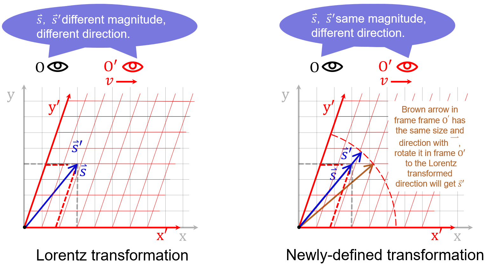

# Introduction
Thomas Relativistic Electronic Structure Calculation (TRESC) is used to compute the electronic structure of non-periodic system in adiabatic approximation,
solving static 2-component DKH2 electronic Hamiltonian of a given molecular.
Current version of program has **NOT** been tested on any test set since it's still under development.
# Program
* fragment contracted Gaussian type orbital in Cartesian coordinate are used as basis set input (.gbs file);
* get initial orbital from Gaussian HF/KS-SCF or .ao2mo file generated by TRESC job earlier;
* calculate relativistic 1e integrals using RI approach(proposed by Hess);
* calculate 2e integrals using Rys Quadrature scheme, use Cauchy-Schwarz integral screening to reduce computation;
* construct Fock matrix via **direct** way, which is time consuming but less demanding on memory and disk r/w;
* integrals are consistent with Gaussian results, and relative energies differ negligibly from Gaussian;
* DIIS(Pulay mixing) can be used to accelerate SCF;
* linear algebra in SCF is computed by subroutine from LAPACK;
* both 1e and 2e integrals support OpenMP parallel computation;
* calculate $$\left< s^2 \right> \left( L\ddot{o}wdin \right)$$, energy components and orbital components;
# Characteristic
## SRTP
Second Relativized Thomas Precession (SRTP) is to conbine the Lorentz vector feature of spin 4-vector $$\left( 0,\vec{s} \right) $$ and the Lorentz scalar feature of the magnitude of its spatial component ($$\hbar /2$$). 'Second Relativized' means the magnitude of spin vector is independent of the reference frame choice.  
To accomplish this, the author carried out a new kinematic and dynamic study of spin 4-vector. We start with a newly-defined reference frame transformation rule, which makes observed $$\vec{s}/s$$ from any frame identical with observed $$\vec{s}/s$$ from corresponding frame under the Lorentz transformation rule, but magnitude $$s$$ always $$\hbar /2$$.    
Assuming that frame O' is moving along the x-axis in frame O, the Lorentz transformation and the newly-defined transformation lead to different observations.  

Its mathematical form can be given directly as a nonlinear equation  
$$\vec{s}\prime=\begin{pmatrix}
	1&		0&		0&		0\\\\
	0&		\left[ 1+\frac{\left( \gamma -1 \right) \beta _{x}^{2}}{\beta ^2} \right] \zeta&		\frac{\left( \gamma -1 \right) \beta _x\beta _y}{\beta ^2}\zeta&		\frac{\left( \gamma -1 \right) \beta _x\beta _z}{\beta ^2}\zeta\\\\
	0&		\frac{\left( \gamma -1 \right) \beta _x\beta _y}{\beta ^2}\zeta&		\left[ 1+\frac{\left( \gamma -1 \right) \beta _{y}^{2}}{\beta ^2} \right] \zeta&		\frac{\left( \gamma -1 \right) \beta _y\beta _z}{\beta ^2}\zeta\\\\
	0&		\frac{\left( \gamma -1 \right) \beta _x\beta _z}{\beta ^2}\zeta&		\frac{\left( \gamma -1 \right) \beta _y\beta _z}{\beta ^2}\zeta&		\left[ 1+\frac{\left( \gamma -1 \right) \beta _{z}^{2}}{\beta ^2} \right] \zeta\\\\
\end{pmatrix} \vec{s}$$
which
$$\zeta =\left( 1+\left( s_x\gamma \beta _x+s_y\gamma \beta _y+s_z\gamma \beta _z \right) ^2 \right) ^{-1/2}$$
This newly-defined transformation is kinematic, but it will change the form of Thomas precession dynamically since Thomas precession is related to the intrinsic property of reference frame transformation.  
After some derivation, the contribution of the Thomas precession to electron energy $$U_{\mathrm{SRTP}}$$ at low speed can be modified as
$$
U_{\mathrm{SRTP}}=\frac{\gamma}{2\beta ^2}\vec{\mathrm{s}}_{\gamma}\cdot \left( \dot{\vec{\beta}}\times \vec{\beta} \right) \frac{\left( \vec{\beta}\cdot \vec{\mathrm{s}} \right) ^2}{s^2\left( 1-\beta ^2 \right) +\left( \vec{\beta}\cdot \vec{\mathrm{s}} \right) ^2}
$$
which $$\mathrm{s}_{\gamma ,i}=\frac{1}{\sqrt{s^2+\gamma ^2\left( \vec{\beta}\cdot \vec{\mathrm{s}} \right) ^2}}\frac{1}{\sqrt{1-\beta _{i}^{2}}}\mathrm{s}_i$$. Then quantization and use the Pauli vector rule yields the modified Dirac matrix 
$$
\alpha =\left( \frac{\left( 1-\beta _{j}^{2} \right) \left( 1-\beta _{k}^{2} \right)}{1-\beta _{i}^{2}} \right) ^{\frac{1}{4}}\left( \begin{matrix}
	&		\sigma _i\\
	\sigma _i&		\\
\end{matrix} \right) 
$$
this formular leads to the modified electron spinor wave function through DKH transformation.  
In addition, SRTP effect is of order $c^{-4}$, one have to consider other terms of order $\geqslant c^{-4}$ before it, including radiation effect. Moreover, the lowest order of SRTP still requires the computation of integrals like $$\langle i|p_{x}^{3}V_{ij}p_y|j\rangle$$, it has a small effect on results but will significantly increases the one-electron integral cost.  
SRTP is currently the author's conjecture with no evidence support, if you're interested, try keyword 'SRTP' when doing DKH2 calculation.
# Upcoming
* support for DFT calculation;
* calculate 2e SOC by SOMF approach;
