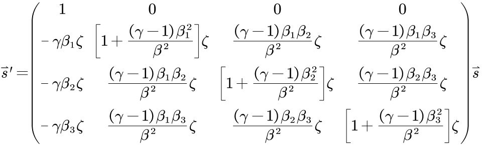
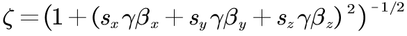
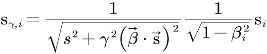
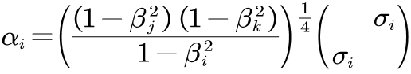

# Introduction
&nbsp;&nbsp;&nbsp;&nbsp;Thomas Relativistic Electronic Structure Calculation (TRESC) is used to calculate the electronic structure of 
non-periodic polyatomic systems in the adiabatic approximation, single-configuration self-consistent field calculation based on the 
static 2-component DKH2 electronic Hamiltonian of a given molecule. 
&nbsp;&nbsp;&nbsp;&nbsp;Current program is still under development.
# Algorithms
* Cartesian or spherical-harmonic fragment contracted Gaussian type orbital are used (input .gbs file);
* Initial guess read from .chk file (by Gaussian HF/KS-SCF) or .ao2mo file (by TRESC job earlier);
* Symmetric orthogonalisation are used by default, canonical orthogonalisation will be used to reduce the linear dependence of basis 
if the threshold is exceeded;
* Relativistic 1e integrals using RI approach (proposed by Hess *et al.*);
* Non-relativistic 2e integrals using Rys quadrature scheme, screening by Cauchy-Schwarz scheme;
* Construct Fock matrix via **direct** way, which is time consuming but less demanding on memory and disk r/w;
* Integrals are consistent with Gaussian program, and relative energies differ negligibly from Gaussian program;
* DIIS(Pulay mixing) can be used to accelerate SCF, dynamic damping can be used to enhance convergence;
* Basic linear algebra is computed using LAPACK subroutines;
* Both 1e and 2e integrals support OpenMP parallel computation;
* Output $$\left< s^2 \right> \left( L\ddot{o}wdin \right)$$, energy components and orbital components;
* Support dispersion correction via DFT-D4 program (stand-alone) developed by Grimme's group;
# Characteristic
## Visualisation of 2-component complex MO
&nbsp;&nbsp;&nbsp;&nbsp;Canonical orbitals will be dumped to a molden format file containing alpha and beta components with keyword `molden`. 
With it, one can generate Gaussian cube format file for any orbital and use `/scripts/2cvis.py` to visualize it in `mayavi`. 
&nbsp;&nbsp;&nbsp;&nbsp;The results are as follows:  

  

&nbsp;&nbsp;&nbsp;&nbsp;It's the HOMO of the triplet carbene $$\mathrm{CH}_2$$, phase deviation from $$\pm {{\mathrm{\pi}}\Bigg/{2}}$$ 
implies a stronger SOC effect, the plotted results agree with the fact that SOC intensity is proportional to $${{1}\Bigg/{\mathrm{r}^3}}$$ approximately.
## A special Hamiltonian: SRTP
&nbsp;&nbsp;&nbsp;&nbsp;Second Relativized Thomas Precession (SRTP) is to conbine the Lorentz vector feature of spin 4-vector 
$$\left( 0,\vec{s} \right) $$ and the Lorentz scalar feature of the magnitude of its spatial components ($$\left| \vec{s} \right|=\hbar /2$$). 
'Second Relativized' means the magnitude of spin vector is independent of the reference frame choice. 
&nbsp;&nbsp;&nbsp;&nbsp;To accomplish it, we start with a newly-defined reference frame transformation rule, which makes the observed $$\vec{s}/s$$ 
from any frame identical with the observed $$\vec{s}/s$$ from corresponding frame under the Lorentz transformation rule, but magnitude $$s$$ always $$\hbar /2$$. 
&nbsp;&nbsp;&nbsp;&nbsp;Assuming that frame O' is moving along the x-axis in frame O, the Lorentz transformation and the newly-defined transformation 
lead to different observations. 

  

&nbsp;&nbsp;&nbsp;&nbsp;Its mathematical form can be given directly as a nonlinear equation 

  

&nbsp;&nbsp;&nbsp;&nbsp;which $$s_i$$ represent spin components and $$\beta _i$$ represent velocity components, $$\gamma $$ represent Lorentz factor and 

  

&nbsp;&nbsp;&nbsp;&nbsp;This newly-defined transformation is kinematic, but it will change the form of Thomas precession dynamically since Thomas precession is 
related to the intrinsic property of reference frame transformation. 
&nbsp;&nbsp;&nbsp;&nbsp;After some derivation, the contribution of the Thomas precession to electron energy at low speed can be modified as 

  

&nbsp;&nbsp;&nbsp;&nbsp;which 

  

 
&nbsp;&nbsp;&nbsp;&nbsp;Then quantization and use the Pauli vector rule yields the modified Dirac matrix 

  

 
&nbsp;&nbsp;&nbsp;&nbsp;This formular leads to the modified electron spinor wave function through DKH transformation. 
&nbsp;&nbsp;&nbsp;&nbsp;In addition, SRTP effect is of order $$c^{-4}$$, one have to consider other terms of order $$\geqslant c^{-4}$$ before it, including 
radiation effect. Moreover, the lowest order of SRTP still requires the computation of integrals like $$\langle i|p_{x}^{3}V_{ij}p_y|j\rangle$$, it has a small 
effect on results but will significantly increases the one-electron integral cost. 
&nbsp;&nbsp;&nbsp;&nbsp;SRTP is currently has no evidence support, if you're interested, try keyword `SRTP` when performing DKH2 calculation. 
# Upcoming
* support for DFT calculation;
* calculate 2e SOC by SOMF approach;
