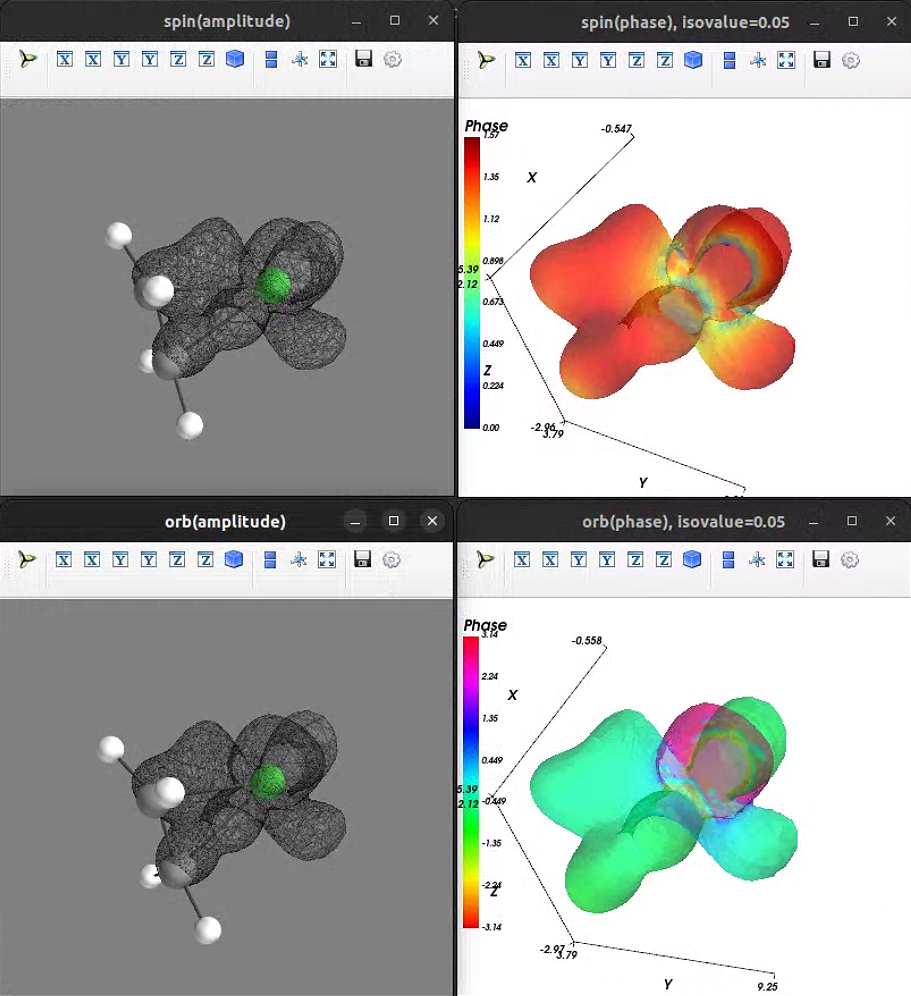
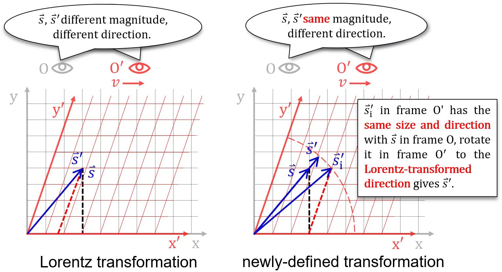
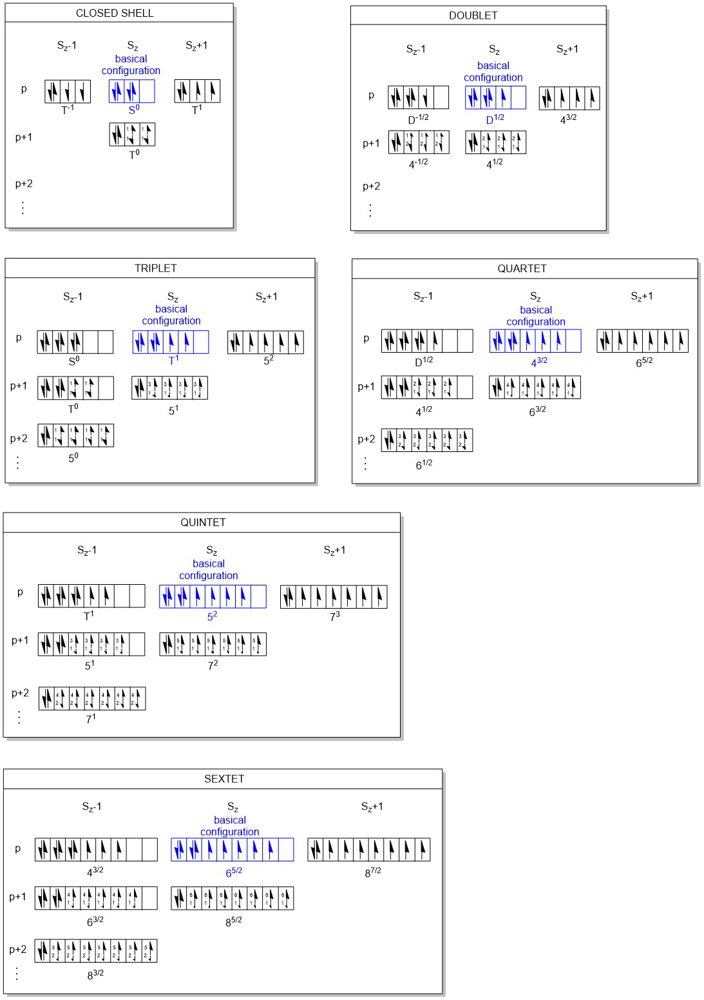

# Introduction

&nbsp;&nbsp;&nbsp;&nbsp;Thomas Relativistic Electronic Structure Calculation
(TRESC) is used to calculate the electronic structure of non-periodic polyatomic
systems under the Born-Oppenheimer approximation, it's developed to do
all-electron single-configuration self-consistent field calculation based on the
static 2-component DKH2 electronic Hamiltonian of a given molecule. 
&nbsp;&nbsp;&nbsp;&nbsp;The main part of the code is written in Fortran 2008
free format.

# Algorithms

* Spherical-harmonic fragment-contracted Gaussian type orbital.
* Initial guess load from Molden input file (generated by other programs, same
or different basis) or .ao2mo binary file (generated by TRESC HF/KS-SCF earlier,
same basis).
* Symmetric orthogonalisation of overlap matrix by default, canonical
orthogonalisation will be used if basis linear dependence reaches the threshold.
* Relativistic spinor integrals based on optimal-parametrized 2nd order Douglas-
Kroll-Hess transformation proposed by Hess *et al.*, including DKH2 1e-integrals
and DKH2 2e-integrals.
* Gaussian finite nucleus model is considered in DKH2 1e-integrals, affecting
the integral values of $$\left<V\right>, \left<pVp\right>, \left<pppVp\right>$$.
* DKH2 2e-integrals are calculated to the order $$c^{-2}$$ by the Rys quadrature
scheme; leveraging permutation symmetry and the Cauchy-Schwarz screening
technique.
* Construct Fock matrix via **direct** way, which is time consuming but less
demanding on memory and disk r&w.
* Non-relativistic integrals are consistent with the Gaussian program.
* Grid integration are based on the Becke's fuzzy partitioning, the
exchange-correlation energy and the partial derivative terms of the
exchange-correlation potential are obtained by external library Libxc.
* Support for KS-DFT functionals: LDA functionals, GGA functionals and hybrid
functionals, the results of non-relativistic calculation differ negligibly from
the Gaussian program.
* 2c-SCF causes mixing between alpha and beta orbitals, sometimes we want this
mixing as little as possible (maintaining the initial spin state as much as
possible); in this case, should try `cspin=f` or `cspin=d` (the latter is for
nearly degenerate frontier orbitals), but these methods may cause variational
instability, so be sure to check the convergence of the last few SCF loops.
* DIIS (Pulay mixing) can be used to accelerate SCF, dynamic damping can be used
to enhance convergence.
* Basic linear algebra is computed using LAPACK subroutines.
* 1e and 2e Fock matices construction and grid-based integration support OpenMP
parallel computation and all parallel zone are thread safe.
* Outprint $$\left< s^2 \right> \left( L\ddot{o}wdin \right)$$, energy and
orbital components.
* Support dispersion correction via DFT-D4 program (stand-alone) developed by
Grimme's group.

> For mathematical and algorithmic details, see
`docs/Mathematics_and_Algorithms.pdf`.

# Characteristic

## Visualisation of complex spinor MOs

&nbsp;&nbsp;&nbsp;&nbsp;vis2c is a python package for visualising spinor
(and scalar) molecular orbitals. When TRESC finishes its 2c-SCF calculation,
canonical orbitals will be dumped to `jobname.molden.d`. With it, one can
launch python and use `cub2c` function to generate 2 Gaussian cube format files
(contain grid data of real and imaginary part of alpha and beta components of
selected orbital) and then visualise the selected orbital based on grid data
automatically. The visualisation are as follows: 

  
   
  <em>HOMO-5 of triplet [Ni-C2H4]</em>

&nbsp;&nbsp;&nbsp;&nbsp;The visualisation shows spin phase and orbital phase,
variance in spin phase reflects the strength of spin-orbit coupling (SOC) of the
selected orbital. `examples/` contains spinor orbitals of some molecule, these
results agree with the fact that orbital with more nodal surfaces in regions
near heavy atoms exhibit stronger SOC and are more likely to spin flipping. 
&nbsp;&nbsp;&nbsp;&nbsp;Gaussian cube file records structured grid data, which
is efficient for post-processing and visualisation. However, if the amplitude
of the small component of selected orbital is too small($$<10^{-3}$$), the
isosurface will not be plotted with sufficient accuracy. To solve this problem,
vis2c allows visualisation based on unstructured data (Becke's fuzzy grid).
With the `jobname.molden.d` generated by TRESC, one can use `mog2c` function to
visualise based on series of Becke grid data generated via `tshell -mog2c`. 
&nbsp;&nbsp;&nbsp;&nbsp;Both structured and unstructured grid points can be set
in `$TRESC/settings.ini`. 
> When visualizing spinor orbitals, it is required to set
the motion of the molecule, which will affect the observations of the spatial
and spin portions of the orbital, although for the general case molecule move
at speed much lower than relativistic speed then reference frame effect
are negligible.

## A special Hamiltonian: SRTP

&nbsp;&nbsp;&nbsp;&nbsp;Second Relativized Thomas Precession (SRTP) is to
conbine the Lorentz vector feature of spin 4-vector
$$\left( 0,\vec{s} \right) $$ and the Lorentz scalar feature of the magnitude of
its spatial components ($$s=\hbar /2$$).
'Second Relativized' means the magnitude of spin vector is independent of the
reference frame choice. 
&nbsp;&nbsp;&nbsp;&nbsp;To accomplish it, we start with a newly-defined
reference frame transformation rule, which makes the observed $$\vec{s}/s$$
from any frame identical with the observed $$\vec{s}/s$$ from corresponding
frame under the Lorentz transformation rule, but magnitude $$s$$ always
$$\hbar /2$$. 
&nbsp;&nbsp;&nbsp;&nbsp;Assuming that frame O' is moving along the x-axis in
frame O, the Lorentz transformation and the newly-defined transformation
lead to different observation. 

 
<em>observation of Lorentz transformation and newly-defined transformation</em>

&nbsp;&nbsp;&nbsp;&nbsp;Its mathematical form can be given directly as a
nonlinear equation 

$$
\left( \begin{array}{c}
 0\\
 s_1\prime\\
 s_2\prime\\
 s_3\prime\\
\end{array} \right) =\left( \begin{matrix}
 1&  0&  0&  0\\
 -\gamma \beta _1\zeta&  \left[ 1+\frac{\left( \gamma -1 \right) \beta _{1}^{2}}
 {\beta ^2} \right] \zeta&  \frac{\left( \gamma -1 \right) \beta _1\beta _2}
 {\beta ^2}\zeta&  \frac{\left( \gamma -1 \right) \beta _1\beta _3}{\beta ^2}
 \zeta\\
 -\gamma \beta _2\zeta&  \frac{\left( \gamma -1 \right) \beta _1\beta _2}
 {\beta ^2}\zeta&  \left[ 1+\frac{\left( \gamma -1 \right) \beta _{2}^{2}}
 {\beta ^2} \right] \zeta&  \frac{\left( \gamma -1 \right) \beta _2\beta _3}
 {\beta ^2}\zeta\\
 -\gamma \beta _3\zeta&  \frac{\left( \gamma -1 \right) \beta _1\beta _3}
 {\beta ^2}\zeta&  \frac{\left( \gamma -1 \right) \beta _2\beta _3}{\beta ^2}
 \zeta&  \left[ 1+\frac{\left( \gamma -1 \right) \beta _{3}^{2}}{\beta ^2}
\right] \zeta\\
\end{matrix} \right) \left( \begin{array}{c}
 0\\
 s_1\\
 s_2\\
 s_3\\
\end{array} \right)
$$

&nbsp;&nbsp;&nbsp;&nbsp;which $$s_i$$ represent spin components and $$\beta _i$$
represent velocity components, $$\gamma$$ represent Lorentz factor and 

$$
\zeta =\left( 1+\gamma ^2\left( \vec{\beta}\cdot \frac{\vec{s}}{s}
\right) ^2 \right) ^{-1/2}
$$

&nbsp;&nbsp;&nbsp;&nbsp;This newly-defined transformation is kinematic, but it
will change the form of Thomas precession dynamically since Thomas precession is
related to the intrinsic property of reference frame transformation. 
&nbsp;&nbsp;&nbsp;&nbsp;After some derivation, the contribution of the Thomas
precession to electron energy at low speed can be represented as 

$$
H_{\mathrm{SRTP}}=\frac{1}{2}\vec{s}_{\gamma}\cdot
\left( \dot{\vec{\beta}}\times \vec{\beta} \right)
$$

&nbsp;&nbsp;&nbsp;&nbsp;which 

$$
s_{\gamma ,i}=\frac{1}{\sqrt{1-\beta _i^{2}}}s_i
$$

&nbsp;&nbsp;&nbsp;&nbsp;Then quantization and use Pauli vector rule to modify
Dirac matrices as 

$$
\alpha _i=\left( \frac{\left( 1-\beta _{j}^{2} \right)\left( 1-\beta _{k}^{2}
\right)}{1-\beta _{i}^{2}} \right) ^{\frac{1}{4}}\left( \begin{matrix}
 &  \sigma _i\\
 \sigma _i&  \\
\end{matrix} \right)
$$

&nbsp;&nbsp;&nbsp;&nbsp;This formular leads to the modified electron spinor wave
function through DKH transformation. 
&nbsp;&nbsp;&nbsp;&nbsp;In addition, SRTP effect is of order $$c^{-4}$$, one
have to consider other terms of order $$\geqslant c^{-4}$$ before it, including
radiation effect. Moreover, the lowest order of SRTP still requires the
computation of integrals like $$\langle i|p_{x}^{3}V_{ij}p_y|j\rangle$$, it has
a small effect on results but will significantly increases the one-electron
integral cost. 
&nbsp;&nbsp;&nbsp;&nbsp;SRTP is currently has no evidence support, if you're
interested, try keyword `SRTP` when performing DKH2 calculation. 

## Analyses for spinor states

### Decomposition to spin-pure states

&nbsp;&nbsp;&nbsp;&nbsp;Spin-pure states can be obtained from spinor states by
rotation group integration:

$$
\langle \varPsi |P_{MM}^{S}|\varPsi \rangle =\frac{2S+1}{8\pi ^2}
\int{\mathrm{d}\varOmega}D_{MM}^{S*}\left( \varOmega \right) \langle \varPsi |
R\left( \varOmega \right) |\varPsi \rangle
$$

&nbsp;&nbsp;&nbsp;&nbsp;Where $$|\psi \rangle$$ is the spinor state of the
system, $$D_{MM}^{S}$$ is the Wigner D-matrix, and $$R$$ is the SU(2) rotation
matrix. After finish 2c-SCF, will search $$|S,M\rangle$$ based on Wigner-Eckart
theorem and calculate their contributions to the spinor state.

  
   
  <em>Spin-pure states contributions</em>

### A measure of Time-Reversal Symmetry(TRS) breaking

&nbsp;&nbsp;&nbsp;&nbsp;After finish 2c-SCF, the $$\kappa$$ parameter is
calculated by:

$$
\kappa =\left\| MM^*+I_N \right\|
$$

&nbsp;&nbsp;&nbsp;&nbsp;Where N is the number of electrons, M is an N*N matrix,
calculated by:

$$
M_{ij}=\langle \phi _i|-i\sigma_y|\phi _j\rangle
$$

&nbsp;&nbsp;&nbsp;&nbsp;Where $$|\phi _i\rangle$$ denotes the i-th occupied
orbital. The deviation of $$\kappa$$ from 0 reflects the deviation of the system
from TRS. For scalar single-configuration wave function, the reference value of
kappa is $$\sqrt{N_{\alpha}-N_{\beta}}$$; deviation from this value in 2c-SCF
calculation reflects the deviation of the system from TRS caused by
SOC, which is closely related to the zero-field split of the system.

# Build

> If AVX2 / AVX512 instruction set is supported, please modify the compilation
options and compiler directives (e.g. align_size) manually. 
> If DFT-D4 dispersion correction is involved, make sure you have install
[DFT-D4](https://dftd4.readthedocs.io/en/latest/recipe/installation.html).

## Linux (Debian as example)

1. Deploy build tools by root or sudo user: 
`sudo apt install ninja-build` 
`sudo apt install cmake` 
2. Install [Intel oneAPI HPC Toolkit](
https://www.intel.com/content/www/us/en/developer/tools/oneapi/toolkits.html),
and append the following to `~/.bashrc`: 
`export ONEAPI_ROOT="/path/to/oneapi"` 
`export PATH="$ONEAPI_ROOT/compiler/latest/bin:$PATH"` 
`source $ONEAPI_ROOT/compiler/latest/env/vars.sh` 
`source $ONEAPI_ROOT/mkl/latest/env/vars.sh` 
`source $ONEAPI_ROOT/mpi/latest/env/vars.sh` 
3. Download the stable release of [Libxc](
https://libxc.gitlab.io/download/) and build it by: 
`cmake -S. -B./build -G "Ninja" -DCMAKE_BUILD_TYPE=Release -DENABLE_FORTRAN=ON
-DBUILD_TESTING=OFF -DBUILD_FPIC=ON
-DCMAKE_Fortran_COMPILER="${ONEAPI_ROOT}/compiler/latest/bin/ifx"
-DCMAKE_C_COMPILER="${ONEAPI_ROOT}/compiler/latest/bin/icx"
-DCMAKE_BUILD_WITH_INSTALL_RPATH=ON
-DCMAKE_C_FLAGS="${CMAKE_C_FLAGS} -O3 -xCORE-AVX2"` 
then 
`cd build && ninja` 
append to `~/.bashrc` after a successful build: 
`export LIBXC_ROOT="/path/to/libxc"`
4. Change directory to TRESC root and build it by: 
`cmake -B build/release -G Ninja -DCMAKE_BUILD_TYPE=Release` 
then 
`cmake --build build/release` 
`chmod +x tshell.sh && cp tshell.sh build` 
append to `~/.bashrc` when everything is done: 
`export TRESC="/path/to/TRESC"` 
`export PATH="$TRESC/build:$PATH` 

# Upcoming

* perturbation calculation;
