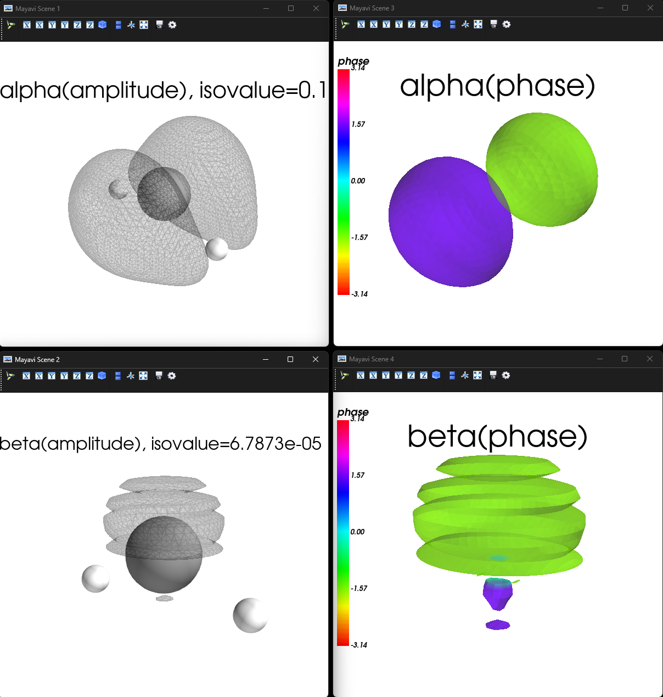
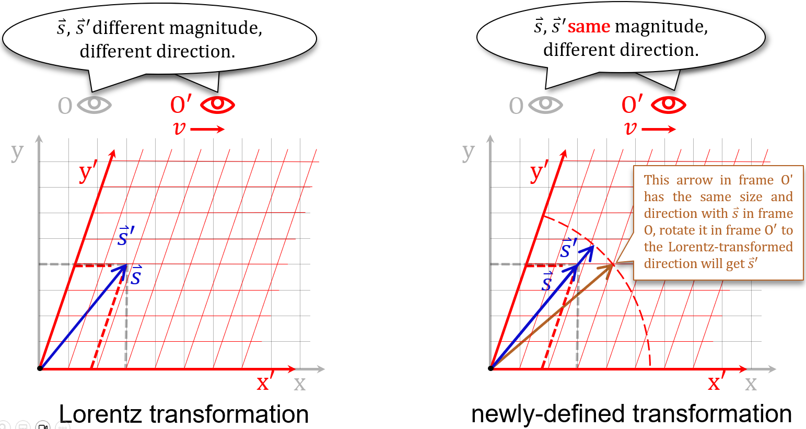

# Introduction

&nbsp;&nbsp;&nbsp;&nbsp;Thomas Relativistic Electronic Structure Calculation
(TRESC) is used to calculate the electronic structure of non-periodic polyatomic
systems under the Born-Oppenheimer approximation, it's designed to do
all-electron single-configuration self-consistent field calculation based on the
static 2-component DKH2 electronic Hamiltonian of a given molecule.<br>
&nbsp;&nbsp;&nbsp;&nbsp;The main part of the code is written in Fortran 2008
free format.

# Algorithms

* Cartesian or spherical-harmonic fragment contracted Gaussian type orbital are
used (input .gbs file).
* Initial guess read from .chk file (generated by Gaussian HF/KS-SCF) or .ao2mo
file (generated by TRESC HF/KS-SCF earlier).
* Symmetric orthogonalisation are used by default, canonical orthogonalisation
will be used to reduce linear dependence of basis if the threshold is exceeded.
* Relativistic 1e integrals using optimal parametrized Douglas-Kroll
transformation transformation proposed by Hess *et al.*.
* Non-relativistic 2e integrals (including HF Coloumb integrals and HF exchange
integrals) using Rys quadrature scheme, screening by Cauchy-Schwarz scheme.
* Construct Fock matrix via **direct** way, which is time consuming but less
demanding on memory and disk r/w.
* Integrals are consistent with the Gaussian program, and relative energies
differ negligibly from the Gaussian program.
* Kohn-Sham grid-based integration are based on Becke's fuzzy partitioning, the
exchange-correlation energy and the partial derivative terms of the
exchange-correlation potential are obtained by external library libxc.
* Support for density functional calculation: LDA functionals, GGA functionals
and hybrid functionals, the results of non-relativistic calculation differ
negligibly from the Gaussian program
* If the frontier orbitals are (nearly) degenerate, 2c-SCF results may deviate
from initial spin states due to the mixing of alpha and beta orbitals in
degenerate space, try keyword `keepspin` to avoid deviations as possible.
* DIIS(Pulay mixing) can be used to accelerate SCF, dynamic damping can be used
to enhance convergence.
* Basic linear algebra is computed using LAPACK subroutines.
* 1e and 2e Fock matix construction and Kohn-Sham grid-based integration support
OpenMP parallel computation and all parallel zone are thread safe.
* Outprint $$\left< s^2 \right> \left( L\ddot{o}wdin \right)$$, energy and
orbital components.
* Support dispersion correction via DFT-D4 program (stand-alone) developed by
Grimme's group.

# Characteristic

## Visualisation of 2-component complex MO

&nbsp;&nbsp;&nbsp;&nbsp;`vis2c` is a python package for visualising 2-component
(and scalar) molecular orbitals. When TRESC finishes its 2c-SCF calculation,
canonical orbitals will be dumped to 2 molden input files. With it, one can
launch python and use `cub2c` function to generate 2 Gaussian cube format files
(contain grid data of real and imaginary part of alpha and beta components of
selected orbital) and then visualise the selected orbital based on grid data
automatically. The visualisation are as follows:<br>
<p align="center">
  
  <br>
  <em>_Fig.1_</em>
</p>

&nbsp;&nbsp;&nbsp;&nbsp;It's the HOMO of the triplet carbene $$\mathrm{CH}_2$$,
phase deviation from $$\pm {{\mathrm{\pi}}\Bigg/{2}}$$ implies a stronger SOC
effect, the plotted results agree with the fact that SOC intensity is
proportional to $${{1}\Bigg/{\mathrm{r}^3}}$$ approximately.<br>
&nbsp;&nbsp;&nbsp;&nbsp;The cube file records uniformly structured grid data,
it's efficient for post-processing and visualisation. However, if the amplitude
of the small component of the selected orbital is small ($$<10^{-3}$$), the
isosurface will not be plotted with sufficient accuracy, resulting in poor
visualisation (e.g. the beta component in Fig.1).<br>
&nbsp;&nbsp;&nbsp;&nbsp;To solve this problem, vis2c allows loading unstructured
grid data (Becke's fuzzy delineated grid data). With the molden input files
generated by TRESC, one can launch python and use `mog2c` function to generate a
series of Becke grid data binary files (via `TRESC -v`), and then visualise the
selected orbital based on grid data automatically. In the case of the triplet
carbine, the Becke's grid data set is less than one-tenth of the uniformly
structured grid data set, but the visualisation is superior:<br>
<p align="center">
  
  <br>
  <em>_Fig.2_</em>
</p>

&nbsp;&nbsp;&nbsp;&nbsp;If necessary, one can modify the code of the subroutine
`mogrid_becke()` in module `Representation`, which produces Becke‘s grid data to
produce more grid points for specific atomic regions.<br>

```Fortran
  if (molecular(ii)%atom_number <= 2) then
    nr = 35
    nl = 230
  else if (molecular(ii)%atom_number <= 10) then
    nr = 65
    nl = 434
  else if (molecular(ii)%atom_number <= 18) then
    nr = 80
    nl = 434
  else
    nr = 100
    nl = 434
  end if
```

## A special Hamiltonian: SRTP

&nbsp;&nbsp;&nbsp;&nbsp;Second Relativized Thomas Precession (SRTP) is to
conbine the Lorentz vector feature of spin 4-vector
$$\left( 0,\vec{s} \right) $$ and the Lorentz scalar feature of the magnitude of
its spatial components ($$s=\hbar /2$$).
'Second Relativized' means the magnitude of spin vector is independent of the
reference frame choice.<br>
&nbsp;&nbsp;&nbsp;&nbsp;To accomplish it, we start with a newly-defined
reference frame transformation rule, which makes the observed $$\vec{s}/s$$
from any frame identical with the observed $$\vec{s}/s$$ from corresponding
frame under the Lorentz transformation rule, but magnitude $$s$$ always
$$\hbar /2$$.<br>
&nbsp;&nbsp;&nbsp;&nbsp;Assuming that frame O' is moving along the x-axis in
frame O, the Lorentz transformation and the newly-defined transformation
lead to different observations.<br>
<p align="center">
  
  <br>
  <em>_Fig.3_</em>
</p>

&nbsp;&nbsp;&nbsp;&nbsp;Its mathematical form can be given directly as a
nonlinear equation<br>

$$
\left( \begin{array}{c}
 0\\
 s_1\prime\\
 s_2\prime\\
 s_3\prime\\
\end{array} \right) =\left( \begin{matrix}
 1&  0&  0&  0\\
 -\gamma \beta _1\zeta&  \left[ 1+\frac{\left( \gamma -1 \right) \beta _{1}^{2}}
 {\beta ^2} \right] \zeta&  \frac{\left( \gamma -1 \right) \beta _1\beta _2}
 {\beta ^2}\zeta&  \frac{\left( \gamma -1 \right) \beta _1\beta _3}{\beta ^2}
 \zeta\\
 -\gamma \beta _2\zeta&  \frac{\left( \gamma -1 \right) \beta _1\beta _2}
 {\beta ^2}\zeta&  \left[ 1+\frac{\left( \gamma -1 \right) \beta _{2}^{2}}
 {\beta ^2} \right] \zeta&  \frac{\left( \gamma -1 \right) \beta _2\beta _3}
 {\beta ^2}\zeta\\
 -\gamma \beta _3\zeta&  \frac{\left( \gamma -1 \right) \beta _1\beta _3}
 {\beta ^2}\zeta&  \frac{\left( \gamma -1 \right) \beta _2\beta _3}{\beta ^2}
 \zeta&  \left[ 1+\frac{\left( \gamma -1 \right) \beta _{3}^{2}}{\beta ^2}
\right] \zeta\\
\end{matrix} \right) \left( \begin{array}{c}
 0\\
 s_1\\
 s_2\\
 s_3\\
\end{array} \right)
$$

&nbsp;&nbsp;&nbsp;&nbsp;which $$s_i$$
represent spin components and
$$\beta _i$$
represent velocity components,
$$\gamma$$
represent Lorentz factor
and<br>

$$
\zeta =\sqrt{1+\gamma ^2\beta ^2s^2}
$$

&nbsp;&nbsp;&nbsp;&nbsp;This newly-defined transformation is kinematic, but it
will change the form of Thomas precession dynamically since Thomas precession is
related to the intrinsic property of reference frame transformation.<br>
&nbsp;&nbsp;&nbsp;&nbsp;After some derivation, the contribution of the Thomas
precession to electron energy at low speed can be represented as<br>

$$
H_{\mathrm{SRTP}}=\frac{1}{2}\vec{s}_{\gamma}\cdot
\left( \dot{\vec{\beta}}\times \vec{\beta} \right)
$$

&nbsp;&nbsp;&nbsp;&nbsp;which<br>

$$
s_{\gamma ,i}=\frac{1}{\sqrt{1-\beta _i^{2}}}s_i
$$

&nbsp;&nbsp;&nbsp;&nbsp;Then quantization and use Pauli vector rule to modify
Dirac matrices as<br>

$$
\alpha _i=\left( \frac{\left( 1-\beta _{j}^{2} \right)\left( 1-\beta _{k}^{2}
\right)}{1-\beta _{i}^{2}} \right) ^{\frac{1}{4}}\left( \begin{matrix}
 &  \sigma _i\\
 \sigma _i&  \\
\end{matrix} \right)
$$

&nbsp;&nbsp;&nbsp;&nbsp;This formular leads to the modified electron spinor wave
 function through DKH transformation.<br>
&nbsp;&nbsp;&nbsp;&nbsp;In addition, SRTP effect is of order $$c^{-4}$$, one
have to consider other terms of order $$\geqslant c^{-4}$$ before it, including
radiation effect. Moreover, the lowest order of SRTP still requires the
computation of integrals like $$\langle i|p_{x}^{3}V_{ij}p_y|j\rangle$$, it has
a small effect on results but will significantly increases the one-electron
integral cost.<br>
&nbsp;&nbsp;&nbsp;&nbsp;SRTP is currently has no evidence support, if you're
interested, try keyword `SRTP` when performing DKH2 calculation.<br>

# Upcoming

* perturbation calculation;
* calculate 2e SOC by SOMF approach;
