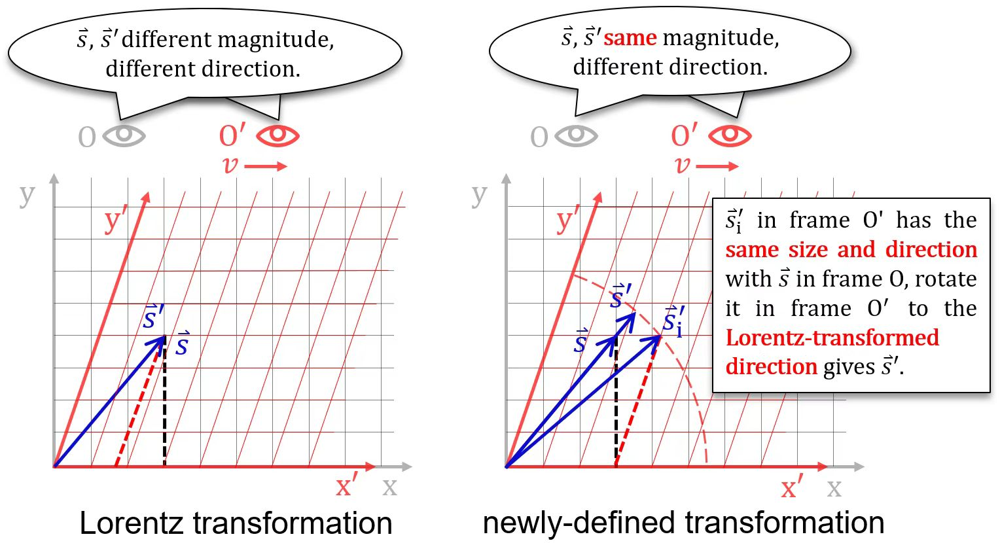
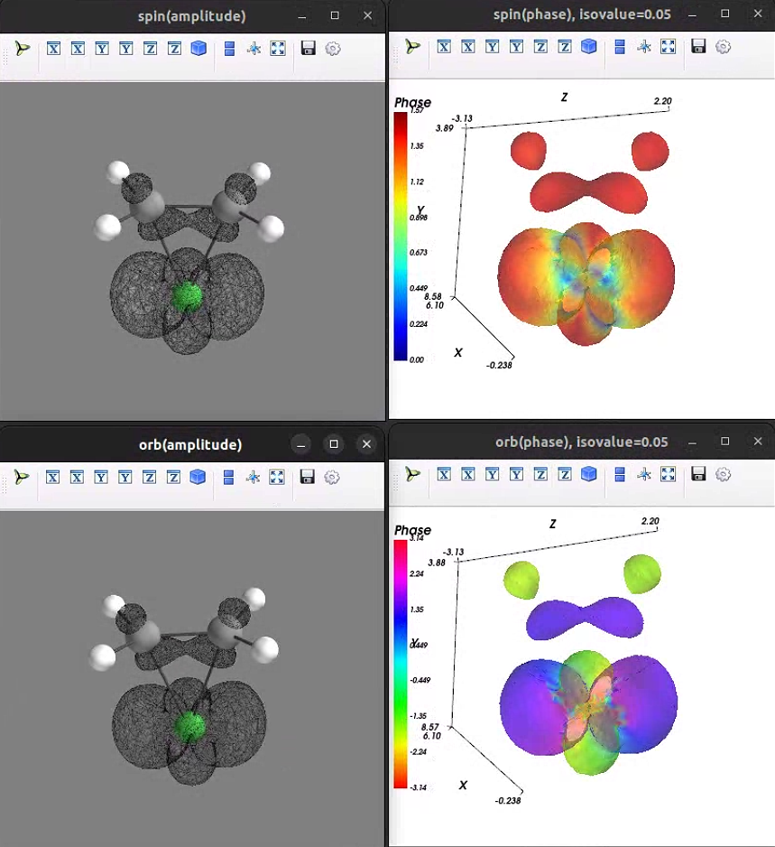
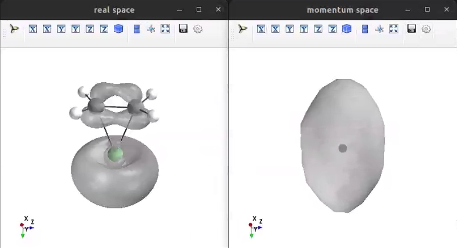

# Introduction

&nbsp;&nbsp;&nbsp;&nbsp;Thomas Relativistic Electronic Structure Calculation
(TRESC) is developed to calculate the electronic structure of non-periodic
polyatomic systems under the Born-Oppenheimer approximation, it supports
Hartree-Fock/Kohn-Sham self-consistent field (HF/KS-SCF) calculation based on
2-component DKH2 Hamiltonian (2c-Hamiltonian) of a given molecule.<br>
&nbsp;&nbsp;&nbsp;&nbsp;The main part of the code is written in Fortran 2008
free format.

# Algorithms

* HF/KS-SCF calculation is based on spherical-harmonic fragment-contracted
Gaussian type orbital.
* Initial guess load from MOLDEN format file (generated by other programs, same
or different basis set) or .ao2mo binary file (generated by TRESC HF/KS-SCF
earlier, same basis set).
* All potential integrals are computed using the Obara-Saika scheme
(2e-integrals can be switched to the Rys Quadrature scheme), and all
2e-integrals are handled using PRISM.
* Symmetric orthogonalisation of overlap matrix by default, canonical
orthogonalisation will be used if basis linear dependence reaches the threshold.
* Relativistic spinor integrals based on optimal-parametrized 2nd order Douglas-
Kroll-Hess(DKH2) transformation proposed by Hess *et al.*, including DKH2
1e-integrals and DKH2 2e-integrals.
* DKH2 1e-integrals are calculated to the order $$c^{-4}$$, which contains
scalar realativistic terms and one-electron spin-orbit coupling terms; Gaussian
finite nucleus model is considered, affecting the integral value of
$$\left<V\right>,\left<pVp\right>, \left<pppVp\right>$$.
* DKH2 2e-integrals are calculated to the order $$c^{-2}$$, which contains
realativistic Coulomb, Exchange terms and so-called spin-same-orbit coupling
terms; all four-center integrals utilize permutation symmetry and Cauchy-Schwarz
screening technique. When the RMSDP is sufficiently small, the effect of density
matrix will be considered in screening as: $$P_{\max}\sqrt{\left( \mu \nu |\mu
\nu \right) \left(\sigma \lambda |\sigma \lambda \right)} \leq threshold$$.
Similar algorithm has been employed in the CP2K program.
* Construct Fock matrix via **direct** way, which is time consuming but less
demanding on memory and disk r&w.
* Grid integration are based on the Becke's fuzzy partitioning, the
exchange-correlation energy and the partial derivative terms of the
exchange-correlation potential are obtained by external library Libxc.
* Support for density functionals: (hybrid) LDAs, (hybrid) GGAs and (hybrid)
meta-GGAs excluding long-range corrected functionals and non-local
correlation, the results of non-relativistic calculation differ negligibly from
the Psi4 program.
* 2c-Hamiltonian causes mixing between alpha and beta orbitals, sometimes we
want this mixing as little as possible (maintaining the initial spin state as
much as possible); in this case, should try `cspin=f` or `cspin=d` (the latter
is for nearly degenerate frontier orbitals), but these methods may cause
variational instability, so be sure to check the convergence of the last few
iterations.
* DIIS (Pulay mixing), dynamic damping, virtual orbital level shifting can be
used to facilitate HF/KS-SCF process.
* Basic linear algebra is computed using LAPACK subroutines.
* 1e and 2e Fock matices construction and grid-based integration support OpenMP
parallel computation and all parallel zone are thread safe.
* Outprint $$\left< s^2 \right> \left( L\ddot{o}wdin \right)$$, energy and
orbital components.
* Support dispersion correction via DFT-D4 program (stand-alone) developed by
Grimme's group.

> For mathematical and algorithmic details, see
`docs/Mathematics_and_Algorithms.pdf`.

# Characteristic

## A special Hamiltonian: SRTP

&nbsp;&nbsp;&nbsp;&nbsp;Second Relativized Thomas Precession (SRTP) is to
conbine the Lorentz vector feature of the spin 4-vector
$$\left(0,\vec{s}\right)$$ and the Lorentz scalar feature of the magnitude of
its spatial components ($$s=\hbar/2$$). 'Second Relativized' means the magnitude
of spin vector is independent of the reference frame choice.<br>
&nbsp;&nbsp;&nbsp;&nbsp;To accomplish it, we start with a newly-defined
reference frame transformation rule, which makes the observed $$\vec{s}/s$$
from any frame identical with the observed $$\vec{s}/s$$ from corresponding
frame under the Lorentz transformation rule, but magnitude $$s$$ always
$$\hbar /2$$.<br>
&nbsp;&nbsp;&nbsp;&nbsp;Assuming that frame O' is moving along the x-axis in
frame O, the Lorentz transformation and the newly-defined transformation
lead to different observation.<br>
<p align="center">

<br>
<em>observation of Lorentz transformation and newly-defined transformation</em>
</p>

&nbsp;&nbsp;&nbsp;&nbsp;Its mathematical form can be given directly as a
nonlinear equation<br>

$$
\left( \begin{array}{c}
 0\\
 s_1\prime\\
 s_2\prime\\
 s_3\prime\\
\end{array} \right) =\left( \begin{matrix}
 1&  0&  0&  0\\
 -\gamma \beta _1\zeta&  \left[ 1+\frac{\left( \gamma -1 \right) \beta _{1}^{2}}
 {\beta ^2} \right] \zeta&  \frac{\left( \gamma -1 \right) \beta _1\beta _2}
 {\beta ^2}\zeta&  \frac{\left( \gamma -1 \right) \beta _1\beta _3}{\beta ^2}
 \zeta\\
 -\gamma \beta _2\zeta&  \frac{\left( \gamma -1 \right) \beta _1\beta _2}
 {\beta ^2}\zeta&  \left[ 1+\frac{\left( \gamma -1 \right) \beta _{2}^{2}}
 {\beta ^2} \right] \zeta&  \frac{\left( \gamma -1 \right) \beta _2\beta _3}
 {\beta ^2}\zeta\\
 -\gamma \beta _3\zeta&  \frac{\left( \gamma -1 \right) \beta _1\beta _3}
 {\beta ^2}\zeta&  \frac{\left( \gamma -1 \right) \beta _2\beta _3}{\beta ^2}
 \zeta&  \left[ 1+\frac{\left( \gamma -1 \right) \beta _{3}^{2}}{\beta ^2}
\right] \zeta\\
\end{matrix} \right) \left( \begin{array}{c}
 0\\
 s_1\\
 s_2\\
 s_3\\
\end{array} \right)
$$

&nbsp;&nbsp;&nbsp;&nbsp;where $$s_i$$ represent spin components and $$\beta _i$$
represent velocity components, $$\gamma$$ represent Lorentz factor and<br>

$$
\zeta =\left( 1+\gamma ^2\left( \vec{\beta}\cdot \frac{\vec{s}}{s}
\right) ^2 \right) ^{-1/2}
$$

&nbsp;&nbsp;&nbsp;&nbsp;This newly-defined transformation is kinematic, but it
will change the form of Thomas precession dynamically since Thomas precession is
related to the intrinsic property of reference frame transformation.<br>
&nbsp;&nbsp;&nbsp;&nbsp;After some derivation, the contribution of the Thomas
precession to electron energy at low speed can be represented as<br>

$$
H_{\mathrm{SRTP}}=\frac{1}{2}\vec{s}_{\gamma}\cdot
\left( \dot{\vec{\beta}}\times \vec{\beta} \right)
$$

&nbsp;&nbsp;&nbsp;&nbsp;where<br>

$$
s_{\gamma ,i}=\frac{1}{\sqrt{1-\beta _i^{2}}}s_i
$$

&nbsp;&nbsp;&nbsp;&nbsp;Then quantization and use Pauli vector rule to modify
Dirac matrices as<br>

$$
\alpha _i=\left( \frac{\left( 1-\beta _{j}^{2} \right)\left( 1-\beta _{k}^{2}
\right)}{1-\beta _{i}^{2}} \right) ^{\frac{1}{4}}\left( \begin{matrix}
 &  \sigma _i\\
 \sigma _i&  \\
\end{matrix} \right)
$$

&nbsp;&nbsp;&nbsp;&nbsp;This formular leads to the modified electron spinor
wavefunction through DKH transformation.<br>
&nbsp;&nbsp;&nbsp;&nbsp;In addition, SRTP effect is of order $$c^{-4}$$, one
have to consider other terms of order $$\geqslant c^{-4}$$ before it, including
radiation effect. Moreover, the lowest order of SRTP still requires the
computation of integrals like $$\langle i|p_{x}^{3}V_{ij}p_y|j\rangle$$, it has
a small effect on results but will significantly increases the one-electron
integral cost.<br>
&nbsp;&nbsp;&nbsp;&nbsp;SRTP is currently has no evidence support, if you're
interested, try keyword `pppVp` in %Hamiltonian when performing DKH2
calculation.<br>

## Characterization of spinor states

### Decomposition to spin-pure states

&nbsp;&nbsp;&nbsp;&nbsp;A given spinor state $$|\psi \rangle$$ can always be
decomposed into series of spin-pure states $$|S,M\rangle$$ by rotation group
integration(RGI):

$$
\langle \varPsi |S,M\rangle =\frac{2S+1}{8\pi ^2}
\int{\mathrm{d}\varOmega}D_{MM}^{S*}\left( \varOmega \right) \langle \varPsi |
R\left( \varOmega \right) |\varPsi \rangle
$$

&nbsp;&nbsp;&nbsp;&nbsp;where $$D_{MM}^{S}$$ is the Wigner D-matrix and $$R$$ is
the SU(2) rotation matrix. TRESC will calculates the contribution of several
spin-pure states to the converged spinor state, any possible spin-pure state
is predicted by the Wigner-Eckart theorem.

### Measure of Time-Reversal Symmetry(TRS) breaking

&nbsp;&nbsp;&nbsp;&nbsp;TRESC calculates the $$\kappa$$ parameter by:

$$
\begin{aligned}
\kappa&=\left\| MM^*+I_N \right\|\\
M_{ij}&=\langle \phi _i|-i\sigma_y|\phi _j\rangle
\end{aligned}
$$

&nbsp;&nbsp;&nbsp;&nbsp;where $$N$$ is the number of electrons,
$$|\phi_i\rangle$$ denotes the i-th occupied orbital.<br>
&nbsp;&nbsp;&nbsp;&nbsp;The deviation of $$\kappa$$ from 0 reflects the degree
of TRS breaking of the system. For scalar single-configuration wavefunction, the
reference $$\kappa$$ is $$\sqrt{N_{\alpha}-N_{\beta}}$$; deviation from this
value after 2c-Hamiltonian HF/KS-SCF calculation reflects the degree of TRS
breaking caused by SOC, which is closely related to the zero-field splitting of
the system.

## Visualisation of complex spinor MOs

&nbsp;&nbsp;&nbsp;&nbsp;Vis2C is a Python package for visualising spinor
(and scalar) molecular orbitals. It supports three visualization methods, which
differ in terms of projection space and grid partitioning. All grid parameters
of these methods can be set in `$TRESC/gridsettings.ini`.<br>

### 1. Structured grid data: cub1c/cub2c

&nbsp;&nbsp;&nbsp;&nbsp;When TRESC finishes its HF/KS-SCF calculation, canonical
orbitals will be dumped to `jobname.molden.d`. With it, one can use `cub2c`
function to generate two GAUSSIAN cube format files (contain grid data of real
and imaginary part of alpha and beta components of the selected orbital) and
then visualise the selected orbital based on the grid data automatically.
The visualisation are as follows:<br>
<p align="center">
  
  <br>
  <em>Ni-C2H4-3-AlphaHOMO-1</em>
</p>

&nbsp;&nbsp;&nbsp;&nbsp;The visualisation shows spin phase and orbital phase,
variance in spin phase reflects the strength of spin-orbit coupling (SOC) of the
selected orbital. Some frontier spinor orbitals in `examples/` shows the fact
that orbital with more nodal surfaces in regions near heavy atoms exhibit
stronger SOC and are more likely to spin flipping.<br>

### 2. Untructured grid data: mog2c

&nbsp;&nbsp;&nbsp;&nbsp;Although structured grid data is efficient for
post-processing and visualisation, it is necessary to use unstructured data for
visualisation in the following three scenarios:<br>

1. A large molecule with a select orbital localised in the inner shell of a
particular atom;
2. The phase changes caused by SOC need to be illustrated in detail (these
regions are located near to heavy nuclei);
3. The frame-dragging effect of a high-speed moving molecule needs to be
illustrated;

&nbsp;&nbsp;&nbsp;&nbsp;Vis2C allows visualisation based on unstructured data
(Becke's fuzzy grid). With the `jobname.molden.d` generated by TRESC, one can
use `mog2c` function to generate a series of Becke grid data and then visualise
the selected orbital automatically.<br>

### 3. Replace phase with momentum: pro1c/pro2c

&nbsp;&nbsp;&nbsp;&nbsp;Momentum space is the dual space of real space, where
phase information in real space can be transformed into amplitude information
in momentum space. Therefore, `pro2c` avoids plotting phases and instead uses
the most intuitive isosurface representation to convey all orbital information.
The visualisation are as follows:<br>
<p align="center">
  
  <br>
  <em>Ni-C2H4-3-AlphaHOMO</em>
</p>

&nbsp;&nbsp;&nbsp;&nbsp;Electrons are made particle-like by this method. For
example, the phase-matching principle for bonding orbitals should be replaced by
the momentum-matching principle.

# Options

&nbsp;&nbsp;&nbsp;&nbsp;TRESC allows to adjust computation by providing keywords
in each module, now list the keywords currently supported.<br>

## %ATOMS (modeling)

* `basis`: choice of basis set
* `geom`: XYZ geometry file in working directory
* `charge`: charge of molecule
* `spin`: spin multiplicity of molecule

## %HAMILTONIAN (electronic integrations)

* `pVp1e`: one-electron pVp integrals (DKH2 spinor)
* `pVp2e`: two-electron pVp integrals (DKH2 spinor)
* `pVp`: equal to pVp1e + pVp2e
* `pppVp`: one-electron pppVp integrals (SRTP effect)
* `cutS`: threshold of eigenvalue of overlapping matrix for orthogonalisation
* `threads`: number of threads in multi-threaded calculation

## %SCF (SCF settings)

* `guess`: initial guess of wavefunction
* `schwarz`: threshold of Cauchy-Schwarz screening
* `dmschwarz`: RMSDP threshold for considering density matrix in Cauchy-Schwarz
screening
* `maxiter`: maximum number of SCF iterations
* `convertol`: SCF convergence tolerance
* `damp`: SCF damping coefficient
* `diisdamp`: DIIS damping coefficient
* `nodiis`: number of initial iterations without DIIS
* `subsp`: size of subspace of DIIS
* `cutdamp`: cut damp when threshold is reached
* `cutdiis`: cut DIIS when threshold is reached
* `prtlev`: minimum AO coefficient output when SCF done
* `cspin`: constrained spin multiplicity calculation
* `molden`: dump MOs to MOLDEN files when SCF done
* `emd4`: DFT-D4 dispersion correction
* `lshift`: virtual orbital energy level shift (Eh), better be in range [0.1,1]

## %FUNCTIONAL (exchange-correlation functionals)

> Identity of functionals can be found at
[Libxc](https://libxc.gitlab.io/functionals/libxc-7.0.0/)<br>
All functionals are available except range-separated and non-local correlation

* `xid`: identity of exchange functional
* `cid`: identity of correlation functional
* `xcid`: identity of exchange-correlation functional

# Build

> If AVX2 / AVX512 instruction set is supported, please modify the compilation
options and compiler directives (e.g. align_size) manually.<br>
> If DFT-D4 dispersion correction is involved, make sure you have install
[DFT-D4](https://dftd4.readthedocs.io/en/latest/recipe/installation.html).

## Linux (Debian as example)

Deploy build tools by root or sudo user:

```Shell
sudo apt install ninja-build
sudo apt install cmake
```

Install [Intel oneAPI HPC Toolkit](
https://www.intel.com/content/www/us/en/developer/tools/oneapi/toolkits.html),
and append the following to `~/.bashrc`:

```Shell
export ONEAPI_ROOT="/path/to/oneapi"
export PATH="$ONEAPI_ROOT/compiler/latest/bin:$PATH"
```

Download the stable release of [Libxc](
https://libxc.gitlab.io/download/) and build it (in oneAPI environment) by:

```Shell
cmake -S . \
-B build \
-G Ninja \
-DCMAKE_BUILD_TYPE=Release \
-DENABLE_FORTRAN=ON \
-DBUILD_TESTING=OFF \
-DBUILD_FPIC=ON \
-DCMAKE_Fortran_COMPILER="${ONEAPI_ROOT}/compiler/latest/bin/ifx" \
-DCMAKE_C_COMPILER="${ONEAPI_ROOT}/compiler/latest/bin/icx" \
-DCMAKE_BUILD_WITH_INSTALL_RPATH=ON \
-DCMAKE_C_FLAGS="${CMAKE_C_FLAGS} -O3 -xCORE-AVX2"
```

then<br>

```Shell
cd build && ninja
```

append to `~/.bashrc` after a successful build:<br>

```Shell
export LIBXC_ROOT="/path/to/libxc"
```

Change directory to TRESC root and build it by:<br>

```Shell
chmod +x release.sh && ./release.sh
```

append to `~/.bashrc` when everything is done:<br>

```Shell
export TRESC="/path/to/TRESC"
export PATH="$TRESC/build:$PATH
alias TRESC='tshell.sh'
alias tshell='tshell.sh'
```

# Upcoming

* high-performance vectorized code for 2e-integrals
* perturbation calculation;
