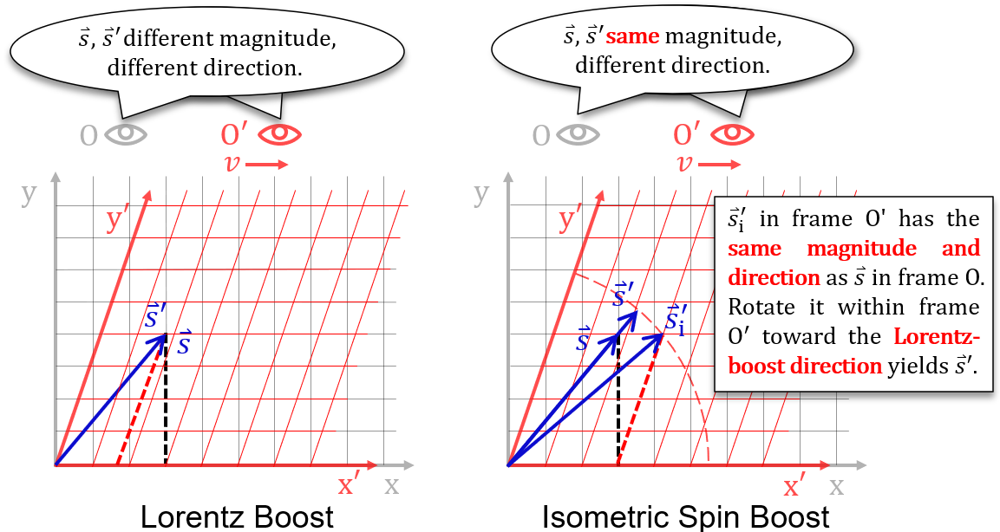
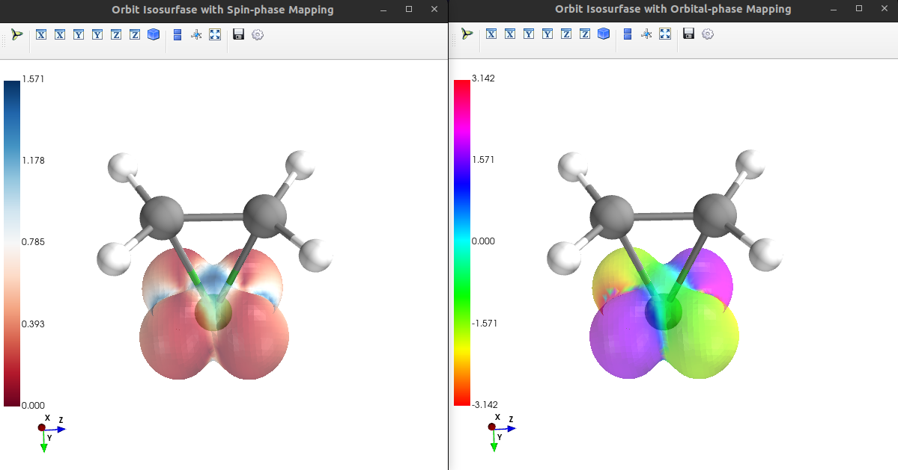
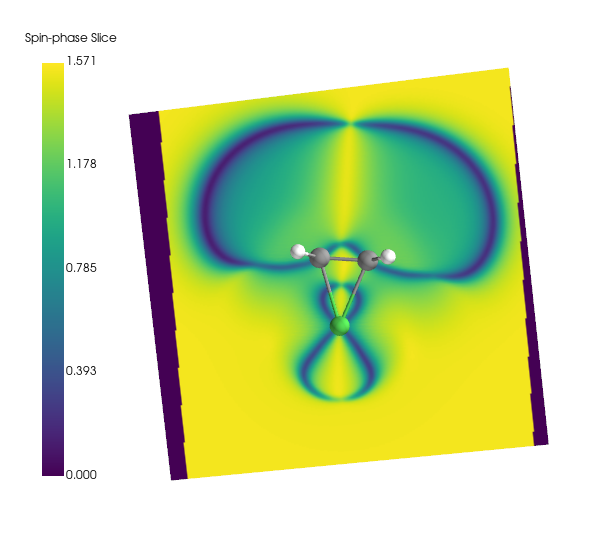
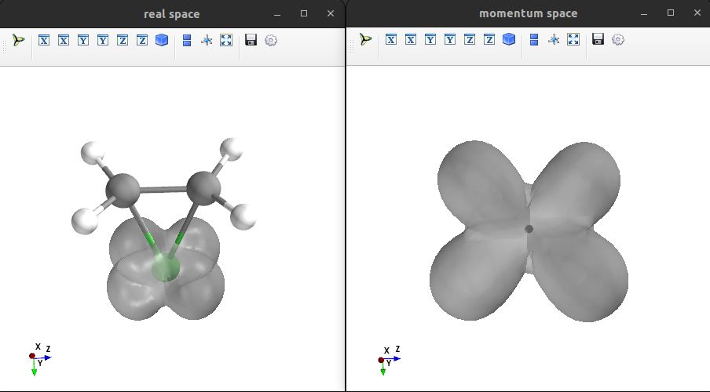

# Introduction

&nbsp;&nbsp;&nbsp;&nbsp;The Thomas Relativistic Electronic Structure Calculation
(TRESC) package is designed to compute the electronic structure of non-periodic
polyatomic systems within the Born-Oppenheimer approximation. It supports
Hartree-Fock and Kohn-Sham self-consistent field (HF/KS-SCF) calculations based
on a two-component (2c) second-order Douglas-Kroll-Hess (DKH2) Hamiltonian for a
given structure.<br>
&nbsp;&nbsp;&nbsp;&nbsp;TRESC exhibits strong performance across both main-group
molecules and transition metal complexes, see `/examples`. The core computational
engine (called tkernel) is implemented in Fortran 2008 free format.

# Algorithms

* Performs only Kramers-unrestricted HF/KS-SCF calculations; it fully relaxes
the orbitals but does not ensure time-reversal symmetry.
* HF/KS-SCF calculation is based on spherical-harmonic fragment-contracted
Gaussian type orbital.
* Initial guess load from MOLDEN format file (generated by other programs, same
or different basis set) or .ao2mo binary file (generated by TRESC HF/KS-SCF
earlier, same basis set).
* All potential integrals are computed using the Obara-Saika scheme
(the retained Rys quadrature routines are not selectable in the current workflow), and all
2e-integrals are handled using PRISM.
* Symmetric orthogonalisation of overlap matrix by default, canonical
orthogonalisation will be used if basis linear dependence reaches the threshold.
* Relativistic spinor integrals based on optimal-parametrized 2nd order Douglas-
Kroll-Hess(DKH2) transformation proposed by Hess *et al.*, including DKH2
1e-integrals and DKH1 2e-integrals.
* DKH2 1e-integrals are calculated up to $`\mathcal{O}(c^{-4})`$, which contains
scalar relativistic terms and one-electron spin-orbit coupling terms; Gaussian
finite nucleus model is considered, affecting the integral value of
$`\left<V\right>`$ and $`\left<pVp\right>`$. The retained
$`\left<pppVp\right>`$ kernels are not used by the active Hamiltonian.
* DKH1 2e-integrals are calculated up to $\mathcal{O}(c^{-2})$, captures the
antisymmetrized Dirac-Coulomb interaction includes the so-called spin-same-orbit
coupling terms; all four-center integrals $`\left(ij|kl\right),
\left(p_ip_j|kl\right), \left(p_ij|p_kl\right)`$, utilize permutation symmetry
and Cauchy-Schwarz screening technique. When the RMSDP is sufficiently small,
the effect of density matrix will be considered in screening as $`P_{\max}\sqrt{
\left( \mu \nu |\mu \nu \right) \left(\sigma \lambda |\sigma \lambda \right)}
\leq threshold`$. Similar algorithm has been employed in the CP2K program.
* Construct Fock matrix via **direct** way, which is time consuming but less
demanding on memory and disk r&w.
* Grid integration are based on the Becke's fuzzy partitioning, the
exchange-correlation energy and the partial derivative terms of the
exchange-correlation potential are obtained by external library Libxc.
* Support for density functionals: (hybrid) LDAs, (hybrid) GGAs and (hybrid)
meta-GGAs excluding long-range corrected functionals and non-local
correlation, the results of non-relativistic calculation differ negligibly from
the Psi4 program.
* 2c-Hamiltonian causes mixing between alpha and beta orbitals, sometimes we
want this mixing as little as possible (maintaining the initial spin state as
much as possible); in this case, should try `cspin=f` or `cspin=d` (the latter
is for nearly degenerate frontier orbitals), but these methods may cause
variational instability, so be sure to check the convergence of the last few
iterations.
* DIIS (Pulay mixing), dynamic damping, virtual orbital level shifting can be
used to facilitate HF/KS-SCF process.
* Basic linear algebra is computed using LAPACK subroutines.
* 1e and 2e Fock matices construction and grid-based integration support OpenMP
parallel computation and all parallel zone are thread safe.
* Outprint $`\left< s^2 \right> \left( L\ddot{o}wdin \right)`$, energy and
orbital components.
* Support dispersion correction via DFT-D4 program (stand-alone) developed by
Grimme's group.

> For mathematical and algorithmic details, see
`docs/Mathematics_and_Algorithms.pdf`.

# Characteristic

## A special Hamiltonian: SRTP

> If you are interested in the origin, derivation, and implementation of the
SRTP effect, see
`docs/Correction_to_the_DKH2_Hamiltonian_Based_on_Anisotropic_Precession.md`.

&nbsp;&nbsp;&nbsp;&nbsp;Second Relativized Thomas Precession (SRTP) combines the
Lorentz vector feature of the spin 4-vector $`\left(0,\vec{S}\right)`$ with the
Lorentz scalar feature of the magnitude of its spatial components
($`s=\hbar/2`$). The term 'Second Relativized' signifies that the magnitude of
the spin vector remains strictly independent of the chosen reference frame. To
achieve this, we introduce a newly-defined frame transformation rule—Isometric
Spin Boost (ISB)—which ensures that the observed $`\vec{S}/s`$ in any frame is
identical to that derived under standard Lorentz transformations, while its
magnitude $`s`$ is invariantly preserved as $`\hbar/2`$.<br>
&nbsp;&nbsp;&nbsp;&nbsp;Assuming that frame O' is moving along the x-axis in
frame O, the Lorentz Boost (LB) and the ISB lead to different observations.<br>
<p align="center">

<br>
<em>Observation of LB and ISB</em>
</p>

&nbsp;&nbsp;&nbsp;&nbsp;Its mathematical form can be given directly as a
nonlinear equation:<br>

$$
\left( \begin{array}{c}
 0\\
 S_1'\\
 S_2'\\
 S_3'\\
\end{array} \right) = \left( \begin{matrix}
 1 & 0 & 0 & 0 \\
 0 & \left[1+\frac{(\gamma -1)\beta_1^2}{\beta^2}\right]\zeta &
 \frac{(\gamma -1)\beta_1\beta_2}{\beta^2}\zeta &
 \frac{(\gamma -1)\beta_1\beta_3}{\beta^2}\zeta \\
 0 & \frac{(\gamma -1)\beta_1\beta_2}{\beta^2}\zeta &
 \left[1+\frac{(\gamma -1)\beta_2^2}{\beta^2}\right]\zeta &
 \frac{(\gamma -1)\beta_2\beta_3}{\beta^2}\zeta \\
 0 & \frac{(\gamma -1)\beta_1\beta_3}{\beta^2}\zeta &
 \frac{(\gamma -1)\beta_2\beta_3}{\beta^2}\zeta &
 \left[1+\frac{(\gamma -1)\beta_3^2}{\beta^2}\right]\zeta
\end{matrix} \right) \left( \begin{array}{c}
 0\\
 S_1\\
 S_2\\
 S_3\\
\end{array} \right)
$$

&nbsp;&nbsp;&nbsp;&nbsp;where $`S_i`$ represent spin components, $`\beta_i`$
represent velocity components, $`\gamma`$ represents the Lorentz factor, and<br>

$$
\zeta = \left( 1+\gamma^2\left( \vec{\beta}\cdot \frac{\vec{S}}{s}
\right)^2 \right)^{-1/2}
$$

&nbsp;&nbsp;&nbsp;&nbsp;Although ISB is essentially kinematic, it dynamically
alters the form of Thomas precession, as this precession is intrinsically linked
to the properties of reference frame transformations.<br>
&nbsp;&nbsp;&nbsp;&nbsp;Following detailed derivations, we discovered that this
precession (SRTP) occurs in an anisotropically stretched space modulated by
electron motion—Spin Precession Space (SPS). The contribution of SRTP to the
electronic energy in the low-velocity limit can be expressed as:<br>

$$
H_{\mathrm{SRTP}} = \frac{1}{2\beta^2} \vec{S}_\gamma \cdot (\dot{\vec{\beta}}
\times \vec{\beta}) \frac{\gamma^4 (\vec{\beta} \cdot \vec{S})^2}{(\gamma^2 +
1)\gamma^2(\vec{\beta} \cdot \vec{S})^2 + 1}
$$

&nbsp;&nbsp;&nbsp;&nbsp;where<br>

$$
S_{\gamma ,i}=\frac{1}{\sqrt{(\gamma ^2+1)\gamma ^2(\vec{\beta}\cdot
\vec{S})^2+1}}\frac{1}{1-\beta _{i}^{2}}S_i
$$


&nbsp;&nbsp;&nbsp;&nbsp;Upon quantization and application of the mean-field
approximation, the contribution of the SRTP correction at
$`\mathcal{O}(c^{-2})`$ is given by the anticommutator:<br>

$$
\hat{H}_{\mathrm{SRTP}}^{(0)} = -\frac{1}{4m^2c^2} \left\lbrace \hat{\vec{S}}
\cdot (\nabla V \times \hat{\vec{p}}), \frac{1}{s^2} \frac{\hat{\vec{p}} \cdot
\mathbf{T} \cdot \hat{\vec{p}}}{\hat{p}^2} \right\rbrace
$$

&nbsp;&nbsp;&nbsp;&nbsp;where the macroscopic spin-polarization tensor
$`\mathbf{T}`$ is defined as:<br>

$$
\mathbf{T} = \frac{1}{N_e} \sum_{k \in \text{occ}} n_k \left( \vec{s}_k \otimes
\vec{s}_k \right),   \vec{s}_k = \langle \psi_k | \hat{\vec{S}} | \psi_k \rangle
$$

&nbsp;&nbsp;&nbsp;&nbsp;This formula yields the modified electron spinor
wavefunction through the Douglas-Kroll-Hess (DKH) transformation. Furthermore,
since the SRTP correction scales as $`\mathcal{O}(c^{-2})`$, one must first
account for other terms up to this order, including first order DKH terms
$`\mathcal{E} _1`$. Moreover, the SRTP effects supported by TRESC are currently
limited to single-electron terms and rely on the mean-field approximation.
Consequently, the full impact of SRTP effects cannot be completely described for
multi-reference molecular orbitals exhibiting exceptionally strong spin-orbit
coupling.<br>
&nbsp;&nbsp;&nbsp;&nbsp;As a new theoretical effect, SRTP predictions await
experimental verification. The implementation is provided for users to explore
and test against high-precision spectroscopic data. Interested users can explore
this effect by adding the `srtp` keyword to the `%Hamiltonian` block when
performing DKH2 calculations.<br>
&nbsp;&nbsp;&nbsp;&nbsp;In addition to the $`p^2`$ and $`pVp`$ integrals required
for the DKH2 Hamiltonian, TRESC retains historical $`pppVp`$ integral kernels
and provides momentum tensor integrals. Should you have original ideas in the
field of relativistic quantum mechanics that require numerical verification,
you can always build upon the existing TRESC codebase.

## Characterization of spinor states

### Decomposition to spin-pure states

&nbsp;&nbsp;&nbsp;&nbsp;A given spinor state $`|\psi \rangle`$ can always be
decomposed into series of spin-pure states $`|S,M\rangle`$ by rotation group
integration(RGI):

$$
\langle \varPsi |S,M\rangle =\frac{2S+1}{8\pi ^2}
\int{\mathrm{d}\varOmega}D_{MM}^{S*}\left( \varOmega \right) \langle \varPsi |
R\left( \varOmega \right) |\varPsi \rangle
$$

&nbsp;&nbsp;&nbsp;&nbsp;where $`D_{MM}^{S}`$ is the Wigner D-matrix and $`R`$ is
the SU(2) rotation matrix. TRESC calculates the contributions of several
spin-pure states to the converged spinor state, with all permissible spin-pure
states predicted by the Wigner-Eckart theorem.

### Time-Reversal Symmetry (TRS) breaking analysis

&nbsp;&nbsp;&nbsp;&nbsp;TRESC obtains Kramers-unrestricted orbitals after
2c-SCF, which spontaneously break TRS. To quantify the breaking, TRESC performs
a Singular Value Decomposition (SVD) on the Kramers overlap matrix $`K`$. The
TRS breaking parameter $`\kappa`$ (representing the effective number of
electrons involved in the symmetry breaking) is defined as follows:

$$
\begin{aligned}
K_{ij} &= \langle \hat{\mathcal{T}}\phi_i \vert{} \phi_j \rangle \\
\mathbf{K} &= \mathbf{U} \boldsymbol{\Sigma} \mathbf{V}^\dagger \\
\kappa &= N - \sum_{k=1}^N \lambda_k
\end{aligned}
$$

&nbsp;&nbsp;&nbsp;&nbsp;where $`N`$ is the number of electrons,
$`\hat{\mathcal{T}} = -i\sigma_y \hat{K}`$ is the time-reversal operator, and
$`\lambda_k \in [0, 1]`$ are the singular values derived from the
decomposition. TRESC projects the time-reversal spinors onto the occupied space
to generate Kramers pairs (similar to the biorthogonalization of UHF/UKS orbits),
and projects the time-reversal orbit onto the virtual space to find the minimum
space that satisfies TRS. Keep in mind that all real systems satisfy TRS in the
absence of an external magnetic field.

## Visualisation of complex spinor MOs

&nbsp;&nbsp;&nbsp;&nbsp;Vis2c is a Python package designed to visualize scalar
and spinor molecular orbitals, offering three visualization methods based on
different projection spaces and grid partitioning strategies. Grid parameters of
all these methods can be changed in `$TRESC/gridsettings.ini`.<br>

### 1. Structured grid data: cub1c/cub2c

&nbsp;&nbsp;&nbsp;&nbsp;When TRESC finishes its HF/KS-SCF calculation, canonical
orbitals will be dumped to `jobname.molden.d`. With it, users can execute the
`cub2c.py` to generate two GAUSSIAN cube format files (contain grid data of real
and imaginary part of alpha and beta components of the selected orbital) and
then visualise the selected orbital based on the grid data automatically.
The visualisation are as follows:<br>
<p align="center">
  
  <br>
  <em>HOMO-3 of triplet [Ni-C2H4], &lt;s^2&gt;=0.67 , &lt;s_z&gt;=-0.41</em>
</p>

&nbsp;&nbsp;&nbsp;&nbsp;The visualization displays both the spin and orbital
phases; the variance in the spin phase reflects the strength of the spin-orbit
coupling within the selected orbital. As demonstrated by the frontier spinor
orbitals in the `examples/`, orbitals with more nodal surfaces near heavy atoms
exhibit stronger SOC and are more susceptible to spin flipping.<br>

&nbsp;&nbsp;&nbsp;&nbsp;Furthermore, executing `cub2c.py` with the `-slice` flag
generates cross-sectional slices of both the orbital amplitude and the spin
phase. These visualizations reveal that the amplitude slices are typically
solid, whereas the spin-phase slices appear hollow, indicating that spin
perturbations predominantly occur at the orbital phase boundaries.<br>
<p align="center">
  
  <br>
  <em>spin-phase slice of HOMO-3 of triplet [Ni-C2H4], a distinctive hollow,
  umbrella-shaped pattern</em>
</p>

### 2. Untructured grid data: mog2c

&nbsp;&nbsp;&nbsp;&nbsp;While structured grid data facilitates efficient
post-processing and visualization, unstructured grids become necessary in the
following three scenarios:<br>

1. Visualizing a specific orbital localized within the inner shell of a
particular atom in a large molecule;
2. Illustrating detailed phase changes induced by SOC in the vicinity of heavy
nuclei;
3. Capturing the frame-dragging effect of a rapidly moving molecule;

&nbsp;&nbsp;&nbsp;&nbsp;Vis2c supports visualization using unstructured data,
specifically Becke's fuzzy grids. By utilizing the `jobname.molden.d` generated
by TRESC, users can execute the `mog2c.py` to automatically generate the
requisite Becke grid data and visualize the selected orbital.<br>

### 3. Replace phase with momentum: pro1c/pro2c

&nbsp;&nbsp;&nbsp;&nbsp;Momentum space is the dual of real space, where spatial
phase information is transformed into momentum amplitude. Consequently,
`pro2c.py` avoids complex phase plotting and instead utilizes intuitive
isosurface representations to convey all orbital information. The visualizations
are as follows:<br>
<p align="center">
  
  <br>
  <em>HOMO-3 of triplet [Ni-C2H4], d-orbital in momentum space also has a
  quatrefoil shape.</em>
</p>

&nbsp;&nbsp;&nbsp;&nbsp;The momentum-space projection of a bound-state orbital
is inherently centrally symmetric, exhibiting symmetry about the origin
(indicated by the central black dot). Furthermore, mapping to momentum space
emphasizes the particle-like nature of electrons; for instance, the conventional
spatial phase-matching principle for bonding orbitals is effectively replaced by
a momentum-matching principle.

# Options

&nbsp;&nbsp;&nbsp;&nbsp;TRESC allows to adjust computation by providing keywords
in each module, now list the keywords currently supported.<br>

## %ATOMS (modeling)

* `basis`: choice of basis set
* `geom`: XYZ geometry file in working directory
* `charge`: charge of molecule
* `spin`: spin multiplicity of molecule

## %HAMILTONIAN (electronic integrations)

* `pVp1e`: one-electron pVp integrals (DKH2 spinor)
* `pVp2e`: two-electron pVp integrals (DKH1 spinor)
* `pVp`: equal to pVp1e + pVp2e
* `srtp`: one-electron SRTP effect
* `cutS`: threshold of eigenvalue of overlapping matrix for orthogonalisation
* `threads`: number of threads in multi-threaded calculation

## %SCF (SCF settings)

* `guess`: initial guess of wavefunction
* `schwarz`: threshold of Cauchy-Schwarz screening
* `dmschwarz`: RMSDP threshold for considering density matrix in Cauchy-Schwarz
screening
* `maxiter`: maximum number of SCF iterations
* `convertol`: SCF convergence tolerance
* `residualtol`: RMS SCF commutator residual tolerance \(FP-PF\) (Eh)
* `damp`: SCF damping coefficient
* `diisdamp`: DIIS damping coefficient
* `nodiis`: number of initial iterations without DIIS
* `subsp`: size of subspace of DIIS
* `cutdamp`: cut damp when threshold is reached
* `cutdiis`: cut DIIS when threshold is reached
* `prtlev`: minimum AO coefficient output when SCF done
* `cspin`: constrained spin multiplicity calculation
* `molden`: dump MOs to MOLDEN files when SCF done
* `emd4`: DFT-D4 dispersion correction
* `lshift`: virtual orbital energy level shift (Eh), better be in range [0.1,1]

## %FUNCTIONAL (exchange-correlation functionals)

> Identity of functionals can be found at
[Libxc](https://libxc.gitlab.io/functionals/libxc-7.0.0/)<br>
All functionals are available except range-separated and non-local correlation

* `xid`: identity of exchange functional
* `cid`: identity of correlation functional
* `xcid`: identity of exchange-correlation functional

# Build

> If AVX2 / AVX512 instruction set is supported, please modify the compilation
options and compiler directives (e.g. align_size) manually.<br>
> If DFT-D4 dispersion correction is involved, make sure you have install
[DFT-D4](https://dftd4.readthedocs.io/en/latest/recipe/installation.html).

## Linux (Debian as example)

Deploy build tools by root or sudo user:

```Shell
sudo apt install ninja-build
sudo apt install cmake
```

Install [Intel oneAPI HPC Toolkit](
https://www.intel.com/content/www/us/en/developer/tools/oneapi/toolkits.html),
and append the following to `~/.bashrc`:

```Shell
export ONEAPI_ROOT="/path/to/oneapi"
export PATH="$ONEAPI_ROOT/compiler/latest/bin:$PATH"
```

Download the stable release of [Libxc](
https://libxc.gitlab.io/download/) and build it (in oneAPI environment) by:

```Shell
cmake -S . \
-B build \
-G Ninja \
-DCMAKE_BUILD_TYPE=Release \
-DENABLE_FORTRAN=ON \
-DBUILD_TESTING=OFF \
-DBUILD_FPIC=ON \
-DCMAKE_Fortran_COMPILER="${ONEAPI_ROOT}/compiler/latest/bin/ifx" \
-DCMAKE_C_COMPILER="${ONEAPI_ROOT}/compiler/latest/bin/icx" \
-DCMAKE_BUILD_WITH_INSTALL_RPATH=ON \
-DCMAKE_C_FLAGS="${CMAKE_C_FLAGS} -O3 -xCORE-AVX2"
```

then<br>

```Shell
cd build && ninja
```

append to `~/.bashrc` after a successful build:<br>

```Shell
export LIBXC_ROOT="/path/to/libxc"
```

Change directory to TRESC root and build it by:<br>

```Shell
chmod +x release.sh && ./release.sh
```

You need to create an environment with

```Shell
conda create --name vis2c python=3.10 numpy scipy matplotlib \
qcelemental mayavi traits traitsui pyqt
```

grant all `.py` in `/vis2c` executable permissions and replace the shebangs with
the path to the Python interpreter of env `vis2c`, it will enable you to use
scripts in any scenario. Append to `~/.bashrc` when everything is done:<br>

```Shell
export TRESC="/path/to/TRESC"
export PATH="$TRESC/build:$PATH"
export PATH="$TRESC/vis2c:$PATH"
alias TRESC='tshell.sh'
alias tshell='tshell.sh'
```

# Upcoming

* high-performance vectorized code for 2e-integrals
* perturbation calculation;
